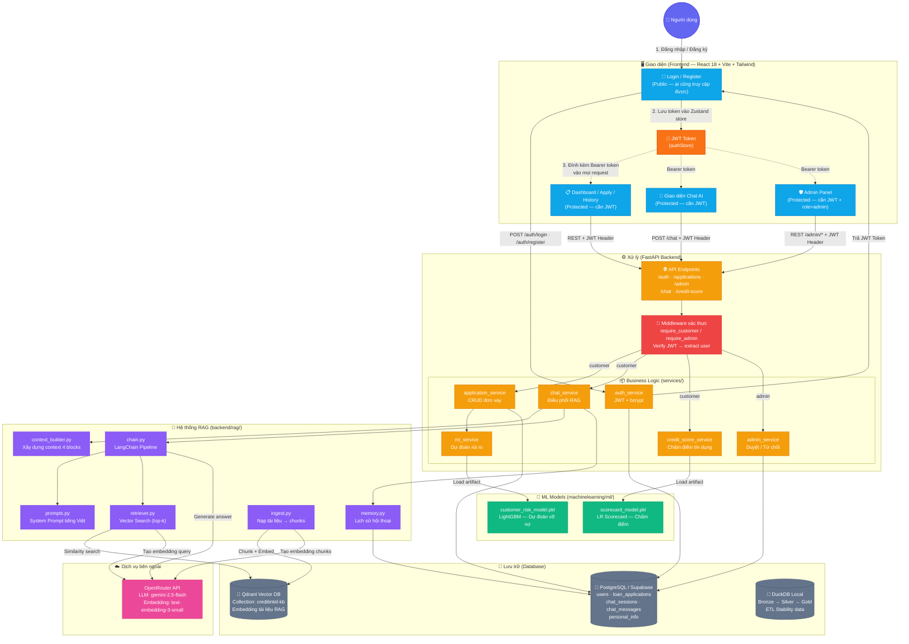
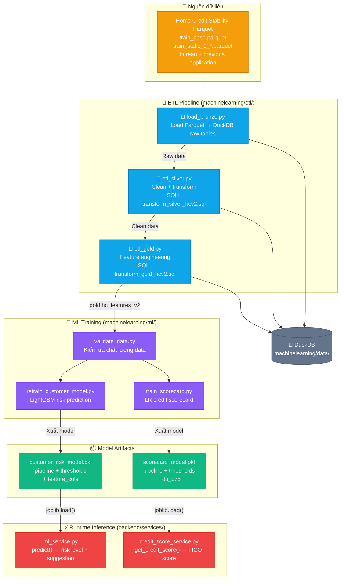

# CreditIntel - Hệ Thống Quản Lý & Đánh Giá Rủi Ro Khoản Vay

> Dự án môn Hệ Quản Trị CSDL - Nhóm KH086  
> FastAPI Backend + React Frontend + Home Credit Stability ETL + Machine Learning + RAG Chatbot

---

## Kiến Trúc Tổng Quan Hệ Thống



> **Chú thích tổng quan:**
> 1. **Phải đăng nhập trước**: Người dùng truy cập Login/Register (public) → Backend xác thực → trả **JWT Token**.
> 2. **Token lưu ở Frontend**: Zustand `authStore` giữ token; `ProtectedRoute` chặn truy cập nếu chưa login.
> 3. **Mọi request protected đều gửi kèm JWT**: Axios interceptor tự đính `Authorization: Bearer <token>` vào header.
> 4. **Backend verify JWT**: Middleware `require_customer` / `require_admin` giải mã token, kiểm tra role trước khi cho phép truy cập service.
> 5. **Admin cần role đặc biệt**: Ngoài JWT còn phải có `role = admin` mới vào được Admin Panel.
> - **RAG** kết hợp context từ hồ sơ khách hàng + tài liệu vector search để trả lời câu hỏi.
> - **ML Models** được train offline từ ETL pipeline, load runtime trong backend services.
> - **PostgreSQL** lưu dữ liệu nghiệp vụ; **Qdrant** lưu vector embeddings; **DuckDB** dùng cho ETL offline.

---

## Luồng RAG Chatbot Chi Tiết

```mermaid
graph LR
    U(("👤 Khách hàng")) -->|"Gửi câu hỏi"| CHAT_UI["💬 Chat UI<br/>(React)"]
    CHAT_UI -->|"POST /chat"| CHAT_EP["API /chat<br/>(FastAPI)"]
    CHAT_EP --> CHAT_SVC2["chat_service.send()"]

    CHAT_SVC2 -->|"1. Rate limit check"| RL{{"≤ 20 msg/phút?"}}
    RL -->|"Vượt"| ERR429["❌ 429 Too Many"]
    RL -->|"OK"| ENSURE["2. Ensure ML prediction"]

    ENSURE -->|"Chưa có prediction"| ML2["ml_service.predict()"]
    ML2 -->|"Cập nhật đơn vay"| DB2[("PostgreSQL")]
    ENSURE -->|"Đã có"| CTX2

    CTX2["3. context_builder<br/>Build 4 blocks JSON"] --> RAG_CHAIN

    subgraph RAG_CHAIN["🤖 RAG Chain"]
        direction TB
        HIST["memory.py<br/>Load 10 turns gần nhất"]
        RET2["retriever.py<br/>Vector search Qdrant<br/>top-k=4 documents"]
        PROMPT2["prompts.py<br/>System prompt + context"]
        LLM2["LangChain → OpenRouter<br/>gemini-2.5-flash"]
    end

    RAG_CHAIN -->|"4. Trả answer + sources"| SAVE["5. Lưu transcript"]
    SAVE --> DB2
    SAVE -->|"Response JSON"| CHAT_UI

    classDef user fill:#6366f1,stroke:#4f46e5,color:#fff,stroke-width:2px
    classDef ui fill:#0ea5e9,stroke:#0284c7,color:#fff
    classDef svc fill:#f59e0b,stroke:#d97706,color:#fff
    classDef rag fill:#8b5cf6,stroke:#7c3aed,color:#fff
    classDef db fill:#64748b,stroke:#475569,color:#fff
    classDef err fill:#ef4444,stroke:#dc2626,color:#fff

    class U user
    class CHAT_UI ui
    class CHAT_EP,CHAT_SVC2,ENSURE,CTX2,SAVE svc
    class HIST,RET2,PROMPT2,LLM2 rag
    class DB2 db
    class ERR429 err
```



> **Chú thích luồng RAG:**
> 1. **Rate Limit**: Giới hạn 20 câu hỏi/phút/user để tránh lạm dụng API.
> 2. **Ensure Prediction**: Nếu đơn vay chưa có kết quả ML → tự động chạy `ml_service.predict()` và cập nhật DB.
> 3. **Context Builder**: Xây dựng 4 blocks — Form context, ML context, Advisory context, Data quality.
> 4. **RAG Chain**: Load lịch sử chat → vector search tài liệu → ghép prompt → gọi LLM sinh câu trả lời.
> 5. **Lưu transcript**: Cả câu hỏi lẫn câu trả lời được lưu vào `chat_messages` để dùng cho lượt hỏi tiếp theo.

---

## Luồng ETL & Machine Learning



> **Chú thích ETL & ML:**
> - **Bronze**: Load raw Parquet của Home Credit Credit Risk Model Stability vào DuckDB, giữ nguyên schema gốc.
> - **Silver**: Làm sạch dữ liệu (xử lý null, chuẩn hóa kiểu dữ liệu, loại bỏ outliers) theo SQL transforms.
> - **Gold**: Feature engineering nâng cao (tạo các chỉ số tài chính, aggregation từ bureau/previous applications/CB queries) → bảng `gold.hc_features_v2`.
> - **Training**: 2 model được train: LightGBM v4 cho dự đoán rủi ro vỡ nợ (35 feature, không dùng `credit_score` tự khai báo) và Logistic Regression scorecard (30 feature, FICO-style 300–850).
> - **Runtime**: Backend load model artifacts bằng `joblib` và chạy inference real-time khi khách hàng nộp đơn.

---

## Cấu Trúc Dự Án

```text
Loan_ETL/
├── backend/                  # FastAPI API server
│   ├── main.py               # Entry point — mount routers, CORS
│   ├── api/routers/          # Route handlers: auth, applications, admin, chat, credit_score
│   ├── services/             # Business logic layer
│   │   ├── auth_service.py           # JWT authentication + bcrypt
│   │   ├── application_service.py    # CRUD đơn vay, submit workflow
│   │   ├── admin_service.py          # Admin approve/reject đơn
│   │   ├── ml_service.py             # Load LightGBM model, predict risk
│   │   ├── credit_score_service.py   # Load scorecard, compute FICO score
│   │   ├── chat_service.py           # Điều phối RAG chatbot
│   │   ├── model_feature_builder.py  # Map form data → ML features
│   │   ├── loan_suggestion_service.py # Binary search optimal loan
│   │   └── document_service.py       # Upload/manage documents
│   ├── rag/                  # RAG chatbot engine
│   │   ├── chain.py          # LangChain chain: prompt → LLM → parse
│   │   ├── retriever.py      # Qdrant vector similarity search
│   │   ├── context_builder.py # Build 4-block context from DB
│   │   ├── memory.py         # Load chat history from PostgreSQL
│   │   ├── prompts.py        # System prompt template (Vietnamese)
│   │   ├── ingest.py         # One-shot: load docs → chunk → embed → Qdrant
│   │   ├── config.py         # RAG settings (model, collection, top-k)
│   │   └── knowledge/        # Markdown knowledge base (faq.md, policy.md)
│   ├── models/               # SQLAlchemy ORM models
│   ├── schemas/              # Pydantic request/response schemas
│   ├── core/                 # Config (env), security (JWT), scoring utils
│   ├── db/                   # DB session, init SQL
│   └── tests_local/          # Local integration tests
│
├── frontend/                 # React 18 + Vite + TailwindCSS
│   └── src/
│       ├── App.jsx           # Router: public, customer, admin routes
│       ├── pages/
│       │   ├── customer/     # Landing, Login, Register, Dashboard,
│       │   │                 # Apply, Chat, History, ApplicationDetail
│       │   └── admin/        # Dashboard, PendingList, ApplicationList,
│       │                     # ApplicationDetail, PersonalInfoView
│       ├── components/       # Reusable UI: Navbar, AdminLayout, ProtectedRoute
│       ├── services/         # Axios API clients: api, auth, chat, applications, admin
│       ├── store/            # Zustand state: authStore
│       ├── hooks/            # Custom React hooks
│       └── mocks/            # Mock data for offline dev
│
├── machinelearning/          # ETL + ML training (offline)
│   ├── etl/                  # ETL scripts: load_bronze, etl_silver, etl_gold, pipeline
│   ├── database/             # SQL transforms: silver + gold
│   ├── ml/                   # Training: retrain_customer_model, train_scorecard
│   │   └── models/           # Exported .pkl artifacts
│   ├── data/                 # DuckDB + raw Parquet files (Home Credit Stability)
│   ├── config/               # etl_db.env
│   ├── notebooks/            # EDA / training notebooks
│   └── utils/                # Shared DB connection helper
│
├── docs/                     # Project documentation
│   ├── overall/              # Architecture notes, admin guide
│   ├── ml/                   # ML documentation
│   └── rag/                  # RAG design docs, benchmark results
│
├── qdrant_storage/           # Docker-mounted Qdrant persistent data
├── AGENTS.md                 # Repository conventions
├── requirements.txt          # Aggregate Python dependencies
└── README.md
```

## Khởi Chạy Nhanh

> Chạy các lệnh Python từ thư mục gốc project (`Loan_ETL/`) trừ khi có ghi chú khác.

### 1. Tạo môi trường Python

```bash
python -m venv .venv
source .venv/bin/activate
```

Nếu muốn cài tất cả Python dependencies cho cả backend và ML/ETL:

```bash
pip install -r requirements.txt
```

Nếu chỉ làm một phần, cài riêng theo layer:

```bash
pip install -r backend/requirements.txt
pip install -r machinelearning/requirements.txt
```

### 2. Backend FastAPI

```bash
pip install -r backend/requirements.txt

cd backend
python init_db.py
uvicorn main:app --reload
```

Swagger UI: http://localhost:8000/docs

Backend dùng model artifacts tại:

- `machinelearning/ml/models/customer_risk_model.pkl`
- `machinelearning/ml/models/scorecard_model.pkl`

Model hiện tại:

- `customer_lgbm_v4_stability`: 35 feature từ `gold.hc_features_v2`, ROC-AUC gần nhất `0.8065`.
- `scorecard_model.pkl`: 30 feature, FICO-style 300–850, ROC-AUC gần nhất `0.7367`.

### 3. Frontend React

```bash
cd frontend
npm install
npm run dev      # http://localhost:5173
npm run mock     # chạy UI với mock API
npm run build    # production build
```

### 4. RAG Chatbot + Qdrant

Backend chat dùng OpenRouter cho LLM/embeddings và Qdrant local cho vector search.
Khi chạy local bằng Docker, `QDRANT_API_KEY` để trống.

```bash
# Chạy từ root project
pkexec systemctl start docker   # hoặc: sudo systemctl start docker

pkexec docker run -d \
  --name creditintel-qdrant \
  -p 6333:6333 \
  -v "$(pwd)/qdrant_storage:/qdrant/storage" \
  qdrant/qdrant

curl http://127.0.0.1:6333/
```

Nếu user của bạn đã thuộc group `docker`, có thể bỏ `pkexec`. Nếu chưa, thêm quyền rồi logout/login lại:

```bash
sudo usermod -aG docker "$USER"
```

Nạp tài liệu vào collection `creditintel-kb`:

```bash
cd backend
PYTHONPATH=. ../.venv/bin/python -m rag.ingest
curl http://127.0.0.1:6333/collections
```

Env cần có trong `backend/.env`:

```env
OPENROUTER_API_KEY=sk-or-...
RAG_LLM_MODEL=google/gemini-2.5-flash
RAG_EMBEDDING_MODEL=openai/text-embedding-3-small
QDRANT_URL=http://localhost:6333
QDRANT_API_KEY=
QDRANT_COLLECTION=creditintel-kb
```

### 5. ETL Pipeline

Đặt dataset Home Credit Credit Risk Model Stability dạng Parquet vào:

`machinelearning/data/home-credit-credit-risk-model-stability/parquet_files/train/`

Các file tối thiểu mà loader đang dùng:

- `train_base.parquet`
- `train_static_0_*.parquet`
- `train_static_cb_0.parquet`
- `train_person_1.parquet`
- `train_credit_bureau_a_1_*.parquet`
- `train_applprev_1_*.parquet`

Chạy toàn bộ pipeline:

```bash
pip install -r machinelearning/requirements.txt
python -m machinelearning.etl.pipeline
```

Hoặc chạy từng bước:

```bash
python -m machinelearning.etl.load_bronze
python -m machinelearning.etl.etl_silver
python -m machinelearning.etl.etl_gold
```

### 6. Machine Learning

```bash
python -m machinelearning.ml.validate_data
python -m machinelearning.ml.retrain_customer_model
python -m machinelearning.ml.train_scorecard
```

Kiểm tra contract artifact:

```bash
python -m machinelearning.ml.check_customer_model_contract
```

Notebook EDA/evaluation chính:

```bash
jupyter lab machinelearning/notebooks/home_credit_eda.ipynb
```

## Công Nghệ Sử Dụng

| Layer | Công nghệ |
|---|---|
| Backend API | Python, FastAPI, SQLAlchemy 2.0, Pydantic v2, JWT, bcrypt |
| Frontend | React 18, Vite, TailwindCSS, Axios, Zustand, React Router |
| Database | PostgreSQL/Supabase, DuckDB local cho ETL |
| ETL | Python, pandas, SQLAlchemy, DuckDB |
| ML | LightGBM, scikit-learn, pandas, joblib |
| RAG Chatbot | LangChain, OpenRouter (Gemini 2.5 Flash), Qdrant Vector DB |
| DevOps | Docker (Qdrant), Vite dev server, Uvicorn |

## Tài Liệu

| Tài liệu | Đường dẫn |
|---|---|
| Backend Architecture | [`backend/README.md`](backend/README.md) |
| Frontend Guide | [`frontend/README.md`](frontend/README.md) |
| Overall Documentation | [`docs/overall/`](docs/overall/) |
| ML Documentation | [`docs/ml/`](docs/ml/) |
| RAG Documentation | [`docs/rag/`](docs/rag/) |
| Admin Guide | [`docs/overall/ADMIN_GUIDE.md`](docs/overall/ADMIN_GUIDE.md) |

## Phạm Vi Theo Nhóm

| Vai trò | Phạm vi |
|---|---|
| Backend Developer | `backend/` - API, auth, admin, DB, RAG integration |
| Frontend Developer | `frontend/` - React UI, pages, components, API client |
| ML Engineer | `machinelearning/ml/` - training scripts, artifacts, model contracts |
| Data Engineer | `machinelearning/etl/`, `machinelearning/database/`, `machinelearning/data/` |
| AI/RAG Engineer | `backend/rag/`, `backend/services/chat_service.py` |

## Ghi Chú Cấu Hình

- Secrets đặt trong `backend/.env`, không commit lên Git.
- ETL config đặt tại `machinelearning/config/etl_db.env`.
- `requirements.txt` ở root chỉ dùng để cài full-stack Python; khi làm riêng backend hoặc ML, ưu tiên file requirements của từng thư mục.
