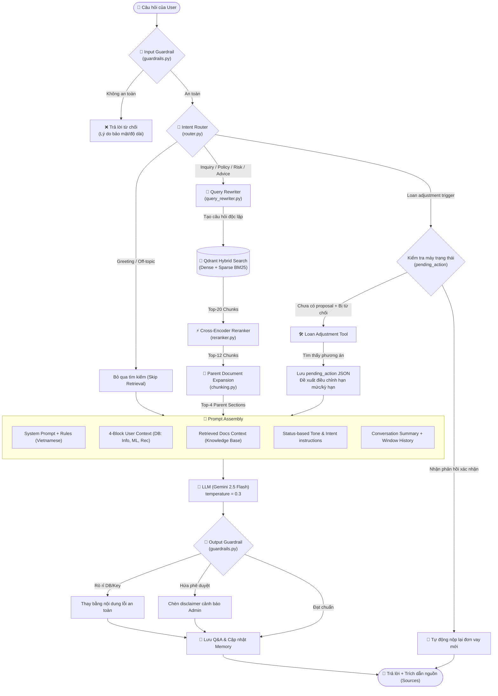
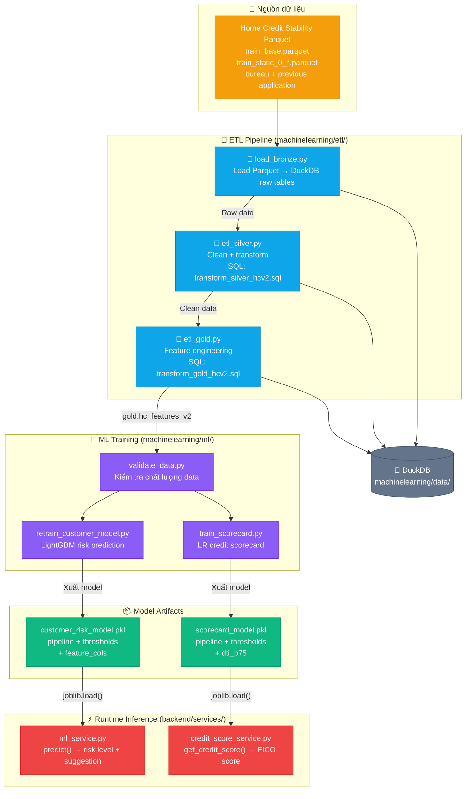

# CreditIntel - Hệ Thống Quản Lý & Đánh Giá Rủi Ro Khoản Vay

> Dự án môn Hệ Quản Trị CSDL - Nhóm KH086  
> FastAPI Backend + React Frontend + Home Credit Stability ETL + Machine Learning

## Kiến Trúc Tổng Quan Hệ Thống

Dự án CreditIntel được phát triển theo mô hình phân lớp rõ ràng, kết hợp chặt chẽ giữa xử lý dữ liệu (Data Engineering), huấn luyện mô hình (Machine Learning) và vận hành trực tuyến (Web Application + RAG Chatbot).

```mermaid
graph TB
    %% ====== USER & FRONTEND ======
    User(("👤 Người dùng")) -->|"Tương tác"| FE
    
    subgraph FE["🖥️ Giao diện (React 18 + Vite + Tailwind)"]
        direction TB
        PortalC["📋 Customer Portal<br/>(Apply, Dashboard, Chat AI)"]
        PortalA["🛡️ Admin Portal<br/>(Review, Stats Dashboard)"]
        Zustand["🔑 Zustand authStore<br/>(JWT Token)"]
    end
    
    FE -->|"REST API + Bearer JWT"| API
    
    %% ====== BACKEND FASTAPI ======
    subgraph BE["⚙️ Xử lý (FastAPI Backend)"]
        direction TB
        API["🌐 API Routers<br/>/auth · /applications · /admin<br/>/chat · /credit-score"]
        Guard["🛂 JWT Auth Middleware<br/>(require_customer / require_admin)"]
        
        API --> Guard
        
        subgraph SVC["📦 Business Logic Services (backend/services/)"]
            AUTH_SVC["auth_service<br/>(JWT + Bcrypt)"]
            APP_SVC["application_service<br/>(CRUD đơn vay)"]
            ADMIN_SVC["admin_service<br/>(Admin duyệt/từ chối)"]
            ML_SVC["ml_service<br/>(Dự đoán rủi ro LightGBM)"]
            CS_SVC["credit_score_service<br/>(Scorecard LR + SHAP)"]
            CHAT_SVC["chat_service<br/>(Điều phối Chat + State Machine)"]
            ADJ_TOOL["loan_adjustment_tool<br/>(Mô phỏng đổi kỳ hạn/tiền)"]
        end
        
        Guard -->|"Xác thực & phân quyền"| SVC
        CHAT_SVC --> ADJ_TOOL
        CHAT_SVC --> APP_SVC
        APP_SVC --> ML_SVC
    end
    
    %% ====== RAG MODULE ======
    subgraph RAG["🤖 Hệ thống RAG Nâng Cao (backend/rag/)"]
        direction TB
        RAG_CHAIN["chain.py<br/>(LCEL Pipeline)"]
        RAG_GUARD["guardrails.py<br/>(Input & Output Safety)"]
        RAG_ROUTER["router.py<br/>(Intent Classification)"]
        RAG_REWRITE["query_rewriter.py<br/>(LLM Query Rewriter)"]
        RAG_RET["retriever.py<br/>(Hybrid Search + Reranker)"]
        RAG_PERS["personalizer.py<br/>(Status-based Personalization)"]
        RAG_MEM["memory.py<br/>(Window + Summarization)"]
        RAG_CHUNK["chunking.py / ingest.py<br/>(Parent-Child Chunking)"]
    end
    
    CHAT_SVC --> RAG_CHAIN
    RAG_CHAIN --> RAG_GUARD
    RAG_CHAIN --> RAG_ROUTER
    RAG_CHAIN --> RAG_REWRITE
    RAG_CHAIN --> RAG_RET
    RAG_CHAIN --> RAG_PERS
    RAG_CHAIN --> RAG_MEM
    RAG_RET --> RAG_CHUNK
    
    %% ====== ML TRAINING ======
    subgraph ML_MODELS["🧠 ML Models (machinelearning/ml/)"]
        LGBM["customer_risk_model.pkl<br/>(LightGBM v4 - Default risk)"]
        SCORECARD["scorecard_model.pkl<br/>(Logistic Regression Scorecard)"]
    end
    
    ML_SVC --> LGBM
    CS_SVC --> SCORECARD

    %% ====== STORAGE ======
    subgraph STORAGE["💾 Cơ Sở Dữ Liệu"]
        DB_PG[("🐘 PostgreSQL / Supabase<br/>(users, applications, chat_messages, ...)")]
        DB_QD[("🔷 Qdrant Vector DB<br/>(Collection: creditintel-kb<br/>Dense + Sparse indices)")]
        DB_DK[("🦆 DuckDB Local<br/>(Bronze → Silver → Gold ETL)")]
    end
    
    SVC --> DB_PG
    RAG_MEM --> DB_PG
    RAG_CHUNK --> DB_QD
    RAG_RET --> DB_QD
    
    %% ====== EXTERNAL ======
    subgraph EXT["☁️ Dịch Vụ Bên Ngoài"]
        OR["OpenRouter API<br/>(LLM: gemini-2.5-flash<br/>Embed: text-embedding-3-small)"]
    end
    
    RAG_CHAIN --> OR
    RAG_REWRITE --> OR
    RAG_MEM --> OR
    RAG_RET --> OR

    %% ====== STYLING ======
    classDef user fill:#6366f1,stroke:#4f46e5,color:#fff,stroke-width:2px
    classDef frontend fill:#0ea5e9,stroke:#0284c7,color:#fff
    classDef backend fill:#f59e0b,stroke:#d97706,color:#fff
    classDef rag fill:#8b5cf6,stroke:#7c3aed,color:#fff
    classDef ml fill:#10b981,stroke:#059669,color:#fff
    classDef storage fill:#64748b,stroke:#475569,color:#fff
    classDef external fill:#ec4899,stroke:#db2777,color:#fff
    classDef token fill:#f97316,stroke:#ea580c,color:#fff,stroke-width:2px
    classDef guard fill:#ef4444,stroke:#dc2626,color:#fff

    class User user
    class PortalC,PortalA frontend
    class Zustand token
    class API,AUTH_SVC,APP_SVC,ADMIN_SVC,ML_SVC,CS_SVC,CHAT_SVC,ADJ_TOOL backend
    class Guard guard
    class RAG_CHAIN,RAG_GUARD,RAG_ROUTER,RAG_REWRITE,RAG_RET,RAG_PERS,RAG_MEM,RAG_CHUNK rag
    class LGBM,SCORECARD ml
    class DB_PG,DB_QD,DB_DK storage
    class OR external

    %% ====== SUBGRAPH STYLING (BORDERS ONLY, TRANSPARENT BG) ======
    style RAG fill:transparent,stroke:#7c3aed,stroke-width:3px,stroke-dasharray:0
    style STORAGE fill:transparent,stroke:#0891b2,stroke-width:3px,stroke-dasharray:0
    style FE fill:transparent,stroke:#94a3b8,stroke-width:2px
    style BE fill:transparent,stroke:#f59e0b,stroke-width:2px
    style SVC fill:transparent,stroke:#d97706,stroke-width:1px,stroke-dasharray:5 5
    style ML_MODELS fill:transparent,stroke:#10b981,stroke-width:2px
    style EXT fill:transparent,stroke:#ec4899,stroke-width:2px
```



> **Chú thích kiến trúc tổng quan:**
> 1. **Giao thức & Phân Quyền**: Người dùng đăng nhập qua JWT Bearer. Token được lưu trữ tại Zustand store ở Frontend và được tự động đính kèm vào header của mọi API request. Backend verify JWT thông qua Middleware kiểm tra vai trò khách hàng (`require_customer`) hoặc quản trị viên (`require_admin`).
> 2. **Xử Lý Nghiệp Vụ (Services)**: Lớp dịch vụ FastAPI quản lý toàn bộ business logic. `ml_service` thực hiện dự đoán rủi ro vỡ nợ tức thời (LightGBM) khi người dùng nộp đơn; `credit_score_service` tính toán FICO score và giải thích SHAP; `chat_service` điều phối hội thoại RAG và gọi `loan_adjustment_tool`.
> 3. **Huấn Luyện ML Offline**: Các mô hình ML được huấn luyện offline bằng DuckDB local từ nguồn dữ liệu Kaggle Home Credit Stability, xuất ra các file `.pkl` để Backend sử dụng trực tiếp tại runtime.
> 4. **Hệ Thống RAG**: RAG được cô lập khỏi DB nghiệp vụ và liên kết trực tiếp với Qdrant Vector DB, sử dụng OpenRouter làm cổng kết nối LLM (Gemini) và dense embeddings.

---

## Luồng RAG Chatbot Nâng Cao & State Machine

Hệ thống RAG của CreditIntel triển khai một pipeline đa giai đoạn cực kỳ bảo mật, chính xác cao và tích hợp sẵn máy trạng thái (state machine) giúp người dùng thực hiện nộp lại hồ sơ thay đổi kỳ hạn trực tiếp từ giao diện chat.



### Các Giai Đoạn Trong RAG Pipeline:

1. **Input Guardrail (`guardrails.py`)**: 
   - Kiểm soát độ dài đầu vào (`MAX_INPUT_LENGTH = 2000`).
   - Sử dụng các mẫu Regex cứng để phát hiện các cuộc tấn công prompt-injection (như jailbreak, yêu cầu in system prompt) hoặc thăm dò thông tin cá nhân (PII probing - cố tình hỏi thông tin của khách hàng khác). Nếu kích hoạt, tin nhắn bị chặn ngay lập tức.
2. **Intent Router (`router.py`)**: 
   - Phân loại tin nhắn của người dùng vào 1 trong 6 ý định: `loan_inquiry`, `risk_explanation`, `policy_question`, `personal_advice`, `greeting`, `off_topic`.
   - Kết hợp khớp nhanh từ khóa (keyword fast-path) để giảm độ trễ và gọi LLM phân loại JSON nếu không khớp từ khóa.
   - Các ý định `greeting` và `off_topic` sẽ bỏ qua bước tìm kiếm tài liệu để tiết kiệm chi phí.
3. **Query Rewriter (`query_rewriter.py`)**:
   - Sử dụng mô hình `google/gemini-2.5-flash` để chuyển câu hỏi hiện tại của người dùng thành câu truy vấn độc lập (standalone query) dựa trên tóm tắt hội thoại và lịch sử chat (tối đa 6 tin nhắn gần nhất) nhằm tối ưu hóa kết quả tìm kiếm ngữ nghĩa.
4. **Hybrid Search & Reranking (`retriever.py`, `reranker.py`, `chunking.py`)**:
   - **Tìm kiếm hỗn hợp (Hybrid Search)**: Qdrant kết hợp tìm kiếm vector dense (OpenAI `text-embedding-3-small` qua OpenRouter) và tìm kiếm vector sparse (BM25 thông qua thư viện `FastEmbedSparse` local).
   - **Reranker**: Sử dụng Cross-Encoder Reranker (`fastembed.rerank.cross_encoder.TextCrossEncoder`) để chấm điểm độ liên quan trực tiếp giữa câu hỏi và top 20 chunks kết quả, lấy ra top 12.
   - **Parent-Child Expansion (Bản đồ phân mảnh)**: Chunks được lưu trữ ở dạng child chunks nhỏ (tối đa 700 ký tự) để tăng độ chính xác khi đối sánh vector, nhưng khi trả về cho prompt sẽ được ánh xạ ngược lên parent document/section hoàn chỉnh chứa heading tương ứng (tối đa 3500 ký tự) để tránh đứt gãy ngữ cảnh.
5. **Personalization (`personalizer.py`)**:
   - Tự động điều chỉnh giọng điệu và chỉ dẫn (tone/instructions) cho LLM theo trạng thái hồ sơ thực tế của người dùng:
     - `auto_rejected` / `admin_rejected` -> Đồng cảm, khích lệ, gợi ý hướng cải thiện (giảm DTI, tăng FICO).
     - `pending_review` -> Hướng dẫn quy trình, thông tin thời gian xử lý.
     - `approved` / `awaiting_info` -> Chúc mừng, hướng dẫn các tài liệu cần tải lên (CCCD, SĐT).
     - `info_submitted` -> Yên tâm, giải thích bước xử lý tiếp theo.
     - Không có hồ sơ -> Thân thiện, giới thiệu dịch vụ.
6. **Memory & Persistence (`memory.py`)**:
   - Áp dụng chiến lược bộ nhớ đệm trượt (sliding window) kết hợp tóm tắt lười (lazy summarization). 
   - Duy trì các tin nhắn gần nhất trong giới hạn token budget. Các tin nhắn cũ hơn sẽ được LLM tự động tóm tắt gộp vào `ChatSession.summary` và lưu vào PostgreSQL để giữ bộ nhớ dài hạn mà không làm tràn ngữ cảnh LLM.
7. **Máy trạng thái điều chỉnh khoản vay (Loan Adjustment State Machine)**:
   - Nếu người dùng có đơn bị `AUTO_REJECTED` hỏi về các phương án điều chỉnh (thay đổi kỳ hạn/số tiền vay), `chat_service` sẽ chuyển luồng xử lý tới `loan_adjustment_tool`.
   - Tool tự động giả định (simulate) qua mô hình ML các tổ hợp kỳ hạn (12, 24, 36, 48, 60 tháng) và số tiền vay tối ưu để tìm ra phương án có xác suất vỡ nợ dưới ngưỡng an toàn `0.4`.
   - Nếu tìm thấy, phương án điều chỉnh sẽ được lưu dưới dạng `pending_confirmation` trong cột `pending_action` của session chat, và chatbot hiển thị câu hỏi đề xuất đồng ý/từ chối.
   - Nếu người dùng nhập các từ khóa xác nhận ("đồng ý", "xác nhận", "ok"), hệ thống tự động gọi service nộp lại hồ sơ mới (`application_service.confirm`) và thông báo kết quả tức thời.
8. **Output Guardrail (`guardrails.py`)**:
   - Kiểm tra kết quả đầu ra của LLM trước khi hiển thị cho người dùng.
   - Phát hiện và che giấu các rò rỉ dữ liệu hệ thống (như tên bảng DB, chuỗi API key, password hash).
   - Phát hiện các câu hứa hẹn phê duyệt 100% của LLM để tự động chèn cảnh báo từ chối trách nhiệm (disclaimer) - khẳng định quyết định cuối cùng thuộc về Admin.

---

## Luồng ETL & Machine Learning



> **Chú thích ETL & ML:**
> - **Bronze**: Load raw Parquet của Home Credit Credit Risk Model Stability vào DuckDB, giữ nguyên schema gốc.
> - **Silver**: Làm sạch dữ liệu (xử lý null, chuẩn hóa kiểu dữ liệu, loại bỏ outliers) theo SQL transforms.
> - **Gold**: Feature engineering nâng cao (tạo các chỉ số tài chính, aggregation từ bureau/previous applications/CB queries) → bảng `gold.hc_features_v2`.
> - **Training**: 2 model được train: LightGBM v4 cho dự đoán rủi ro vỡ nợ (35 feature, không dùng `credit_score` tự khai báo) và Logistic Regression scorecard (30 feature, FICO-style 300–850).
> - **Runtime**: Backend load model artifacts bằng `joblib` và chạy inference real-time khi khách hàng nộp đơn.

---

## Cấu Trúc Dự Án

```text
Loan_ETL/
├── backend/                  # FastAPI API server
│   ├── main.py               # Entry point — mount routers, CORS
│   ├── api/routers/          # Route handlers: auth, applications, admin, chat, credit_score
│   ├── services/             # Business logic layer
│   │   ├── auth_service.py           # JWT authentication + bcrypt
│   │   ├── application_service.py    # CRUD đơn vay, submit workflow
│   │   ├── admin_service.py          # Admin approve/reject đơn
│   │   ├── ml_service.py             # Load LightGBM model, predict risk
│   │   ├── credit_score_service.py   # Load scorecard, compute FICO score
│   │   ├── chat_service.py           # Điều phối RAG chatbot & flow nộp lại
│   │   ├── loan_adjustment_tool.py   # Tìm phương án điều chỉnh hạn mức/kỳ hạn tối ưu
│   │   ├── model_feature_builder.py  # Map form data → ML features
│   │   ├── loan_suggestion_service.py # Binary search optimal loan
│   │   └── document_service.py       # Upload/manage documents
│   ├── rag/                  # RAG chatbot engine
│   │   ├── chain.py          # RAG pipeline execution (Guardrail -> Route -> Rewrite -> Hybrid Retrieve -> Rerank -> LLM -> Guardrail)
│   │   ├── router.py         # Phân loại ý định (Intent Classification) bằng từ khóa + LLM JSON
│   │   ├── query_rewriter.py # Viết lại câu truy vấn độc lập dựa trên lịch sử
│   │   ├── retriever.py      # Qdrant Hybrid Search & Reranking retriever
│   │   ├── reranker.py       # Cross-Encoder Reranker sử dụng fastembed
│   │   ├── chunking.py       # Phân mảnh tài liệu hierarchical (Parent-Child)
│   │   ├── context_builder.py # Build 4-block user context từ Database
│   │   ├── personalizer.py   # Tự động điều chỉnh giọng điệu & chỉ dẫn dựa trên trạng thái đơn
│   │   ├── guardrails.py     # Kiểm soát an toàn đầu vào (Prompt Injection) & đầu ra (Data leak, hứa duyệt)
│   │   ├── memory.py         # Quản lý lịch sử hội thoại (Sliding Window + Conversation Summarization)
│   │   ├── prompts.py        # System prompt template (Vietnamese)
│   │   ├── ingest.py         # One-shot: nạp docs → chunk → embed → Qdrant
│   │   ├── config.py         # Cấu hình RAG parameters (model, collections, top-k)
│   │   ├── eval_runner.py    # Chạy kiểm thử tự động offline cho hệ thống RAG
│   │   ├── eval_metrics.py   # Bộ chỉ số đánh giá RAG (Groundness, Faithfulness, Relevance)
│   │   └── knowledge/        # Markdown knowledge base (faq.md, policy.md)
│   ├── models/               # SQLAlchemy ORM models
│   ├── schemas/              # Pydantic request/response schemas
│   ├── core/                 # Config (env), security (JWT), scoring utils
│   ├── db/                   # DB session, init SQL
│   └── tests_local/          # Local integration tests
```

├── frontend/                 # React 18 + Vite + TailwindCSS
│   └── src/
│       ├── App.jsx           # Router: public, customer, admin routes
│       ├── pages/
│       │   ├── customer/     # Landing, Login, Register, Dashboard,
│       │   │                 # Apply, Chat, History, ApplicationDetail
│       │   └── admin/        # Dashboard, PendingList, ApplicationList,
│       │                     # ApplicationDetail, PersonalInfoView
│       ├── components/       # Reusable UI: Navbar, AdminLayout, ProtectedRoute
│       ├── services/         # Axios API clients: api, auth, chat, applications, admin
│       ├── store/            # Zustand state: authStore
│       ├── hooks/            # Custom React hooks
│       └── mocks/            # Mock data for offline dev
│
├── machinelearning/          # ETL + ML training (offline)
│   ├── etl/                  # ETL scripts: load_bronze, etl_silver, etl_gold, pipeline
│   ├── database/             # SQL transforms: silver + gold
│   ├── ml/                   # Training: retrain_customer_model, train_scorecard
│   │   └── models/           # Exported .pkl artifacts
│   ├── data/                 # DuckDB + raw Parquet files (Home Credit Stability)
│   ├── config/               # etl_db.env
│   ├── notebooks/            # EDA / training notebooks
│   └── utils/                # Shared DB connection helper
│
├── docs/                     # Project documentation
│   ├── overall/              # Architecture notes, admin guide
│   ├── ml/                   # ML documentation
│   └── rag/                  # RAG design docs, benchmark results
│
├── qdrant_storage/           # Docker-mounted Qdrant persistent data
├── AGENTS.md                 # Repository conventions
├── requirements.txt          # Aggregate Python dependencies
└── README.md
```

## Khởi Chạy Nhanh

> Chạy các lệnh Python từ thư mục gốc project (`Loan_ETL/`) trừ khi có ghi chú khác.

### 1. Tạo môi trường Python

```bash
python -m venv .venv
source .venv/bin/activate
```

Nếu muốn cài tất cả Python dependencies cho cả backend và ML/ETL:

```bash
pip install -r requirements.txt
```

Nếu chỉ làm một phần, cài riêng theo layer:

```bash
pip install -r backend/requirements.txt
pip install -r machinelearning/requirements.txt
```

### 2. Backend FastAPI

```bash
pip install -r backend/requirements.txt

cd backend
python init_db.py
uvicorn main:app --reload
```

Swagger UI: http://localhost:8000/docs

Backend dùng model artifacts tại:

- `machinelearning/ml/models/customer_risk_model.pkl`
- `machinelearning/ml/models/scorecard_model.pkl`

Model hiện tại:

- `customer_lgbm_v4_stability`: 35 feature từ `gold.hc_features_v2`, ROC-AUC gần nhất `0.8065`.
- `scorecard_model.pkl`: 30 feature, FICO-style 300–850, ROC-AUC gần nhất `0.7367`.

### 3. Frontend React

```bash
cd frontend
npm install
npm run dev      # http://localhost:5173
npm run mock     # chạy UI với mock API
npm run build    # production build
```

### 4. RAG Chatbot + Qdrant

Backend chat dùng OpenRouter cho LLM/embeddings và Qdrant local cho vector search.
Khi chạy local bằng Docker, `QDRANT_API_KEY` để trống.

```bash
# Chạy từ root project
pkexec systemctl start docker   # hoặc: sudo systemctl start docker

pkexec docker run -d \
  --name creditintel-qdrant \
  -p 6333:6333 \
  -v "$(pwd)/qdrant_storage:/qdrant/storage" \
  qdrant/qdrant

curl http://127.0.0.1:6333/
```

Nếu user của bạn đã thuộc group `docker`, có thể bỏ `pkexec`. Nếu chưa, thêm quyền rồi logout/login lại:

```bash
sudo usermod -aG docker "$USER"
```

Nạp tài liệu vào collection `creditintel-kb`:

```bash
cd backend
PYTHONPATH=. ../.venv/bin/python -m rag.ingest
curl http://127.0.0.1:6333/collections
```

Env cần có trong `backend/.env`:

```env
OPENROUTER_API_KEY=sk-or-...
RAG_LLM_MODEL=google/gemini-2.5-flash
RAG_EMBEDDING_MODEL=openai/text-embedding-3-small
QDRANT_URL=http://localhost:6333
QDRANT_API_KEY=
QDRANT_COLLECTION=creditintel-kb
```

### 5. ETL Pipeline

Đặt dataset Home Credit Credit Risk Model Stability dạng Parquet vào:

`machinelearning/data/home-credit-credit-risk-model-stability/parquet_files/train/`

Các file tối thiểu mà loader đang dùng:

- `train_base.parquet`
- `train_static_0_*.parquet`
- `train_static_cb_0.parquet`
- `train_person_1.parquet`
- `train_credit_bureau_a_1_*.parquet`
- `train_applprev_1_*.parquet`

Chạy toàn bộ pipeline:

```bash
pip install -r machinelearning/requirements.txt
python -m machinelearning.etl.pipeline
```

Hoặc chạy từng bước:

```bash
python -m machinelearning.etl.load_bronze
python -m machinelearning.etl.etl_silver
python -m machinelearning.etl.etl_gold
```

### 6. Machine Learning

```bash
python -m machinelearning.ml.validate_data
python -m machinelearning.ml.retrain_customer_model
python -m machinelearning.ml.train_scorecard
```

Kiểm tra contract artifact:

```bash
python -m machinelearning.ml.check_customer_model_contract
```

Notebook EDA/evaluation chính:

```bash
jupyter lab machinelearning/notebooks/home_credit_eda.ipynb
```

## Công Nghệ Sử Dụng

| Layer | Công nghệ |
|---|---|
| Backend API | Python, FastAPI, SQLAlchemy 2.0, Pydantic v2, JWT, bcrypt |
| Frontend | React 18, Vite, TailwindCSS, Axios, Zustand, React Router |
| Database | PostgreSQL/Supabase, DuckDB local cho ETL |
| ETL | Python, pandas, SQLAlchemy, DuckDB |
| ML | LightGBM, scikit-learn, pandas, joblib |
| RAG Chatbot | LangChain, OpenRouter (Gemini 2.5 Flash), Qdrant Vector DB |
| DevOps | Docker (Qdrant), Vite dev server, Uvicorn |

## Tài Liệu

| Tài liệu | Đường dẫn |
|---|---|
| Backend Architecture | [`backend/README.md`](backend/README.md) |
| Frontend Guide | [`frontend/README.md`](frontend/README.md) |
| Overall Documentation | [`docs/overall/`](docs/overall/) |
| ML Documentation | [`docs/ml/`](docs/ml/) |
| RAG Documentation | [`docs/rag/`](docs/rag/) |
| Admin Guide | [`docs/overall/ADMIN_GUIDE.md`](docs/overall/ADMIN_GUIDE.md) |

## Phạm Vi Theo Nhóm

| Vai trò | Phạm vi |
|---|---|
| Backend Developer | `backend/` - API, auth, admin, DB, RAG integration |
| Frontend Developer | `frontend/` - React UI, pages, components, API client |
| ML Engineer | `machinelearning/ml/` - training scripts, artifacts, model contracts |
| Data Engineer | `machinelearning/etl/`, `machinelearning/database/`, `machinelearning/data/` |
| AI/RAG Engineer | `backend/rag/`, `backend/services/chat_service.py` |

## Ghi Chú Cấu Hình

- Secrets đặt trong `backend/.env`, không commit lên Git.
- ETL config đặt tại `machinelearning/config/etl_db.env`.
- `requirements.txt` ở root chỉ dùng để cài full-stack Python; khi làm riêng backend hoặc ML, ưu tiên file requirements của từng thư mục.
