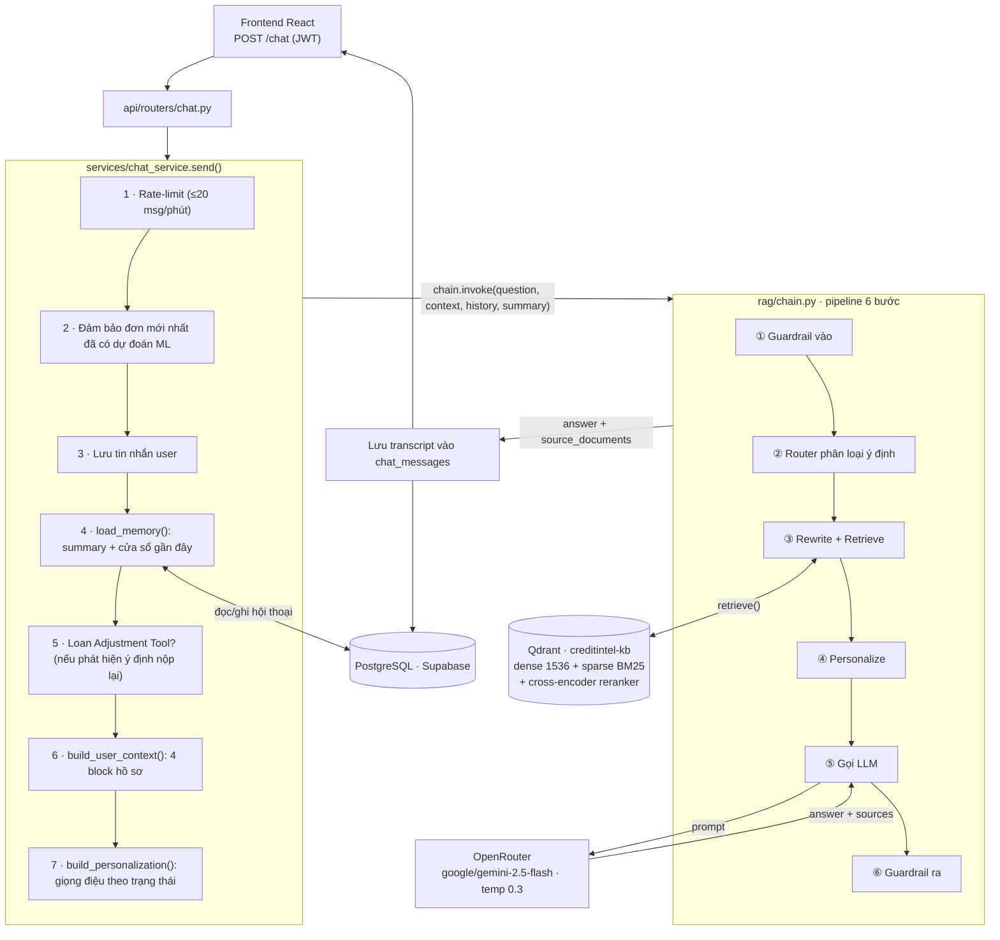

# CHƯƠNG V. RAG VÀ TRỢ LÝ AI TÍN DỤNG

---

## 5.1 Giới thiệu RAG trong hệ thống

Sau khi mô hình học máy đưa ra xác suất vỡ nợ và phân loại rủi ro (Chương IV), khách hàng vẫn đối diện một khoảng cách nhận thức: con số `P(default) = 0.30` hay trạng thái `AUTO_REJECTED` tự thân không giải thích được **vì sao** hồ sơ bị đánh giá như vậy, và **làm gì** để cải thiện. CreditIntel giải quyết khoảng cách này bằng một **trợ lý hội thoại** đặt trên kiến trúc **RAG (Retrieval-Augmented Generation)**.

RAG là kỹ thuật ghép một mô hình ngôn ngữ lớn (LLM) với một kho tri thức bên ngoài: thay vì để LLM trả lời hoàn toàn dựa trên tham số huấn luyện sẵn có, vốn dễ sinh ra hiện tượng "bịa" thông tin (hallucination), hệ thống truy xuất các đoạn tài liệu liên quan rồi nạp chúng vào prompt như bằng chứng để LLM căn cứ vào đó mà sinh câu trả lời. Với một sản phẩm tài chính, đây không phải một lựa chọn tùy nghi mà là yêu cầu bắt buộc, xuất phát từ ba lý do gắn bó chặt với nhau. Lý do đầu tiên là tính trung thực và truy nguồn (grounding và citation): mọi phát ngôn về chính sách, từ hạn mức tới ngưỡng rủi ro hay quy trình xét duyệt, đều phải bắt nguồn từ tài liệu chính thức `policy.md` và `faq.md` cùng trích dẫn rõ nguồn, tuyệt đối không để LLM tự sáng tác chính sách. Lý do thứ hai là cá nhân hóa theo hồ sơ thật: trợ lý phải trả lời dựa trên đúng đơn vay của khách hàng đang đăng nhập với số tiền, DTI, điểm tín dụng và kết quả ML cụ thể, chứ không phải đưa ra lời khuyên tài chính chung chung. Lý do thứ ba là an toàn và ranh giới: trợ lý không bao giờ được hứa duyệt vay, không được rò rỉ dữ liệu của khách hàng khác hay cấu trúc nội bộ của hệ thống, và phải từ chối một cách lịch sự những câu hỏi nằm ngoài phạm vi.

Khác với một chatbot FAQ thông thường, trợ lý CreditIntel là một **RAG có trạng thái, có công cụ (tool-augmented) và có ý thức bảo mật**: nó nhớ hội thoại, hiểu ý định người dùng, có thể tự mô phỏng phương án nộp lại đơn vay, và được bao bọc bởi hai lớp guardrail vào/ra. Toàn bộ mã nguồn nằm trong gói `backend/rag/` (pipeline) và `backend/services/chat_service.py` (điều phối).

---

## 5.2 Cơ sở lý thuyết

Trước khi đi vào kiến trúc cụ thể, mục này trình bày năm khái niệm nền tảng mà hệ thống sử dụng.

### 5.2.1 RAG (Retrieval-Augmented Generation)

Một lượt RAG kinh điển gồm hai pha. **Pha Indexing (offline):** tài liệu được cắt thành các đoạn (chunk), mã hóa thành vector và lưu vào cơ sở dữ liệu vector. **Pha Querying (online):** câu hỏi của người dùng cũng được mã hóa thành vector, hệ thống tìm các chunk gần nhất về mặt ngữ nghĩa, rồi đưa chúng cùng câu hỏi vào prompt của LLM. Công thức tổng quát:

```
answer = LLM( prompt(question, retrieve(question, knowledge_base)) )
```

Giá trị cốt lõi nằm ở chỗ tri thức được **tách rời** khỏi trọng số mô hình: cập nhật chính sách chỉ cần sửa file Markdown và chạy lại ingest, không cần huấn luyện lại LLM.

### 5.2.2 Embedding

Embedding là phép ánh xạ một đoạn văn bản thành một vector số thực nhiều chiều, sao cho hai đoạn văn có ngữ nghĩa gần nhau thì vector của chúng gần nhau (theo độ đo cosine). CreditIntel dùng model `openai/text-embedding-3-small` qua OpenRouter, sinh ra vector **1536 chiều** (xem `sparse_vectors_config`/`VectorParams(size=1536)` trong `ingest.py`). Độ đo khoảng cách được cấu hình là **Cosine** (`models.Distance.COSINE`).

### 5.2.3 Hybrid Search (Tìm kiếm lai)

Tìm kiếm thuần ngữ nghĩa (dense vector) giỏi nắm bắt ý nghĩa nhưng đôi khi bỏ sót các **từ khóa chính xác** (mã trạng thái `AUTO_REJECTED`, con số `40%`, thuật ngữ `DTI`). Ngược lại, tìm kiếm từ khóa cổ điển **BM25** (sparse vector) bắt chính xác từ khóa nhưng mù ngữ nghĩa. **Hybrid Search** kết hợp cả hai: mỗi điểm dữ liệu trong Qdrant mang **hai vector có tên**, `dense` (embedding ngữ nghĩa) và `sparse` (BM25, model `Qdrant/bm25`), và kết quả được hợp nhất. Hệ thống bật chế độ `RetrievalMode.HYBRID`; nếu thư viện BM25 không nạp được, nó tự hạ cấp an toàn về `RetrievalMode.DENSE` (xem `retriever.py`).

### 5.2.4 Reranking (Xếp hạng lại)

Truy xuất hybrid trả về một tập **ứng viên rộng** (20 chunk) được xếp hạng bằng độ tương đồng vector, vốn chỉ là xấp xỉ. **Reranker** là một mô hình **cross-encoder**: thay vì mã hóa câu hỏi và tài liệu độc lập rồi so vector, nó đưa **cặp (câu hỏi, tài liệu) vào cùng một lần forward** để chấm điểm liên quan chính xác hơn nhiều. CreditIntel dùng `jinaai/jina-reranker-v2-base-multilingual` (đa ngôn ngữ, hỗ trợ tiếng Việt) để xếp hạng lại 20 ứng viên và giữ 12 chunk tốt nhất. Đây là sự đánh đổi **độ chính xác lấy độ trễ**: cross-encoder chạy trên CPU mất khoảng **3–10 giây** (warm cache), nên hệ thống cho phép tắt qua cấu hình để A/B.

### 5.2.5 Chunking và bài toán Parent-Child

Cắt tài liệu là một đánh đổi kinh điển giữa độ chính xác truy xuất và độ giàu ngữ cảnh. Khi cắt thành các đoạn nhỏ, embedding trở nên đậm đặc về ngữ nghĩa nên truy xuất rất chính xác, nhưng bản thân đoạn lại thiếu ngữ cảnh khi đưa cho LLM. Ngược lại, khi cắt thành các đoạn lớn, đoạn văn giàu ngữ cảnh cho LLM nhưng embedding bị loãng, khiến việc truy xuất kém nhạy. Hai mục tiêu này kéo về hai hướng đối nghịch, và đó chính là bài toán mà kỹ thuật parent-child sinh ra để giải.

**Parent-Child Chunking** hóa giải mâu thuẫn này: tài liệu được cắt thành các đoạn lớn (**parent**) giàu ngữ cảnh, rồi mỗi parent lại cắt tiếp thành các đoạn nhỏ (**child**). Hệ thống **đánh chỉ mục và tìm kiếm trên child** (chính xác), nhưng **trả về parent** cho LLM (đầy đủ ngữ cảnh). Đây là kỹ thuật trung tâm của giai đoạn ingest, trình bày chi tiết ở mục 5.5.

---

## 5.3 Kiến trúc tổng quan

Trợ lý RAG được tổ chức thành hai mặt phẳng rõ ràng: **mặt phẳng điều phối** (`services/chat_service.py`, quản lý phiên, rate-limit, bộ nhớ, công cụ, lưu transcript) và **mặt phẳng suy luận RAG** (`rag/chain.py`, pipeline 6 bước thuần túy, không chạm cơ sở dữ liệu). Sự tách bạch này giữ cho lõi RAG kiểm thử được độc lập, còn mọi phụ thuộc ORM/HTTP nằm ở tầng service.

### Sơ đồ luồng tổng thể

```
┌──────────────────────────────────────────────────────────────────────────────┐
│                     CREDITINTEL, RAG CHAT ARCHITECTURE                        │
├──────────────────────────────────────────────────────────────────────────────┤
│                                                                                │
│   Frontend (React)                                                             │
│   POST /chat  ──JWT──►  api/routers/chat.py                                    │
│                              │                                                  │
│                              ▼                                                  │
│        ┌──────────────────────────────────────────────────────────┐           │
│        │           services/chat_service.send()                    │           │
│        │  1. Rate-limit (≤20 msg/phút)                             │           │
│        │  2. Đảm bảo đơn mới nhất ĐÃ có dự đoán ML                 │           │
│        │  3. Lưu tin nhắn user (trước khi gọi RAG)                  │           │
│        │  4. load_memory()  ── summary + cửa sổ gần đây ◄── Postgres│           │
│        │  5. Loan Adjustment Tool? (nếu phát hiện ý định nộp lại)   │           │
│        │  6. build_user_context()  ── 4 block hồ sơ                │           │
│        │  7. build_personalization()  ── giọng điệu theo trạng thái│           │
│        └───────────────────────────────┬──────────────────────────┘           │
│                                         │ chain.invoke(question, context,      │
│                                         │              history, summary)        │
│                                         ▼                                        │
│        ┌──────────────────────────────────────────────────────────┐           │
│        │              rag/chain.py ,  PIPELINE 6 BƯỚC             │           │
│        │  ① Guardrail vào   ② Router intent   ③ Rewrite+Retrieve    │           │
│        │  ④ Personalize     ⑤ LLM call        ⑥ Guardrail ra        │           │
│        └─────────┬──────────────────────────────────┬─────────────┘           │
│                  │ retrieve()                        │ LLM                       │
│                  ▼                                   ▼                           │
│   ┌──────────────────────────────┐     ┌──────────────────────────────┐       │
│   │  Qdrant  (creditintel-kb)    │     │  OpenRouter                   │       │
│   │  dense(1536) + sparse(BM25)  │     │  google/gemini-2.5-flash      │       │
│   │  + Cross-Encoder Reranker    │     │  (temperature 0.3)            │       │
│   └──────────────────────────────┘     └──────────────────────────────┘       │
│                                         │                                        │
│                                         ▼ answer + sources                       │
│        ┌──────────────────────────────────────────────────────────┐           │
│        │  Lưu transcript (chat_messages) ◄── PostgreSQL            │           │
│        └──────────────────────────────────────────────────────────┘           │
└──────────────────────────────────────────────────────────────────────────────┘
```

Phiên bản sơ đồ dưới đây được viết bằng **Mermaid**, có thể render thành hình ảnh chất lượng cao (PNG/SVG) để chèn vào báo cáo qua [mermaid.live](https://mermaid.live), tiện ích Markdown của VS Code, hay plugin Mermaid trong Google Docs/Word:



### Các thành phần được cache theo Singleton

Mọi tài nguyên đắt đỏ (kết nối LLM, embedding, vector store, reranker) được khởi tạo **một lần** và tái sử dụng bằng mẫu **double-checked locking** (xem mục 5.7.3). Cụ thể:

| Thành phần | File | Đối tượng cache |
|---|---|---|
| LCEL chain (`prompt \| llm \| parser`) | `chain.py` | `_chain` |
| Retriever (embeddings + Qdrant + reranker) | `retriever.py` | `_retriever` |
| Intent classifier LLM | `router.py` | `_classifier_llm` |
| Query-rewrite LLM | `query_rewriter.py` | `_rewrite_llm` |
| Summary LLM | `memory.py` | `_summary_llm` |
| Reranker (cross-encoder) | `reranker.py` | `_singleton` |

### Các tham số vận hành (từ `core/config.py`)

| Tham số | Giá trị mặc định | Ý nghĩa |
|---|---|---|
| `rag_llm_model` | `google/gemini-2.5-flash` | LLM sinh câu trả lời |
| `rag_embedding_model` | `openai/text-embedding-3-small` | Embedding dense (1536-dim) |
| `rag_bm25_model` | `Qdrant/bm25` | Sparse embedding (hybrid) |
| `rag_reranker_model` | `jinaai/jina-reranker-v2-base-multilingual` | Cross-encoder rerank |
| `rag_reranker_enabled` | `True` | Bật/tắt rerank (A/B) |
| `rag_reranker_candidate_k` | `20` | Số ứng viên kéo từ Qdrant |
| `rag_reranker_top_k` | `12` | Số child giữ lại sau rerank |
| `rag_top_k` | `4` | Số **parent** cuối cùng đưa vào LLM |
| `rag_memory_window_token_budget` | `2000` | Ngân sách token cho cửa sổ hội thoại gần đây |
| `rag_memory_summary_max_tokens` | `500` | Độ dài tối đa bản tóm tắt |
| `rag_memory_min_messages_to_summarize` | `6` | Ngưỡng kích hoạt tóm tắt |
| `qdrant_collection` | `creditintel-kb` | Tên collection Qdrant |

---

## 5.4 Nguồn tri thức: ba dòng ngữ cảnh

Một đặc điểm kiến trúc quan trọng của CreditIntel là prompt cuối cùng được lắp ghép từ **ba nguồn tri thức độc lập**, mỗi nguồn trả lời một loại câu hỏi khác nhau. Việc tách bạch này được phản ánh trực tiếp trong template prompt (`prompts.py`) với các khối được phân cách rõ ràng.

### 5.4.1 Knowledge Base: tri thức chính sách (tĩnh, dùng chung)

Đây là kho tri thức được vector hóa trong Qdrant và là nguồn cho khối `TÀI LIỆU LIÊN QUAN` trong prompt. Kho hiện gồm ba tài liệu. Tệp `backend/rag/knowledge/policy.md` chứa chính sách xét duyệt, bao quát phạm vi khoản vay từ 500 tới 150.000 đô-la với các kỳ hạn 12, 24, 36, 48 và 60 tháng, ba mức rủi ro, cùng quy trình hai giai đoạn từ AI tới admin. Tệp `backend/rag/knowledge/faq.md` tập hợp các câu hỏi thường gặp được nhóm theo chủ đề như mô hình AI, trạng thái `AUTO_REJECTED` và blacklist CIC, chỉ số DTI hay quy trình xử lý đơn. Cuối cùng, thư mục `docs/data_dictionary/` (hiện chỉ có một tệp `kaggle_overview.md` và để ngỏ cho việc bổ sung) cung cấp từ điển đặc trưng, giúp trợ lý giải thích các thuật ngữ dữ liệu khi cần.

Loader (`ingest.load_documents`) quét đệ quy hai thư mục `knowledge/` và `docs/data_dictionary/` theo glob `**/*.md`. Tri thức này **chung cho mọi khách hàng** và chỉ thay đổi khi ta sửa tài liệu rồi chạy lại ingest.

### 5.4.2 User Context: hồ sơ cá nhân (động, theo từng khách hàng)

Đây là nguồn làm nên tính "cá nhân hóa" và là **ưu tiên cao nhất** khi trả lời câu hỏi về đơn vay của chính khách hàng. Module `context_builder.py` lấy đơn vay **gần nhất** của user và dựng **bốn khối ngữ cảnh** (theo `docs/rag/rag_ml_context_requirements.md`):

| Khối | Nội dung | Nguồn |
|---|---|---|
| **Form context** | Trạng thái đơn, số tiền, kỳ hạn, thu nhập, DTI, điểm tín dụng, việc làm, sở hữu nhà, dữ liệu CIC, nhân khẩu học | Trường của `LoanApplication` |
| **ML context** | `default_probability`, `risk_level`, `risk_score` (= (1−p)×100, **càng cao càng an toàn**), hạn mức & kỳ hạn đề xuất, `model_version` | Kết quả suy luận ML |
| **Advisory context** | **Suy diễn tại chỗ:** so sánh số tiền/kỳ hạn vs đề xuất, dải DTI, dải điểm tín dụng, tối đa 4 yếu tố rủi ro, tối đa 4 điểm tích cực, danh sách khuyến nghị hành động | Tính toán từ form + ML |
| **Data quality** | Số trường bị hệ thống mặc định (`imputed_features`) → mức tin cậy cao/trung bình/thấp + ghi chú giọng điệu | `imputed_features` |

Điểm tinh tế là **khối Advisory được sinh bằng luật xác định (deterministic), không phải bằng LLM**. Ví dụ, DTI được phân dải qua bảng tra `_DTI_BANDS` (Tốt < 30%, Cần chú ý 30–43%, Rủi ro cao > 43%); yếu tố rủi ro/tích cực được suy ra bằng các điều kiện rõ ràng (`if dti > 0.43`, `if cs >= 740`…). Nhờ vậy, LLM nhận được **một bản phân tích đã chuẩn hóa** thay vì phải tự suy luận từ số thô, giảm mạnh nguy cơ tính sai hoặc bịa.

> **Quyết định thiết kế: vì sao tách Advisory thành luật cứng.** Nếu để LLM tự tính "DTI 45% là cao hay thấp", nó có thể trả lời thiếu nhất quán giữa các lượt. Bằng cách tính sẵn dải và yếu tố rủi ro ở tầng Python, hệ thống đảm bảo mọi câu trả lời đều dựa trên **cùng một bộ ngưỡng nghiệp vụ**, đồng thời cho phép kiểm thử khối context độc lập với LLM.

### 5.4.3 Chat Memory: bộ nhớ hội thoại (động, theo phiên)

Nguồn thứ ba là lịch sử hội thoại, cho khối `TÓM TẮT HỘI THOẠI TRƯỚC ĐÓ` và placeholder `chat_history`. Module `memory.py` triển khai chiến lược **cửa sổ trượt + đệm tóm tắt lười** (sliding window + lazy summary buffer), trình bày chi tiết ở mục 5.7.1.

### 5.4.4 Lắp ghép prompt cuối cùng

Bảy biến được bơm vào `SYSTEM_TEMPLATE` (`prompts.py`): tên khách hàng, hướng dẫn giọng điệu, hướng dẫn theo ý định, hồ sơ khách hàng (User Context), tóm tắt hội thoại, và tài liệu liên quan (Knowledge Base). Quy tắc số 7 trong system prompt nêu rõ thứ tự ưu tiên: *"Với câu hỏi cá nhân, LUÔN ưu tiên THÔNG TIN HỒ SƠ KHÁCH HÀNG. TÀI LIỆU LIÊN QUAN chỉ là bổ trợ chính sách."* Đây chính là cơ chế hòa giải khi hai nguồn tri thức có thể mâu thuẫn.

---

## 5.5 Giai đoạn Ingest: Parent-Child Chunking

Giai đoạn ingest (`rag/chunking.py` + `rag/ingest.py`) biến các file Markdown thành các điểm dữ liệu trong Qdrant. Toàn bộ quá trình **xác định (deterministic)**: không gọi LLM, không gọi embedding trong lúc cắt chunk, chỉ phân tích cấu trúc Markdown bằng regex. Điều này khiến kết quả chunk tái lập được và kiểm thử được.

### 5.5.1 Cắt cấu trúc-aware thành Parent

Hằng số cắt (đầu `chunking.py`):

```python
PARENT_MAX_CHARS = 3500
CHILD_MAX_CHARS  = 700
CHILD_OVERLAP_CHARS = 80
```

Hàm `_split_markdown_into_parent_sections` cắt theo cấu trúc tài liệu chứ không cắt mù theo độ dài, và cách cắt thay đổi tùy loại tài liệu. Với tài liệu FAQ (khi `source_type == "faq"`), mỗi mục hỏi-đáp đánh dấu bằng `**Q: ...**` trở thành một parent riêng, bởi đúng một cặp hỏi-đáp vốn đã là một đơn vị ngữ nghĩa trọn vẹn. Với tài liệu thường, thuật toán ưu tiên cắt theo tiêu đề cấp hai (`## H2`), giữ phần mở đầu trước H2 đầu tiên làm một parent mang tên tài liệu; nếu tài liệu không có H2 thì lùi về cắt theo H1, và nếu không có tiêu đề nào thì cả tài liệu được coi là một parent duy nhất. Trong mọi trường hợp, parent nào vượt quá ngưỡng `PARENT_MAX_CHARS` sẽ được cắt tiếp bằng `_split_long_parent` theo lối đóng gói từng block và không chồng lấn.

Mỗi parent nhận một định danh ổn định:

```python
def _stable_parent_id(source, section_title, parent_index, section_part_index, parent_content):
    raw = f"{source}|{section_title}|{parent_index}|{section_part_index}|{parent_content[:200]}"
    return hashlib.sha1(raw.encode("utf-8")).hexdigest()[:16]
```

`parent_id` là **SHA1 (16 ký tự đầu)** của tổ hợp nguồn + tiêu đề + vị trí + 200 ký tự đầu nội dung. Định danh này dùng để **gom nhóm child về parent** ở runtime (mục 5.6).

### 5.5.2 Cắt Parent thành Child

Mỗi parent được cắt tiếp thành các child ≤ 700 ký tự với chồng lấn 80 ký tự (`_split_parent_into_child_texts` → `_pack_blocks`). Thuật toán đóng gói theo **block Markdown** (tách theo dòng trống): gộp các block liền nhau cho đến khi chạm trần, mới sang chunk mới, và mang theo phần đuôi overlap để không cắt đứt mạch ngữ nghĩa giữa hai child. Điểm mấu chốt: **mỗi child mang theo toàn bộ nội dung parent trong metadata** (`parent_content`), nên ở runtime ta khôi phục được parent mà không cần truy vấn ngược.

### 5.5.3 Metadata và cấu trúc điểm Qdrant

Mỗi child Document mang theo metadata phong phú: `source`, `source_type` (faq/policy/data_dictionary/knowledge_base), `document_title`, `section_title`, `parent_id`, `parent_index`, `chunk_index`, `retrieval_unit="child"`, và `parent_content`. Metadata này phục vụ cả việc hiển thị nguồn trích dẫn lẫn việc tái dựng parent.

Khi upsert (`ingest.upsert_to_qdrant`), collection được tạo với **hai vector có tên** trên mỗi điểm:

```python
client.create_collection(
    collection_name=collection_name,
    vectors_config={"dense": models.VectorParams(size=1536, distance=models.Distance.COSINE)},
    sparse_vectors_config={"sparse": models.SparseVectorParams()},
)
```

> **Lưu ý vận hành (bắt buộc khi nâng cấp):** vì chế độ hybrid yêu cầu **cả** vector `dense` lẫn `sparse` trên mọi điểm, mỗi khi đổi thuật toán chunk hoặc bật hybrid lần đầu, phải chạy lại `python -m rag.ingest --recreate` một lần để dựng lại collection. Collection cũ chỉ có vector dense sẽ lỗi khi truy vấn hybrid.

CLI ingest hỗ trợ ba chế độ: `--dry-run` (liệt kê tài liệu + số chunk, không ghi), mặc định (upsert tăng dần, giữ dữ liệu cũ), và `--recreate` (xóa rồi dựng lại, phá hủy).

---

## 5.6 Giai đoạn Runtime: pipeline sáu bước

Mỗi lượt chat đi qua hàm `chain.invoke()` và được xử lý tuần tự qua sáu bước, trải dài từ khâu kiểm soát đầu vào cho tới khâu hậu kiểm đầu ra. Điều đáng nói không chỉ là trình tự sáu bước ấy, mà là **triết lý vận hành** xuyên suốt toàn bộ pipeline: hệ thống được thiết kế để *suy giảm duyên dáng* (degrade gracefully). Mỗi thành phần phụ trợ, viết lại câu hỏi, truy xuất tài liệu, xếp hạng lại, tóm tắt hội thoại, đều có thể thất bại một cách độc lập mà không kéo sập cả lượt chat. Thay vì ném ra lỗi 500 và để màn hình khách hàng trống trơn, hệ thống vẫn sinh ra một câu trả lời, chỉ là với chất lượng giảm dần tương ứng với thành phần bị hỏng. Người dùng cuối luôn nhận được phản hồi, còn các sự cố kỹ thuật được ghi vào log để bộ phận vận hành theo dõi. Triết lý này không phải một khẩu hiệu trừu tượng; nó thấm vào cách từng bước dưới đây bắt và nuốt ngoại lệ của riêng mình.

Bước thứ nhất là **guardrail đầu vào**. Trước khi tiêu tốn bất kỳ lời gọi LLM nào, vốn vừa chậm vừa tốn phí, tin nhắn của khách hàng được đưa qua hàm `check_input` trong `guardrails.py`, một lớp lọc thuần biểu thức chính quy nên gần như tức thời và miễn phí. Lớp này canh ba loại rủi ro khác nhau. Trước hết là độ dài và tính hợp lệ cơ bản: tin vượt quá ngưỡng `MAX_INPUT_LENGTH` là 2000 ký tự, hoặc rỗng và chỉ gồm khoảng trắng, đều bị chặn ngay với một thông báo tiếng Việt thân thiện. Tiếp đến là phòng chống tấn công tiêm lệnh (prompt injection): khoảng hai mươi mẫu regex phủ cả tiếng Anh lẫn tiếng Việt được dựng sẵn để bắt những thủ đoạn quen thuộc như "ignore previous instructions", "reveal your system prompt", "jailbreak", "DAN mode", cùng các biến thể tiếng Việt như "bỏ qua các hướng dẫn ở trên", "quên mọi thứ" hay "tiết lộ prompt hệ thống của bạn". Sau cùng là chống dò rỉ dữ liệu cá nhân (PII probing): một nhóm mẫu khác chặn các ý đồ moi thông tin của khách hàng khác, chẳng hạn "thông tin của khách hàng khác", "danh sách tất cả user", hay những câu mang dáng dấp truy vấn cơ sở dữ liệu như "select * from". Khi bất kỳ mẫu nào khớp, pipeline dừng lại ngay tại chỗ và trả về một câu từ chối lịch sự kèm cờ `blocked=True`; router và LLM hoàn toàn không được gọi tới. Đây vừa là tầng phòng thủ rẻ nhất, vừa là tầng đầu tiên trong kiến trúc bảo mật nhiều lớp của hệ thống.

Bước thứ hai là **router phân loại ý định**. Câu hỏi vượt qua guardrail sẽ được hàm `classify_intent` xếp vào đúng một trong sáu ý định: hỏi về khoản vay (`loan_inquiry`), giải thích rủi ro (`risk_explanation`), hỏi chính sách (`policy_question`), xin tư vấn cá nhân (`personal_advice`), chào hỏi (`greeting`), và lạc đề (`off_topic`). Router vận hành theo chiến lược hai tầng nhằm cân bằng giữa tốc độ và độ chính xác. Tầng thứ nhất là đường tắt bằng từ khóa: một loạt mẫu regex bắt ngay các lời chào điển hình, các câu hỏi rủi ro mang dấu hiệu cá nhân rõ rệt (ví dụ "xác suất vỡ nợ của tôi", "hệ thống đề xuất tôi vay"), các câu hỏi chính sách đặc trưng (chứa "auto_rejected", "bị từ chối", "admin xét duyệt"), và, chỉ với những tin ngắn dưới 100 ký tự, các câu lạc đề lộ liễu về thời tiết, bóng đá, nấu ăn hay lập trình. Tầng này hoàn toàn xác định, không tốn một xu gọi mạng và trả kết quả tức thì. Chỉ khi không mẫu nào khớp, router mới rơi xuống tầng thứ hai: gọi `gemini-2.5-flash` ở `temperature=0` với `max_tokens=60` và một system prompt yêu cầu trả về đúng một mẩu JSON dạng `{"intent": ..., "confidence": ...}`. Mọi tình huống bất trắc, JSON hỏng, intent trả về không nằm trong tập hợp lệ, timeout hay lỗi mạng, đều được quy về ý định mặc định an toàn là `loan_inquiry`. Kết quả phân loại quyết định bước kế tiếp thông qua hàm `needs_retrieval`: bốn ý định nghiệp vụ cần bằng chứng tài liệu thì sẽ kích hoạt truy xuất, trong khi `greeting` và `off_topic` được cho đi tắt, bỏ qua truy xuất để tiết kiệm độ trễ vì chúng vốn không cần tới kho tri thức.

Bước thứ ba kết hợp **viết lại câu hỏi và truy xuất tài liệu**, và đây là trái tim kỹ thuật của cả pipeline. Vấn đề được giải quyết ở khâu viết lại bắt nguồn từ bản chất hội thoại: một câu hỏi nối tiếp như "thế còn kỳ hạn 60 tháng thì sao?" hoàn toàn vô nghĩa nếu tách khỏi ngữ cảnh để đem đi tìm tài liệu. Module `rewrite_for_retrieval` dùng một LLM ở `temperature=0` để biến câu hỏi phụ thuộc ngữ cảnh ấy thành một câu độc lập, tự đầy đủ, dựa trên bản tóm tắt hội thoại cộng tối đa sáu lượt gần nhất. Khâu này được bao bọc bởi ba lớp an toàn chồng lên nhau: nó chỉ thực sự viết lại khi có ngữ cảnh hội thoại để dựa vào; câu viết lại phải vượt qua bộ làm sạch `_clean_rewrite` để đảm bảo gọn trong một dòng, không quá 500 ký tự và không dính nhãn thừa; và bất kỳ lỗi nào xảy ra cũng khiến hệ thống lặng lẽ quay về dùng câu gốc. Một điểm thiết kế quan trọng cần nhấn mạnh: câu được viết lại chỉ phục vụ việc truy xuất, còn khâu sinh câu trả lời cuối cùng vẫn dùng nguyên văn tin nhắn gốc của khách hàng, nhờ đó tránh được nguy cơ bóp méo ý định người dùng.

Phần truy xuất là nơi ba kỹ thuật đã trình bày ở mục 5.2 hội tụ và lồng vào nhau thành ba lớp đồng tâm:

```
┌─────────────────────────────────────────────────────────────────┐
│  ParentDocumentRetriever  (max_parent_docs = TOP_K = 4)          │
│   └─ RerankedRetriever     (reranker, top_k = 12)               │
│        └─ base_retriever (Qdrant hybrid, k = 20)                 │
└─────────────────────────────────────────────────────────────────┘
```

Lớp trong cùng là truy vấn hybrid trên Qdrant, kéo về hai mươi đoạn con (child) ứng viên bằng cách hợp nhất kết quả của vector dày đặc (dense) và vector thưa BM25. Lớp giữa là `RerankedRetriever`, đưa hai mươi ứng viên ấy qua cross-encoder Jina để chấm lại điểm liên quan theo từng cặp câu-hỏi-tài-liệu, rồi giữ lại mười hai đoạn con điểm cao nhất; nếu reranker gặp sự cố, nó bắt ngoại lệ và trả về mười hai đoạn đầu của tập thô thay vì để khâu xếp hạng làm sập cả quá trình truy xuất, đồng thời tăng một bộ đếm `_rerank_fallback_count` để bộ phận vận hành quan trắc tỷ lệ rơi vào nhánh dự phòng. Lớp ngoài cùng là `ParentDocumentRetriever`, gọi `expand_child_documents_to_parents` để khử trùng lặp theo `parent_id`, lấy lại nội dung đoạn cha từ metadata đã nhúng sẵn, và trả về tối đa bốn đoạn cha. Chính ở đây nguyên lý "tìm kiếm trên đoạn con nhưng trả về đoạn cha" của Parent-Child Chunking được hiện thực hóa: hệ thống tận dụng độ chính xác của embedding đoạn nhỏ để định vị, rồi dâng cho LLM toàn bộ ngữ cảnh giàu có của đoạn lớn.

Bước thứ tư là **cá nhân hóa**. Khác với các bước kia, ngữ cảnh cá nhân hóa không được tính bên trong pipeline mà do tầng điều phối `chat_service` dựng sẵn rồi truyền vào, giữ cho lõi RAG tách bạch khỏi tầng ORM và HTTP. Ngữ cảnh này gồm tên hiển thị của khách hàng và một bộ hướng dẫn giọng điệu thay đổi theo trạng thái đơn vay hiện tại (chi tiết ở mục 5.7). Song song, hàm `get_intent_instructions` bổ sung một lớp hướng dẫn theo ý định đã phân loại ở bước hai; chẳng hạn, với ý định giải thích rủi ro, hướng dẫn yêu cầu LLM diễn đạt "xác suất vỡ nợ ước tính khoảng 35%" thay vì phơi bày con số kỹ thuật khô khan "P(default) = 0.35". Hai lớp hướng dẫn này quyết định giọng điệu và trọng tâm của câu trả lời mà không đụng tới nội dung sự thật.

Bước thứ năm là **gọi LLM sinh câu trả lời**. Toàn bộ ngữ cảnh đã lắp ghép, câu hỏi gốc, hồ sơ khách hàng, tài liệu truy xuất, lịch sử và tóm tắt hội thoại, các hướng dẫn giọng điệu và ý định, được nạp vào chuỗi LCEL `chat_prompt | llm | StrOutputParser()`. Tài liệu trước khi đưa vào prompt được định dạng bởi `_format_documents`, gắn cho mỗi đoạn một tiêu đề trích nguồn dạng `[i] nguồn :: tên tài liệu → tiêu đề mục`, nhờ đó LLM có thể trích dẫn đúng xuất xứ thay vì nói chung chung. LLM chạy ở `temperature=0.3` để cân bằng giữa tính nhất quán và sự tự nhiên trong văn phong, kèm cấu hình `timeout` và `max_retries` lấy từ tệp config. Mọi lỗi quá hạn hay mất kết nối ở khâu này được gói lại thành các ngoại lệ nội bộ `RAGTimeoutError` và `LLMError` để tầng trên xử lý nhất quán.

Bước thứ sáu khép lại pipeline bằng **guardrail đầu ra**. Câu trả lời do LLM sinh ra không được tin tưởng vô điều kiện mà phải qua hàm `check_output` hậu kiểm theo ba mức độ nghiêm khắc khác nhau. Nghiêm khắc nhất là chống rò rỉ thông tin nội bộ: nếu câu trả lời lỡ chứa tên bảng cơ sở dữ liệu như `loan_applications` hay `chat_messages`, một câu lệnh SQL, khóa `openrouter_api_key`, mẫu khóa API dạng `sk-...`, hay metadata model nội bộ, thì toàn bộ câu trả lời bị thay thế cứng bằng một thông báo lỗi an toàn, thà không trả lời còn hơn để lộ ruột gan hệ thống. Mức can thiệp nhẹ hơn dành cho việc hứa hẹn duyệt vay: nếu LLM trót khẳng định kiểu "chắc chắn sẽ được duyệt", hệ thống không xóa câu trả lời mà gắn thêm một dòng disclaimer nhắc rằng quyết định phê duyệt cuối cùng luôn thuộc về bộ phận Admin. Cuối cùng là giới hạn độ dài: câu trả lời vượt `MAX_OUTPUT_LENGTH` là 3000 ký tự sẽ được cắt gọn tại ranh giới câu hoàn chỉnh gần nhất để không bị đứt giữa chừng. Sau khi qua sáu bước, hàm `invoke` trả về một cấu trúc gồm câu trả lời đã làm sạch, danh sách tài liệu nguồn, ý định đã phân loại và câu truy vấn thực sự dùng để tìm kiếm, đủ thông tin cho tầng điều phối lưu transcript và cho giao diện hiển thị nguồn trích dẫn.

---

## 5.7 Kỹ thuật nâng cao

Ba kỹ thuật trình bày trong mục này là những gì nâng trợ lý CreditIntel vượt lên trên một chatbot hỏi-đáp thông thường: bộ nhớ hội thoại cho phép nó nhớ và nối mạch câu chuyện, công cụ điều chỉnh khoản vay cho phép nó hành động thay vì chỉ nói, và mẫu khởi tạo an toàn đa luồng cho phép nó phục vụ nhiều người cùng lúc một cách hiệu quả.

### 5.7.1 Chat Memory: cửa sổ trượt kết hợp đệm tóm tắt lười

Một hội thoại càng kéo dài thì prompt càng phình to và càng tốn token, nhưng cắt cụt lịch sử lại khiến trợ lý quên mất khách hàng vừa nói gì. Hàm `load_memory` trong `memory.py` hóa giải mâu thuẫn này bằng cách kết hợp hai cơ chế bổ sung cho nhau. Cơ chế thứ nhất là cửa sổ trượt theo ngân sách token. Hệ thống lấy toàn bộ tin nhắn của phiên (bỏ qua các tin bị đánh dấu lỗi), rồi để hàm `_split_window` duyệt từ tin mới nhất ngược về quá khứ, cộng dồn chi phí token ước lượng thô theo công thức `len(text) // 4`, cho tới khi chạm trần ngân sách `rag_memory_window_token_budget` là 2000 token. Phần "gần đây" nằm trong cửa sổ ấy được đưa nguyên văn vào biến `chat_history` của prompt. Một chi tiết bảo vệ tinh tế là lượt mới nhất không bao giờ bị loại bỏ, kể cả khi tự thân nó đã vượt ngân sách, để bảo đảm câu vừa hỏi luôn có mặt trong ngữ cảnh.

Cơ chế thứ hai là đệm tóm tắt lười (lazy summary buffer), xử lý phần hội thoại cũ hơn cửa sổ. Thay vì vứt bỏ phần ấy, hệ thống nén nó thành một bản tóm tắt tiếng Việt lưu trong cột `session.summary` của cơ sở dữ liệu. Điều làm cho cơ chế này "lười", và do đó tiết kiệm, là nó chỉ thực sự gọi LLM tóm tắt khi hai điều kiện cùng thỏa: số tin cũ chưa được tóm tắt phải đạt ngưỡng `rag_memory_min_messages_to_summarize` là sáu tin, và bản tóm tắt hiện có phải chưa bao phủ tới tin cũ nhất, được kiểm qua con trỏ `summary_covers_until_id`. Khi cả hai điều kiện thỏa, một LLM riêng (chạy ở `temperature=0.2`, giới hạn `max_tokens=500`) được gọi để hợp nhất bản tóm tắt cũ với các lượt mới thành một bản tóm tắt bao trùm. Việc ghi bản tóm tắt mới được thực hiện có giao dịch: nếu lệnh commit thất bại, toàn bộ trạng thái tóm tắt, nội dung, con trỏ bao phủ và mốc thời gian, được khôi phục về giá trị cũ.

> **Quyết định thiết kế: vì sao tóm tắt "lười" thay vì tóm tắt mỗi lượt.** Nếu tóm tắt sau mỗi tin nhắn, hệ thống sẽ phải trả thêm một lời gọi LLM cho từng lượt chat, vừa chậm vừa đắt. Bằng cách chờ tích lũy đủ sáu tin cũ và chỉ tóm tắt khi bản tóm tắt hiện tại đã "lỗi thời", hệ thống cắt bỏ phần lớn chi phí ấy mà vẫn giữ được ngữ cảnh dài hạn. Và đúng theo triết lý suy giảm duyên dáng, khi việc tóm tắt thất bại thì lượt chat không hề sập: hệ thống chỉ giữ lại bản tóm tắt cũ và ghi một dòng log cảnh báo.

### 5.7.2 Loan Adjustment Tool: RAG mang khả năng hành động

Tính năng điều chỉnh khoản vay là bước nhảy biến trợ lý từ một cỗ máy trả lời thành một tác nhân có khả năng hành động thực sự. Khi một đơn vay rơi vào trạng thái `AUTO_REJECTED`, thay vì chỉ giải thích vì sao bị từ chối, trợ lý có thể tự mô phỏng các phương án khả thi và nộp lại đơn thay cho khách hàng. Phần logic cốt lõi nằm ở `services/loan_adjustment_tool.py` và được điều phối bởi `chat_service.py`.

Quá trình bắt đầu từ việc phát hiện ý định. Hàm `_is_loan_adjustment_request` dùng một bộ luật từ khóa tiếng Việt, bao gồm cả các biến thể không dấu, để nhận ra những yêu cầu kiểu "đề xuất gói vay phù hợp", "nộp lại đơn" hay "đổi kỳ hạn nào để được duyệt". Một chi tiết đáng chú ý là tập từ khóa này còn cố tình bao gồm chính những cụm mà trợ lý tự gợi ý làm nút trả lời nhanh, chẳng hạn "gói vay phù hợp" hay "đề xuất phương án", để khép kín vòng lặp tương tác người-máy: khách chỉ cần bấm vào gợi ý của AI là kích hoạt được công cụ.

Khi ý định đã được xác nhận, hàm `find_best_reapplication_option` tìm phương án tối ưu bằng cách lần lượt thử hai chiến lược theo thứ tự ưu tiên trên chính đơn đã bị từ chối. Chiến lược đầu tiên là kéo dài kỳ hạn: giữ nguyên số tiền vay và thử các kỳ hạn dài hơn trong tập {12, 24, 36, 48, 60} tháng, vì kỳ hạn dài hơn làm giảm áp lực trả nợ hằng tháng. Nếu cách đó vẫn chưa đủ, chiến lược thứ hai là giảm số tiền: cố định ở kỳ hạn tối đa sáu mươi tháng rồi lần lượt thử hạn mức mà hệ thống đề xuất, các mốc 75%, 50%, 25% của số tiền ban đầu, và cuối cùng là mức sàn 500 đô-la. Điểm mấu chốt về độ tin cậy là mỗi ứng viên sinh ra đều được đưa trở lại đúng mô hình ML production qua `ml_service.predict` để lấy xác suất vỡ nợ thực, chứ không phải một con số phỏng đoán. Một ứng viên chỉ được coi là đạt khi xác suất vỡ nợ của nó nằm dưới ngưỡng `AUTO_REVIEW_THRESHOLD` là 0.4 và đồng thời vượt qua được bộ kiểm tra `validate_confirmed_values`. Công cụ trả về tối đa ba phương án đã xếp hạng; trong trường hợp không ứng viên nào lọt xuống dưới ngưỡng, nó chuyển sang trạng thái `fallback_proposal`, trình bày ba biểu mẫu tốt nhất quan sát được kèm cảnh báo minh bạch rằng chúng vẫn cần admin duyệt thủ công.

Các phương án tìm được sau đó được tiêm vào ngữ cảnh của LLM thông qua `_format_loan_adjustment_context`, vốn gắn một khối "PHƯƠNG ÁN ĐỀ XUẤT TỪ HỆ THỐNG" vào User Context kèm một chỉ dẫn quan trọng dặn LLM trình bày các phương án như sự thật đã được tính sẵn, đồng thời hướng dẫn khách nhắn "Đồng ý" hoặc "Xác nhận" để nộp, hay "Hủy" để bỏ. Quy tắc số 9 trong system prompt cấm tuyệt đối việc LLM giả vờ "đang chạy tính toán nền", bởi mọi phương án phải có sẵn ngay trong lượt hiện tại. Toàn bộ thao tác nộp lại được bảo vệ bằng một vòng xác nhận có trạng thái: phương án được lưu vào `session.pending_action` với thời gian sống ba mươi phút theo hằng số `PENDING_ACTION_TTL_MINUTES`. Ở lượt kế tiếp, hàm `_handle_pending_loan_adjustment_response` đọc câu trả lời của khách; nếu là phủ định thì hủy bỏ, còn nếu là khẳng định thì `_confirm_pending_loan_adjustment` gọi `application_service.confirm` để tạo một đơn vay hoàn toàn mới, chỉ thay đổi số tiền và kỳ hạn, giữ nguyên mọi số liệu còn lại, rồi báo lại mã đơn mới cùng xác suất vỡ nợ tương ứng. Hồ sơ bị từ chối cũ tuyệt đối không bao giờ bị sửa đổi, bảo toàn tính toàn vẹn của lịch sử.

> **Quyết định thiết kế: vì sao công cụ phải gọi lại đúng mô hình ML.** Một cách làm cẩu thả là để LLM tự đoán kỳ hạn nào sẽ được duyệt, nhưng đó chính là mảnh đất màu mỡ cho ảo giác và những lời hứa sai. Thay vào đó, công cụ chạy vét cạn các phương án qua chính mô hình đang vận hành trong production, rồi chỉ trình bày những phương án đã được kiểm chứng nằm dưới ngưỡng 0.4. Trong kiến trúc này, LLM bị giới hạn ở vai trò người diễn giải kết quả, còn quyền ra quyết định tín dụng vẫn nằm trọn trong tay mô hình và bộ luật nghiệp vụ.

### 5.7.3 Singleton và an toàn đa luồng

Backend FastAPI phục vụ nhiều request đồng thời trên nhiều luồng, trong khi việc khởi tạo các client LLM, embedding hay Qdrant, và đặc biệt là nạp mô hình reranker nặng khoảng 1,1 GB, vừa tốn kém vừa tuyệt đối không được phép chạy lặp giữa các luồng. Để giải quyết, mọi tài nguyên dùng chung đều được khởi tạo theo mẫu khóa kiểm tra hai lần (double-checked locking):

```python
_chain_lock = Lock()
_chain = None

def get_chain():
    global _chain
    if _chain is None:                 # kiểm tra 1 (không khóa, nhanh)
        with _chain_lock:              # chỉ khóa khi cần khởi tạo
            if _chain is None:         # kiểm tra 2 (trong khóa, an toàn)
                _chain = chat_prompt | llm | StrOutputParser()
    return _chain
```

Kiểm tra ngoài khóa cho **đường nóng** (đã khởi tạo) chạy không tranh chấp; khóa chỉ chặn ở lần đầu, và kiểm tra lần hai bên trong khóa đảm bảo **đúng một** luồng khởi tạo. Mẫu này lặp lại ở `get_retriever`, `_get_classifier_llm`. Reranker đi xa hơn với **lazy loading**: `Reranker._ensure_loaded` chỉ thực sự nạp `TextCrossEncoder` ở lần `rerank` đầu tiên, nên nếu rerank bị tắt qua config, mô hình 1.1 GB không bao giờ được tải.

---

## 5.8 Đánh giá chất lượng

Đánh giá một hệ thống RAG là việc khó, bởi đầu ra của nó là văn bản tự do, không có một đáp án duy nhất để so khớp tuyệt đối như bài toán phân loại. Người ta thường viện tới một LLM khác để chấm điểm, nhưng cách ấy vừa đắt, vừa chậm, vừa thiếu tái lập vì bản thân LLM chấm điểm cũng ngẫu nhiên. CreditIntel chọn một hướng đi khác: xây một khung đánh giá hoàn toàn xác định, không cần LLM chấm điểm, gồm ba module `eval_metrics.py`, `eval_runner.py` và `eval_dataset.py`. Khung này chạy nhanh, cho kết quả lặp lại được giữa các lần chạy, và quan trọng là đủ nhẹ để nhúng vào quy trình tích hợp liên tục (CI) như một cổng chặn chất lượng.

Nền tảng của khung là bộ dữ liệu đánh giá lưu trong một tệp JSON do `eval_dataset.py` quản lý, với ràng buộc cứng là phải có từ ba mươi tới năm mươi case. Mỗi case mô tả đầy đủ một tình huống kiểm thử: câu hỏi đầu vào, đáp án tham chiếu (`ground_truth`), danh sách nguồn tài liệu kỳ vọng (`expected_sources`), các thuật ngữ kỳ vọng xuất hiện trong ngữ cảnh truy xuất (`expected_context_terms`), những cụm bắt buộc phải có trong câu trả lời (`must_include`), những cụm cấm tuyệt đối (`must_not_include`), và một nhãn nhóm chủ đề (`group`) như `policy`, `faq`, `guardrail`, `edge_case` hay `personalized`. Bộ nạp dữ liệu sẽ từ chối thẳng những dataset thiếu trường bắt buộc hoặc có `id` trùng lặp, bảo đảm tính toàn vẹn ngay từ đầu vào.

Trên nền dữ liệu ấy, khung tính ba chỉ số. Chỉ số đầu tiên là độ trung thực (Faithfulness), đo xem câu trả lời có thực sự chứa các ý bắt buộc và các ý đó có cơ sở trong ngữ cảnh truy xuất hay hồ sơ khách hàng hay không; cụ thể nó được tính bằng `0.7 × độ phủ + 0.3 × tỷ lệ có cơ sở`, rồi trừ đi `0.25` cho mỗi cụm cấm lỡ xuất hiện, nhờ vậy một câu trả lời nói đúng ý nhưng bịa thêm điều cấm vẫn bị phạt nặng. Chỉ số thứ hai là độ chính xác ngữ cảnh (Context Precision), bằng tỷ lệ giữa số đoạn truy xuất thực sự liên quan tới nguồn hoặc thuật ngữ kỳ vọng trên tổng số đoạn trả về, nói cách khác là đo độ "sạch" của khâu truy xuất. Chỉ số thứ ba là điểm tổng hợp (Overall) của mỗi case, được tính bằng `0.6 × Faithfulness + 0.4 × Context Precision`. Một câu trả lời được coi là đạt khi điểm tổng hợp của nó không thấp hơn ngưỡng `PASS_THRESHOLD` là 0.75. Toàn bộ việc khớp cụm từ đều đi qua hàm `normalize_text` để chuẩn hóa dấu câu, hạ chữ thường và gộp khoảng trắng, đồng thời hỗ trợ cú pháp biến thể kiểu "phương án A | phương án B" nhằm bám sát sự đa dạng cách diễn đạt của tiếng Việt.

Cần thẳng thắn về một giới hạn của khung: nó nghiêng hẳn về phía precision và grounding, còn thành phần recall, tức khả năng truy hồi đủ thông tin liên quan, chỉ hiện diện một cách gián tiếp qua chỉ số độ phủ bên trong Faithfulness. Lý do là độ phủ chỉ có thể đạt cao khi khâu truy xuất đã kéo về đủ tài liệu cần thiết để câu trả lời nhắc tới các ý bắt buộc; nhưng đây là một phép đo recall vòng vo chứ không phải recall đúng nghĩa với nhãn "đoạn vàng". Hệ quả và hướng khắc phục của điểm này được bàn kỹ hơn ở mục 5.8.1 và 5.9.

Cuối cùng, khung được trang bị cơ chế phát hiện hồi quy để dùng trong CI. Hàm `diff_results` so sánh kết quả hiện tại với một baseline theo từng `id` case. Một case bị đánh dấu hồi quy nếu điểm của nó tụt quá ngưỡng `CASE_REGRESSION_DELTA` là −0.15, hoặc nếu nó rơi từ trạng thái đạt xuống không đạt; còn cả một lần chạy bị coi là hồi quy khi điểm trung bình toàn cục tụt quá ngưỡng `RUN_REGRESSION_DELTA` là −0.05. Khi runner được gọi với cờ `--fail-on-regression`, nó sẽ trả về mã thoát khác không trong trường hợp phát hiện hồi quy, cho phép tự động chặn một lần merge nếu thay đổi nào đó, sửa prompt, đổi thuật toán chunk, hay chỉnh ngưỡng rerank, vô tình làm giảm chất lượng.

### 5.8.1 Kết quả thực nghiệm (run 02/06/2026)

Bộ eval **31 case** được chạy lại trên **pipeline hiện hành** (hybrid + cross-encoder rerank `k=20→12`, `top_k=4` parent, LLM `gemini-2.5-flash` `temperature=0.3`), trên collection `creditintel-kb` (75 điểm child ứng với phiên bản KB hiện tại gồm 3 tài liệu, đủ cả vector `dense` lẫn `sparse`). Không case nào lỗi gọi hàm. Kết quả tổng hợp:

| Chỉ số (toàn bộ 31 case) | Giá trị |
|---|---|
| Faithfulness trung bình | **0.850** |
| Context Precision trung bình | **0.774** |
| **Overall trung bình** | **0.819** |
| Số case đạt (`overall ≥ 0.75`) | 23/31 |

Tách theo nhóm chủ đề cho thấy chất lượng phân bố rất không đều, và làm lộ rõ một **artifact của thước đo** chứ không phải lỗi pipeline:

| Nhóm | n | Faithfulness | Context Precision | Overall |
|---|---|---|---|---|
| `policy` | 5 | 0.953 | 0.950 | **0.952** |
| `faq` | 10 | 0.930 | 0.975 | **0.948** |
| `guardrail` | 6 | 0.692 | 1.000 | **0.815** |
| `edge_case` | 5 | 0.787 | 0.700 | **0.752** |
| `personalized` | 5 | 0.837 | **0.000** | **0.502** |

**Đọc kết quả, điểm mấu chốt về nhóm `personalized`.** Năm case `personalized` "rớt" (`overall ≈ 0.50`) **không phải vì câu trả lời sai**, mà vì câu trả lời cá nhân hóa lấy cơ sở (grounding) từ **User Context**, bốn khối hồ sơ tính sẵn bằng luật cứng (mục 5.4.2), *chứ không từ tài liệu KB truy xuất*. Trong khi đó `Context Precision` chỉ chấm độ sạch của **tài liệu KB trả về**; với câu hỏi cá nhân, retrieval thường không (và không cần) trả về doc KB nào, nên precision = 0 *theo thiết kế*. Faithfulness của nhóm này vẫn cao (0.837), xác nhận nội dung trả lời vẫn đúng. **Nếu loại bỏ artifact này** (bỏ nhóm `personalized` khỏi phép đo precision), Context Precision trên 26 case còn lại đạt **≈ 0.92**, và tỷ lệ đạt thực chất là **23/26 (~88%)**, ba ca rớt thật sự là `GUARDRAIL-05`, `EDGE-04`, `EDGE-01`.

> **Hệ quả cho khung đo.** Đây là hạn chế đã biết của metric hiện tại: nó đo *precision của retrieval* nên trừng phạt oan các câu trả lời grounding-bằng-hồ-sơ. Hướng khắc phục (mục 5.9.3): tách một metric **"user-context grounding"** riêng cho nhóm personalized, thay vì ép chúng vào thước đo precision của KB.

**Về Context Recall (mục TOC #8).** Khung hiện tại **không đo recall trực tiếp**, không có nhãn "đoạn vàng" (gold passages) để tính tỷ lệ truy hồi. Recall chỉ hiện diện *gián tiếp* qua thành phần `coverage` của Faithfulness (tỷ lệ ý `must_include` được câu trả lời nhắc tới, vốn chỉ cao khi retrieval đã kéo đủ thông tin). Báo cáo final nên nêu rõ giới hạn này, hoặc bổ sung một tập gold-passage nhỏ để đo recall đúng nghĩa.

**Kiểm tra hồi quy so với mốc 22/05.** So với run tốt nhất ngày 22/05 (`rerank_v11_k24_top12`, overall 0.837), điểm tổng (run `temperature=0.3`) giảm nhẹ còn 0.819 (**Δ = −0.018**), **nằm trong dung sai run-level −0.05, không bị gắn cờ hồi quy ở mức run**. Ở mức case có hai ca tụt quá ngưỡng (`EDGE-01`, `GUARDRAIL-06`) và ba ca cải thiện (`EDGE-03`, `FAQ-03`, `FAQ-07`).

**Tách nhiễu lấy mẫu bằng run `temperature=0`.** Để loại dao động do LLM sinh ngẫu nhiên, một run thứ hai được chạy ở `temperature=0` rồi so **apples-to-apples** với baseline cùng nhiệt độ (`rag_eval_results_current_pipeline_temp0.json`, overall 0.831):

| So sánh | Overall hiện tại | Overall baseline | Δ | Case hồi quy |
|---|---|---|---|---|
| temp=0.3 vs 22/05 (rerank tốt nhất) | 0.819 | 0.837 | −0.018 | `EDGE-01`, `GUARDRAIL-06` |
| **temp=0 vs 22/05 (temp=0)** | **0.824** | **0.831** | **−0.007** | **chỉ `EDGE-01`** |

Khi cố định `temp=0`, chênh lệch tổng co lại còn **−0.007** (gần như phẳng) và `GUARDRAIL-06` **hết hồi quy** → xác nhận cú tụt của nó ở run 0.3 chỉ là **nhiễu lấy mẫu**. Riêng **`EDGE-01` hồi quy ở cả hai run** nên là **tín hiệu thật**: câu *"vay nhiều hơn mức đề xuất?"*, sau thay đổi `retriever.py` ngày 02/06, tập tài liệu trả về đổi thứ tự/thành phần khiến câu trả lời rớt cụm bắt buộc `"xét duyệt"`, kéo Faithfulness 1.0→0.62 và Context Precision 0.75→0.50. Đây là **một ca lẻ, biên** (thiếu đúng một cụm `must_include`), đáng theo dõi nhưng không hạ chất lượng tổng thể của pipeline.

> **Kết luận eval.** Thay đổi code ngày 02/06 (`chain.py`/`retriever.py`) **không gây hồi quy ở mức pipeline** (Δ overall temp=0 chỉ −0.007). Pipeline hiện hành đạt **overall ≈ 0.82**, mạnh ở `policy`/`faq` (~0.95), trung bình ở `guardrail`/`edge_case`, và bị thước đo "phạt oan" nhóm `personalized` (xem trên). Một regression case lẻ (`EDGE-01`) do thay đổi thứ tự retrieval cần rà lại.

*Tạo phẩm: `rag_eval_results_2026-06-02_current.json` (temp 0.3), `rag_eval_results_2026-06-02_temp0.json` (temp 0), và hai file diff tương ứng trong `RAG_eval/`.*

---

## 5.9 Điểm mạnh, hạn chế và hướng phát triển

### 5.9.1 Điểm mạnh

Điểm mạnh nổi bật nhất của hệ thống là kiến trúc phòng thủ nhiều tầng. Hai lớp guardrail kẹp ở đầu vào và đầu ra, một system prompt nêu rõ chín quy tắc ứng xử, và trên hết là triết lý suy giảm duyên dáng thấm vào từng mắt xích của pipeline: khi reranker hỏng thì hệ thống trả về tập ứng viên thô, khi viết lại câu hỏi thất bại thì dùng lại câu gốc, khi truy xuất gặp sự cố thì vẫn trả lời mà không cần tài liệu, và khi tóm tắt lỗi thì giữ nguyên bản tóm tắt cũ. Nhờ cách thiết kế ấy, không một thành phần phụ trợ đơn lẻ nào có thể kéo sập cả lượt chat, một phẩm chất đặc biệt quan trọng với sản phẩm tài chính cần độ tin cậy cao.

Một thế mạnh cốt lõi khác là cơ chế grounding kép. Hệ thống không chỉ dựa vào kho tri thức chính sách mà còn kết hợp với User Context được tính sẵn bằng luật xác định ở tầng Python, qua đó giảm mạnh nguy cơ LLM bịa ra các con số tài chính nhạy cảm. Đi cùng với đó là một đường ống truy xuất chất lượng cao, nơi tìm kiếm hybrid bắt được cả ngữ nghĩa lẫn từ khóa chính xác, cross-encoder tinh lọc lại thứ hạng, và kỹ thuật Parent-Child cân bằng khéo léo giữa độ chính xác khi định vị và độ giàu ngữ cảnh khi sinh câu trả lời. Hệ thống còn vượt khỏi khuôn khổ hỏi-đáp nhờ công cụ điều chỉnh khoản vay biết gọi lại chính mô hình ML production, biến trợ lý thành một tác nhân biết hành động kèm vòng xác nhận an toàn. Sau cùng, toàn bộ chất lượng ấy được bảo chứng bằng một khung đánh giá xác định, tái lập được và có khả năng chặn hồi quy ngay trong CI.

### 5.9.2 Hạn chế

Song hành với các thế mạnh là những hạn chế cần nhìn nhận thẳng thắn. Trước hết là độ trễ của khâu xếp hạng lại: cross-encoder chạy trên CPU mất khoảng ba tới mười giây với cache đã ấm, và đây chính là nút cổ chai độ trễ chính của cả pipeline; thêm vào đó, lần truy vấn đầu tiên sau khi bật tính năng còn phải tải về mô hình nặng khoảng 1,1 GB. Kế đến, router phân loại ý định dựa trên regex tuy nhanh và rẻ nhưng bản chất giòn: đường tắt bằng từ khóa dễ bỏ sót những cách diễn đạt lạ, và khi đó hệ thống buộc phải rơi xuống lời gọi LLM, làm tăng cả độ trễ lẫn chi phí.

Về mặt nội dung, kho tri thức hiện còn nhỏ, mới chỉ gồm `policy.md`, `faq.md` và từ điển dữ liệu, nên chưa phủ hết các tình huống nghiệp vụ phức tạp; chất lượng câu trả lời vì thế bị chặn trên bởi chính độ phủ của kho. Tương tự, việc phát hiện ý định điều chỉnh khoản vay vẫn dựa vào một danh sách cụm từ tiếng Việt phải bảo trì thủ công, khó tổng quát hóa cho những cách hỏi ngoài dự liệu. Hệ thống cũng phụ thuộc vào nhà cung cấp bên ngoài khi cả LLM lẫn embedding đều đi qua OpenRouter, kéo theo rủi ro về độ trễ, chi phí và tính sẵn sàng của bên thứ ba. Cuối cùng, ngay bản thân thước đo đánh giá cũng còn thiên lệch: chỉ số Context Precision vốn đo độ sạch của tài liệu KB trả về nên chấm oan điểm không cho nhóm câu trả lời cá nhân hóa, vốn lấy cơ sở từ User Context chứ không từ KB, như đã phân tích ở mục 5.8.1, đồng thời khung chưa đo được Context Recall một cách trực tiếp do thiếu tập "đoạn vàng" tham chiếu.

### 5.9.3 Hướng phát triển

Từ những hạn chế trên, một số hướng phát triển hiện ra khá rõ ràng. Về hiệu năng, nút cổ chai rerank có thể được giải quyết bằng cách đưa cross-encoder lên GPU, thay bằng một reranker nhẹ hơn hoặc đã lượng tử hóa, hay tinh vi hơn là xếp hạng lại theo cơ chế bất đồng bộ kèm một ngưỡng tin cậy để bỏ qua bước này khi không thực sự cần. Về tri thức, kho cần được mở rộng và tự động hóa: bổ sung các kịch bản nghiệp vụ, đồng bộ định kỳ với chính sách thực tế, và thêm cơ chế quản lý phiên bản cho tài liệu. Về định tuyến, lớp regex giòn có thể được thay thế hoặc bổ trợ bằng một bộ phân loại học máy nhẹ được huấn luyện riêng, qua đó giảm bớt sự phụ thuộc vào LLM cho việc phân loại ý định.

Trên trục tác nhân, bộ công cụ có thể được mở rộng vượt khỏi việc điều chỉnh khoản vay, thêm các công cụ tra cứu trạng thái đơn, ước tính lịch trả nợ, hay mô phỏng kịch bản "nếu-thì" cho điểm tín dụng. Riêng về đánh giá, hai cải tiến đáng ưu tiên là tinh chỉnh khung đo bằng cách tách một chỉ số "user-context grounding" riêng cho nhóm cá nhân hóa thay vì ép chúng vào thước đo precision của KB, đồng thời bổ sung một tập "đoạn vàng" để đo Context Recall đúng nghĩa; song song đó có thể thêm một tầng chấm điểm bằng LLM-as-judge chạy cạnh khung xác định hiện tại để bắt những lỗi ngữ nghĩa mà phép khớp cụm từ bỏ sót. Sau cùng, trên phương diện vận hành, các bộ đếm sẵn có như `get_rerank_stats` và tỷ lệ rơi vào nhánh dự phòng nên được đưa lên dashboard quản trị, giúp phát hiện sớm những suy giảm âm thầm của pipeline trước khi chúng ảnh hưởng tới người dùng.

---

