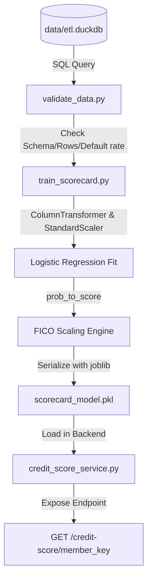

# Tài Liệu Huấn Luyện Credit Scorecard (LR Scorecard v2)

Tài liệu này cung cấp cái nhìn chi tiết, toàn diện và thực tế nhất về quy trình tiền kiểm định dữ liệu, kiến trúc huấn luyện mô hình **Credit Scorecard v2** sử dụng hồi quy Logistic (Logistic Regression), các công thức toán học và mã nguồn định tỉ lệ điểm FICO, cùng thông số kết quả đánh giá mô hình.

---

## 1. Bản Đồ Thư Mục & I/O (Inputs/Outputs Mapping)

Hệ thống huấn luyện Scorecard hoạt động dựa trên sự phối hợp chặt chẽ giữa các tập tin và thư mục vật lý sau trong repository [Loan_ETL](file:///D:/GIT%20REPO/loan-etl/Loan_ETL):

* **Thư mục dự án gốc**: [D:/GIT REPO/loan-etl/Loan_ETL/](file:///D:/GIT%20REPO/loan-etl/Loan_ETL)
* **Cơ sở dữ liệu DuckDB**: [data/etl.duckdb](file:///D:/GIT%20REPO/loan-etl/Loan_ETL/data/etl.duckdb) (Lưu trữ các bảng dữ liệu tầng Bronze, Silver và Gold)
* **Tập lệnh SQL tạo Gold Features**: [machinelearning/database/transform_gold_hcv2.sql](file:///D:/GIT%20REPO/loan-etl/Loan_ETL/machinelearning/database/transform_gold_hcv2.sql) (Thực hiện chế biến, kết hợp và chuẩn hóa đặc trưng hành vi)
* **Tập lệnh kiểm định dữ liệu**: [machinelearning/ml/validate_data.py](file:///D:/GIT%20REPO/loan-etl/Loan_ETL/machinelearning/ml/validate_data.py) (Kiểm định chất lượng dữ liệu trước khi train)
* **Tập lệnh huấn luyện mô hình**: [machinelearning/ml/train_scorecard.py](file:///D:/GIT%20REPO/loan-etl/Loan_ETL/machinelearning/ml/train_scorecard.py) (Thực thi pipeline StandardScaler + Logistic Regression + FICO Engine)
* **Artifact mô hình đầu ra**: [machinelearning/ml/models/scorecard_model.pkl](file:///D:/GIT%20REPO/loan-etl/Loan_ETL/machinelearning/ml/models/scorecard_model.pkl) (File serialized chứa pipeline và các thông số FICO)
* **Lớp dịch vụ Backend**: [backend/services/credit_score_service.py](file:///D:/GIT%20REPO/loan-etl/Loan_ETL/backend/services/credit_score_service.py) (Nạp mô hình và thực hiện suy luận điểm số real-time)
* **Router API của Backend**: [backend/api/routers/credit_score.py](file:///D:/GIT%20REPO/loan-etl/Loan_ETL/backend/api/routers/credit_score.py) (Cung cấp endpoint tính toán điểm số cho khách hàng)



---

## 2. Tiền Kiểm Định Chất Lượng Dữ Liệu (Data Validation Stage)

Trước khi thực thi huấn luyện mô hình, dữ liệu trong bảng `silver.hc_v2_cleansed` được chạy qua tập lệnh kiểm định [validate_data.py](file:///D:/GIT%20REPO/loan-etl/Loan_ETL/machinelearning/ml/validate_data.py) nhằm đảm bảo dữ liệu đáp ứng các yêu cầu chất lượng tối thiểu để tránh lỗi huấn luyện (như rò rỉ dữ liệu, khuyết thiếu biến quan trọng).

### Mã Nguồn Kiểm Định (Trích đoạn từ `validate_data.py`)
```python
REQUIRED_COLUMNS = {
    "stated_monthly_income", "loan_original_amount", "term", "employment_status",
    "debt_to_income_ratio", "is_homeowner", "is_default",
    "age_years", "num_active_credits",
}
MIN_ROWS              = 100_000
MIN_DEFAULT_RATE      = 0.01
MAX_DEFAULT_RATE      = 0.50
MAX_NULL_RATE_PCT     = 40.0     # v2 income has ~33% nulls

def validate():
    engine = get_engine()
    # 1. Row count check
    n_rows = int(_scalar(engine, "SELECT COUNT(*) FROM silver.hc_v2_cleansed"))
    if n_rows < MIN_ROWS:
        raise ValidationError(f"Quá ít rows: {n_rows:,} < {MIN_ROWS:,}")

    # 2. Schema check (các cột nghiệp vụ bắt buộc)
    cols = set(pd.read_sql("SELECT * FROM silver.hc_v2_cleansed LIMIT 1", engine).columns)
    missing = REQUIRED_COLUMNS - cols
    if missing:
        raise ValidationError(f"Thiếu cột: {missing}")

    # 3. Null rate checks (kiểm tra tỷ lệ khuyết thiếu cột cốt lõi)
    null_df = pd.read_sql("""
        SELECT
            ROUND(100.0 * AVG(CASE WHEN stated_monthly_income IS NULL THEN 1 ELSE 0 END), 2) AS income,
            ROUND(100.0 * AVG(CASE WHEN loan_original_amount   IS NULL THEN 1 ELSE 0 END), 2) AS loan,
            ROUND(100.0 * AVG(CASE WHEN debt_to_income_ratio   IS NULL THEN 1 ELSE 0 END), 2) AS dti,
            ROUND(100.0 * AVG(CASE WHEN is_default             IS NULL THEN 1 ELSE 0 END), 2) AS target
        FROM silver.hc_v2_cleansed
    """, engine).iloc[0]
    for col, pct in null_df.items():
        if col == "target" and pct > 0:
            raise ValidationError(f"target ({col}) có {pct}% null — không được phép")
        if pct > MAX_NULL_RATE_PCT:
            raise ValidationError(f"{col} null rate {pct}% > {MAX_NULL_RATE_PCT}%")

    # 4. Default rate check (tỷ lệ vỡ nợ tự nhiên đảm bảo cân bằng tối thiểu)
    rate = float(_scalar(engine, "SELECT AVG(is_default::DOUBLE) FROM silver.hc_v2_cleansed"))
    if not (MIN_DEFAULT_RATE <= rate <= MAX_DEFAULT_RATE):
        raise ValidationError(f"Default rate bất thường: {rate:.2%}")
```

---

## 3. Kiến Trúc Pipeline Huấn Luyện (Model Pipeline Architecture)

Mô hình Scorecard được xây dựng bằng cách định nghĩa các đặc trưng và cấu hình pipeline xử lý dữ liệu tự động trong [train_scorecard.py](file:///D:/GIT%20REPO/loan-etl/Loan_ETL/machinelearning/ml/train_scorecard.py).

### 3.1. Danh Sách Đặc Trưng Được Chọn (30 Features)
Mô hình sử dụng 28 đặc trưng dạng số (Numeric) và 2 đặc trưng phân loại (Categorical). So với mô hình phán quyết LightGBM, Scorecard loại bỏ các biến tiền tệ tuyệt đối (`loan_amount`, `monthly_income`) để tránh mất cân bằng do nhạy cảm thang đo và loại bỏ biến tự khai `credit_score` để đảm bảo chống gian lận.

### 3.2. Mã Nguồn Tiền Xử Lý Và Khởi Tạo Pipeline
Tất cả các đặc trưng số đi qua `StandardScaler()` để chuẩn hóa phân phối về trung bình bằng $0$ và độ lệch chuẩn bằng $1$. Các đặc trưng phân loại đi qua `OrdinalEncoder()` để ánh xạ thành số nguyên danh mục.

```python
NUMERIC_FEATURES = [
    "debt_to_income_ratio", "loan_amount_to_income", "log_monthly_income", "payment_to_income", "high_dti_flag",
    "current_debt_ratio", "total_debt_to_income", "max_dpd_24m", "avg_dpd_recent", "num_installs_dpd10",
    "num_bureau_records", "num_active_credit", "total_overdue_amount", "max_credit_overdue_days", "has_bad_debt",
    "total_prolongations", "num_previous_loans", "previous_default_rate", "cb_queries_30d", "num_cb_queries",
    "is_homeowner_flag", "income_verifiable_flag", "years_employed", "age_years", "education_ordinal",
    "is_married_flag", "income_missing_flag", "dti_missing_flag"
]
CATEGORICAL_FEATURES = ["employment_status_grouped", "occupation_type"]
ALL_FEATURES = NUMERIC_FEATURES + CATEGORICAL_FEATURES

# Xây dựng ColumnTransformer để phân nhánh xử lý dữ liệu đầu vào
preprocessor = ColumnTransformer([
    ("num", StandardScaler(), NUMERIC_FEATURES),
    ("cat", OrdinalEncoder(handle_unknown="use_encoded_value", unknown_value=-1), CATEGORICAL_FEATURES),
])

# Pipeline hoàn chỉnh
pipeline = Pipeline([
    ("preprocessor", preprocessor),
    ("classifier",   LogisticRegression(
        C=0.1,             # L2 regularization strength
        max_iter=500,      # Số vòng lặp tối đa
        random_state=42,   # Đảm bảo tính lặp lại
        class_weight=None  # Cực kỳ quan trọng: KHÔNG DÙNG balanced để giữ xác suất tự nhiên
    )),
])
```

* **Lưu ý nghiệp vụ**: Việc không sử dụng tham số `class_weight="balanced"` là yêu cầu bắt buộc khi thiết lập Scorecard. Nếu chúng ta hiệu chỉnh cân bằng trọng số mẫu, xác suất vỡ nợ dự báo sẽ bị phóng đại lên và lệch khỏi phân phối thực tế (từ 3.10% lên gần 50%), làm cho công thức định tỉ lệ FICO PDO bị méo mó nghiêm trọng.

---

## 4. Công Thức Quy Đổi Điểm FICO (FICO Scaling Engine)

Quy trình ánh xạ xác suất vỡ nợ $p = P(\text{default})$ thành điểm FICO $[300, 850]$ tuân theo hệ thức FICO PDO và được hiện thực hóa trong hàm `prob_to_score`.

### Mã Nguồn Quy Đổi Điểm (Trích đoạn từ `train_scorecard.py`)
```python
BASE_SCORE     = 600
BASE_ODDS_GOOD = 50
PDO            = 20
SCORE_MIN      = 300
SCORE_MAX      = 850

_FACTOR     = PDO / math.log(2)
_BASE_LOGIT = -math.log(BASE_ODDS_GOOD)

def prob_to_score(p) -> np.ndarray:
    """Convert P(default) → FICO score in [300, 850]."""
    # Tránh giá trị cực đoan gây lỗi hàm log
    p = np.clip(np.asarray(p, dtype=float), 1e-9, 1 - 1e-9)
    logit = np.log(p / (1 - p))
    # Công thức định tỉ lệ FICO
    score = BASE_SCORE - _FACTOR * (logit - _BASE_LOGIT)
    # Giới hạn trong khoảng [300, 850]
    return np.clip(np.round(score), SCORE_MIN, SCORE_MAX).astype(int)
```

---

## 5. Cơ Chế Tính Điểm Đóng Góp Của Từng Đặc Trưng (Points Breakdown)

Để trích xuất bảng phân rã điểm số phục vụ cho công tác giải thích (Explainability), thuật toán tính toán lượng điểm thay đổi tương ứng khi giá trị đặc trưng tăng thêm 1 khoảng bằng 1 độ lệch chuẩn ($\Delta z_i = +1$):
$$\text{Points\_per\_Std\_Dev}_i = -\text{Factor} \times \beta_i$$

### Mã Nguồn Tính Trọng Số Điểm (Trích đoạn từ `train_scorecard.py`)
```python
    lr            = pipeline.named_steps["classifier"]
    coefficients  = lr.coef_[0]
    feature_names = NUMERIC_FEATURES + CATEGORICAL_FEATURES
    
    # Tính điểm trên mỗi độ lệch chuẩn cho từng đặc trưng
    points_per_std = (-_FACTOR * coefficients).round(2)
    
    # Tạo bảng đóng góp đặc trưng
    contribution = pd.DataFrame({
        "feature":         feature_names,
        "coef":            coefficients.round(4),
        "points_per_std":  points_per_std,
    }).sort_values("points_per_std", ascending=False)
```

---

## 6. Kết Quả Huấn Luyện & Đánh Giá Mô Hình (v2 Stability)

### 6.1. Dữ Liệu Đầu Vào Thực Tế
* **Tập dữ liệu**: Bảng `gold.hc_features_v2`
* **Số mẫu**: **1,526,659 dòng** dữ liệu thực tế từ tập dữ liệu Home Credit 2024.
* **Tỷ lệ vỡ nợ thực tế (Default rate)**: **3.10%**

### 6.2. Hiệu Năng Mô Hình trên Tập Kiểm Thử (Test Set)
Mô hình được đánh giá trên tập kiểm thử độc lập gồm **305,332 dòng** (tỷ lệ 80/20 phân tầng):

* **ROC-AUC**: **0.7367** (Phản ánh khả năng phân loại rủi ro tín dụng rất tốt đối với mô hình tuyến tính đơn giản).
* **Khoảng điểm FICO thực tế quan sát**: **471 – 676**
* **Điểm trung bình (Mean Score)**: **564**
* **Điểm trung vị (Median Score)**: **566**
* **Độ lệch chuẩn điểm số (Score Std)**: **22.4**

### 6.3. Báo Cáo Phân Nhóm Điểm Số FICO Thực Tế
| Dải Điểm FICO | Phân Hạng Tín Dụng | Tỷ Lệ Thực Tế | Tỷ Lệ Vỡ Nợ Thực Tế | Ý Nghĩa Phê Duyệt |
| :---: | :---: | :---: | :---: | :--- |
| **300 – 499** | Yếu (Poor) | $0.05\%$ | $13.10\%$ | Từ chối hồ sơ tự động. |
| **500 – 579** | Trung bình thấp (Fair) | $23.74\%$ | $7.66\%$ | Thẩm định kỹ lưỡng / Áp dụng lãi suất rủi ro. |
| **580 – 669** | Tốt (Good) | $76.18\%$ | $1.81\%$ | Đạt tiêu chuẩn phê duyệt chuẩn. |
| **670 – 739** | Khá tốt (Very Good) | $0.03\%$ | $0.00\%$ | Ưu tiên phê duyệt / Ưu đãi lãi suất. |
| **740 – 850** | Xuất sắc (Excellent) | $<0.01\%$ | $0.00\%$ | Phê duyệt siêu tốc / Lãi suất tối thiểu. |

---

## 7. Đóng Gói Và Xuất Bản Artifact Mô Hình (Serialization)

Sau khi hoàn tất đánh giá, toàn bộ thông số định tỉ lệ, danh sách biến, bảng đóng góp điểm, và pipeline huấn luyện được đóng gói vào một cấu trúc Dictionary và ghi ra tệp nhị phân bằng thư viện `joblib` để backend FastAPI nạp real-time.

### Mã Nguồn Lưu Trữ Artifact (Trích đoạn từ `train_scorecard.py`)
```python
    artifact = {
        "pipeline":       pipeline,
        "feature_cols":   ALL_FEATURES,
        "thresholds":     {"low": LOW_THRESHOLD, "high": HIGH_THRESHOLD},
        "fico_params": {
            "base_score":     BASE_SCORE,
            "base_odds_good": BASE_ODDS_GOOD,
            "pdo":            PDO,
            "factor":         _FACTOR,
            "base_logit":     _BASE_LOGIT,
            "score_min":      SCORE_MIN,
            "score_max":      SCORE_MAX,
        },
        "contribution_table": contribution.to_dict(orient="records"),
        "dti_p75":            dti_p75,
        "metrics":            {"roc_auc": float(auc)},
    }
    
    # Tạo thư mục nếu chưa tồn tại và ghi tệp pkl
    MODEL_PATH.parent.mkdir(parents=True, exist_ok=True)
    joblib.dump(artifact, MODEL_PATH)
```

---

## 8. Lệnh Thực Thi Huấn Luyện (CLI Execution)

Để tiến hành huấn luyện lại mô hình Scorecard khi có dữ liệu mới, chạy lệnh sau từ thư mục gốc của dự án (kích hoạt môi trường ảo `.venv` trước và thiết lập mã hóa đầu ra console UTF-8 để tránh lỗi hiển thị tiếng Việt):

```bash
# Thiết lập UTF-8 để tránh lỗi charmap encode trên Windows
$env:PYTHONIOENCODING="utf-8"

# Chạy script huấn luyện scorecard
.venv\Scripts\python.exe -m machinelearning.ml.train_scorecard
```
