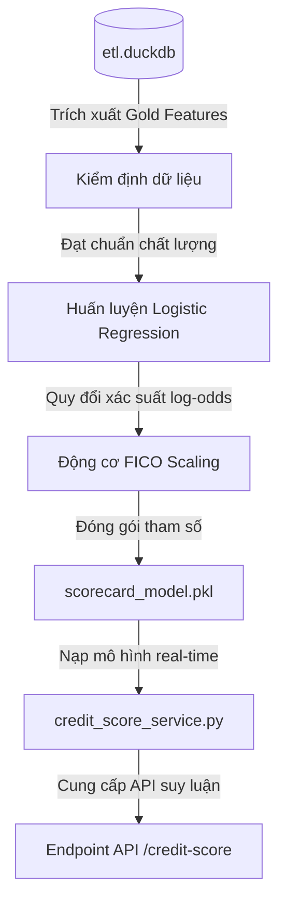

# Quy Trình Huấn Luyện & Thiết Kế Credit Scorecard (Scorecard v2)

Tài liệu này giải thích chi tiết quy trình thiết kế, kiểm định dữ liệu và triết lý huấn luyện mô hình **Credit Scorecard v2** (sử dụng thuật toán Hồi quy Logistic). Mục tiêu là giúp đội ngũ phát triển và các chuyên gia quản trị rủi ro hiểu rõ logic nghiệp vụ đứng sau các bước xử lý dữ liệu, phương thức quy đổi điểm FICO và cơ chế vận hành của hệ thống chấm điểm tín dụng.

---

## 1. Dòng Chảy Dữ Liệu và Bản Đồ Thành Phần (Data Flow & Architecture)

Hệ thống scorecard hoạt động dựa trên một chu trình khép kín từ khâu lưu trữ dữ liệu, kiểm định, huấn luyện cho đến khi mô hình được đưa vào vận hành thực tế trên Backend API.



* **Cơ sở dữ liệu DuckDB ([etl.duckdb](file:///D:/GIT%20REPO/loan-etl/Loan_ETL/data/etl.duckdb))**: Nguồn lưu trữ tập trung dữ liệu đã qua xử lý. Các đặc trưng dùng cho scorecard được chế biến và lưu tại bảng `gold.hc_features_v2` bằng tập lệnh SQL [transform_gold_hcv2.sql](file:///D:/GIT%20REPO/loan-etl/Loan_ETL/machinelearning/database/transform_gold_hcv2.sql).
* **Bộ kiểm định ([validate_data.py](file:///D:/GIT%20REPO/loan-etl/Loan_ETL/machinelearning/ml/validate_data.py))**: "Chốt chặn" bảo vệ mô hình khỏi các lỗi dữ liệu đầu vào.
* **Pipeline huấn luyện ([train_scorecard.py](file:///D:/GIT%20REPO/loan-etl/Loan_ETL/machinelearning/ml/train_scorecard.py))**: Chịu trách nhiệm thực thi các bước chuẩn hóa, tối ưu hóa thuật toán hồi quy, tính toán điểm đóng góp của từng thuộc tính và định tỉ lệ điểm FICO.
* **Artifact mô hình ([scorecard_model.pkl](file:///D:/GIT%20REPO/loan-etl/Loan_ETL/machinelearning/ml/models/scorecard_model.pkl))**: File lưu trữ toàn bộ tri thức của mô hình (bao gồm pipeline tiền xử lý, hệ số trọng số hồi quy và tham số FICO).
* **Dịch vụ Backend ([credit_score_service.py](file:///D:/GIT%20REPO/loan-etl/Loan_ETL/backend/services/credit_score_service.py))**: Đọc file artifact và tính toán điểm tín dụng tức thì (real-time inference) cho khách hàng khi có yêu cầu từ API.

---

## 2. Tiền Kiểm Định Chất Lượng Dữ Liệu (Data Validation Stage)

Trước khi mô hình được phép tiếp cận dữ liệu để học, dữ liệu phải vượt qua các tiêu chí kiểm định nghiêm ngặt tại [validate_data.py](file:///D:/GIT%20REPO/loan-etl/Loan_ETL/machinelearning/ml/validate_data.py). Bước này giúp ngăn chặn hiện tượng rò rỉ thông tin (Data Leakage) hoặc huấn luyện trên một tập mẫu không đủ độ tin cậy.

### Ý nghĩa nghiệp vụ của các tiêu chí kiểm định:

* **Số lượng dòng tối thiểu (Tối thiểu 100,000 mẫu)**: Đảm bảo tập huấn luyện đủ lớn để đại diện cho phân phối dân số thực tế, tránh hiện tượng mô hình học vẹt trên tập mẫu nhỏ (Overfitting).
* **Sự hiện diện của các trường cốt lõi**: Đảm bảo tất cả các thuộc tính tài chính quan trọng của khách hàng (thu nhập, dư nợ hiện tại, lịch sử quá hạn, thông tin nhân khẩu học) đều có mặt đầy đủ.
* **Kiểm soát tỷ lệ dữ liệu khuyết thiếu (Tối đa 40% giá trị rỗng)**:
  * Riêng đối với cột mục tiêu (`is_default` - trạng thái vỡ nợ), **không cho phép có bất kỳ giá trị trống nào** vì đây là nhãn học có giám sát.
  * Đối với các thuộc tính tài chính khác như thu nhập hay chỉ số nợ DTI, nếu tỷ lệ khuyết thiếu quá lớn sẽ làm giảm nghiêm trọng năng lực dự báo của mô hình.
* **Kiểm tra tỷ lệ vỡ nợ tự nhiên (Từ 1% đến 50%)**: Tỷ lệ vỡ nợ thực tế trong tập dữ liệu Home Credit là **3.10%**. Đây là tỷ lệ tự nhiên phản ánh đúng hành vi của thị trường. Việc kiểm định khoảng này giúp cảnh báo nếu dữ liệu đầu vào bị méo mó (ví dụ: mất nhãn vỡ nợ hoặc bị gán nhãn sai lệch hàng loạt).

---

## 3. Triết Lý Thiết Kế Đặc Trưng & Kiến Trúc Pipeline

### 3.1. Tại sao lại lựa chọn Hồi quy Logistic (Logistic Regression)?
Trong khi mô hình dự báo rủi ro khách hàng (`customer_risk_model`) sử dụng thuật toán cây quyết định phức tạp như LightGBM để tối ưu độ chính xác phi tuyến tính, mô hình **Credit Scorecard** lại trung thành với thuật toán **Logistic Regression**.

> [!NOTE]
> **Lý do lựa chọn:**
> 1. **Tính minh bạch và giải thích được (Explainability)**: Mỗi thuộc tính đầu vào của Logistic Regression có một hệ số hồi quy ($\beta$) cố định. Từ hệ số này, chúng ta có thể quy đổi trực tiếp ra số điểm cộng/trừ cụ thể cho từng khách hàng. Điều này giúp các chuyên viên phê duyệt tín dụng giải thích được rõ ràng lý do tại sao khách hàng bị từ chối hoặc đạt điểm cao.
> 2. **Tuân thủ quy định quản lý**: Các ngân hàng trung ương và tổ chức tài chính quốc tế (như chuẩn Basel) yêu cầu các mô hình chấm điểm phê duyệt tín dụng phải giải thích được cơ chế và có tính tuyến tính ổn định để kiểm soát rủi ro hệ thống.

### 3.2. Cấu trúc Pipeline xử lý dữ liệu tự động
Mô hình sử dụng **30 đặc trưng** (28 đặc trưng số và 2 đặc trưng phân loại) được chọn lọc từ bảng Gold. Các đặc trưng này đi qua một đường ống xử lý tự động (Pipeline):

```
                                [30 Đặc trưng Đầu vào]
                                          │
                ┌─────────────────────────┴────────────────────────┐
                ▼ (28 Đặc trưng Số)                                ▼ (2 Đặc trưng Phân loại)
         [StandardScaler]                                  [OrdinalEncoder]
         * Scale normalization                             * Employment Status Group
         * Mean = 0, Std = 1                               * Occupation Type
         * Prepares for linear regression                  * Maps categories to integers
                │                                                  │
                └─────────────────────────┬────────────────────────┘
                                          ▼
                             [Logistic Regression Fit]
                             * C=0.1 (L2 Regularization)
                             * class_weight=None (Natural probabilities)
```

* **Chuẩn hóa số học (`StandardScaler`)**: Các trường số học (ví dụ: độ tuổi từ 18-70, trong khi thu nhập có thể lên tới 100,000) có thang đo hoàn toàn khác nhau. StandardScaler đưa tất cả về cùng một thang đo (trung bình bằng 0, độ lệch chuẩn bằng 1) để thuật toán Hồi quy Logistic không bị thiên vị bởi các biến có giá trị lớn.
* **Mã hóa phân loại (`OrdinalEncoder`)**: Quy đổi các nhóm nghề nghiệp và trạng thái lao động dạng chữ thành các số nguyên tương ứng giúp mô hình tuyến tính xử lý được dữ liệu phi số.
* **Giữ nguyên trọng số lớp tự nhiên (`class_weight=None`)**:
  > [!IMPORTANT]
  > Chúng ta **không sử dụng** kỹ thuật cân bằng dữ liệu (`balanced`) khi huấn luyện Scorecard. Mô hình cần dự đoán chính xác xác suất vỡ nợ thực tế của thị trường ($\approx 3.10\%$). Nếu ép mô hình cân bằng nhãn 50/50, xác suất vỡ nợ dự đoán sẽ bị thổi phồng lên cực lớn, khiến điểm tín dụng FICO tính ra bị kéo tụt xuống mức cực kỳ thấp và mất đi ý nghĩa phân loại thực tế.

---

## 4. Động Cơ Quy Đối Điểm FICO (FICO Scaling Engine)

Mục tiêu cốt lõi của scorecard là chuyển đổi xác suất vỡ nợ thô $p = P(\text{default})$ thành một thang điểm FICO dễ hiểu từ **300 đến 850**.

### 4.1. Các tham số cấu hình cơ bản của Động cơ FICO:
* **Base Score (Điểm cơ sở) = 600**: Điểm chuẩn để đối chiếu.
* **Base Odds (Tỷ lệ cược cơ sở) = 50**: Tỷ lệ giữa "Khách hàng tốt" (không vỡ nợ) và "Khách hàng xấu" (vỡ nợ) tại mức điểm cơ sở. Nghĩa là tại mức 600 điểm, cứ 50 khách hàng tốt thì mới có 1 khách hàng vỡ nợ.
* **PDO (Points to Double the Odds) = 20**: Số điểm tăng thêm cần thiết để tỷ lệ cược tốt/xấu tăng gấp đôi. Ví dụ: Nếu tại 600 điểm tỷ lệ cược là 50:1, thì tại 620 điểm tỷ lệ cược sẽ là 100:1, và tại 640 điểm sẽ là 200:1.

### 4.2. Logic Toán học đứng sau việc quy đổi điểm:
Từ xác suất mặc định $p$, mô hình tính toán giá trị log-odds mặc định (logit):
$$\text{logit} = \ln\left(\frac{p}{1-p}\right)$$

Công thức quy đổi điểm FICO được xây dựng như sau:
$$\text{Score} = \text{Base Score} - \text{Factor} \times (\text{logit} - \text{Base Logit})$$

Trong đó:
* $\text{Factor} = \frac{\text{PDO}}{\ln(2)} \approx 28.85$ (Hệ số co dãn điểm theo tỷ lệ cược).
* $\text{Base Logit} = -\ln(\text{Base Odds}) \approx -3.91$ (Log-odds tại điểm cơ sở).

Hàm số này có tính chất **nghịch biến**: Khi xác suất mặc định $p$ tăng lên, giá trị logit tăng $\rightarrow$ điểm tín dụng của khách hàng sẽ bị **kéo giảm xuống**. Điểm số cuối cùng được làm tròn thành số nguyên và giới hạn nghiêm ngặt trong khoảng `[300, 850]`.

---

## 5. Cơ Chế Tính Điểm Cộng/Trừ Cho Từng Đặc Trưng (Points Breakdown)

Để giải thích tại sao khách hàng đạt được một số điểm nhất định, chúng ta phân rã điểm số dựa vào tác động của từng đặc trưng khi nó tăng thêm 1 độ lệch chuẩn ($\Delta z_i = +1$):

$$\text{Points\_per\_Std\_Dev}_i = -\text{Factor} \times \beta_i$$

Với $\beta_i$ là hệ số hồi quy của đặc trưng $i$ học được từ mô hình:
* **Đặc trưng mang yếu tố rủi ro ($\beta_i > 0$)**: Ví dụ như số ngày quá hạn dư nợ, số lần chậm thanh toán. Khi thuộc tính này tăng lên, điểm số tín dụng của khách hàng sẽ bị **trừ đi** một lượng tương ứng với $\text{Points\_per\_Std\_Dev}_i$.
* **Đặc trưng mang yếu tố an toàn ($\beta_i < 0$)**: Ví dụ như số năm làm việc, độ tuổi, thu nhập ổn định. Khi các thuộc tính này tăng, điểm số tín dụng của khách hàng sẽ được **cộng thêm**.

---

## 6. Kết Quả Huấn Luyện & Giải Thích Phân Nhóm Điểm Số (Scorecard Metrics)

Mô hình Scorecard v2 được huấn luyện trên **1,526,659 khách hàng** thực tế từ bộ dữ liệu Home Credit với hiệu năng đo lường trên tập kiểm thử độc lập như sau:

* **Chỉ số ROC-AUC**: **0.7367** (Khả năng phân loại rủi ro của mô hình ở mức rất tốt và cực kỳ ổn định đối với mô hình tuyến tính đơn giản).
* **Khoảng điểm FICO thực tế quan sát được**: **471 – 676** (điểm trung bình tập trung xung quanh **564**).

### Bảng Phân Nhóm Điểm Số và Khuyến Nghị Phê Duyệt:

| Dải Điểm FICO | Phân Hạng Tín Dụng | Tỷ Lệ Dân Số | Tỷ Lệ Vỡ Nợ Thực Tế | Khuyến Nghị Quyết Định Nghiệp Vụ |
| :---: | :---: | :---: | :---: | :--- |
| **300 – 499** | Yếu (Poor) | $0.05\%$ | $13.10\%$ | **Từ chối tự động**: Khách hàng có rủi ro quá cao, tỷ lệ vỡ nợ thực tế lên tới 13.10%. |
| **500 – 579** | Trung bình thấp (Fair) | $23.74\%$ | $7.66\%$ | **Thẩm định thủ công**: Cần kiểm tra kỹ các hồ sơ bổ sung hoặc áp dụng mức lãi suất cao hơn để bù đắp rủi ro. |
| **580 – 669** | Tốt (Good) | $76.18\%$ | $1.81\%$ | **Phê duyệt chuẩn**: Đây là nhóm khách hàng phổ thông an toàn, tỷ lệ mặc định rất thấp (chỉ 1.81%). |
| **670 – 739** | Khá tốt (Very Good) | $0.03\%$ | $0.00\%$ | **Ưu tiên phê duyệt**: Khách hàng uy tín cao, khuyến nghị áp dụng các chương trình ưu đãi lãi suất. |
| **740 – 850** | Xuất sắc (Excellent) | $<0.01\%$ | $0.00\%$ | **Phê duyệt siêu tốc**: Cấp hạn mức tối đa, quy trình phê duyệt tự động ngay lập tức với lãi suất ưu đãi nhất. |

---

## 7. Đóng Gói Mô Hình & Vận Hành (Model Deployment)

Sau khi huấn luyện thành công và vượt qua tất cả các chỉ số đánh giá chất lượng, mô hình được đóng gói thành tệp [scorecard_model.pkl](file:///D:/GIT%20REPO/loan-etl/Loan_ETL/machinelearning/ml/models/scorecard_model.pkl) bao gồm:
1. Pipeline tiền xử lý hoàn chỉnh (để áp dụng cùng một bộ chuẩn hóa StandardScaler cho dữ liệu đầu vào mới).
2. Hệ số trọng số của mô hình Logistic Regression.
3. Các tham số định tỷ lệ FICO và giá trị bách phân vị DTI (`dti_p75`).

Khi có một hồ sơ vay mới gửi về qua API Backend, lớp dịch vụ [credit_score_service.py](file:///D:/GIT%20REPO/loan-etl/Loan_ETL/backend/services/credit_score_service.py) sẽ tự động nạp file `.pkl` này, chuyển đổi thông tin đầu vào của khách hàng thành vector đặc trưng, chạy qua mô hình để lấy xác suất rủi ro và chuyển đổi thành điểm FICO cùng bảng phân rã điểm cộng/trừ chi tiết để hiển thị lên giao diện quản trị Admin.
