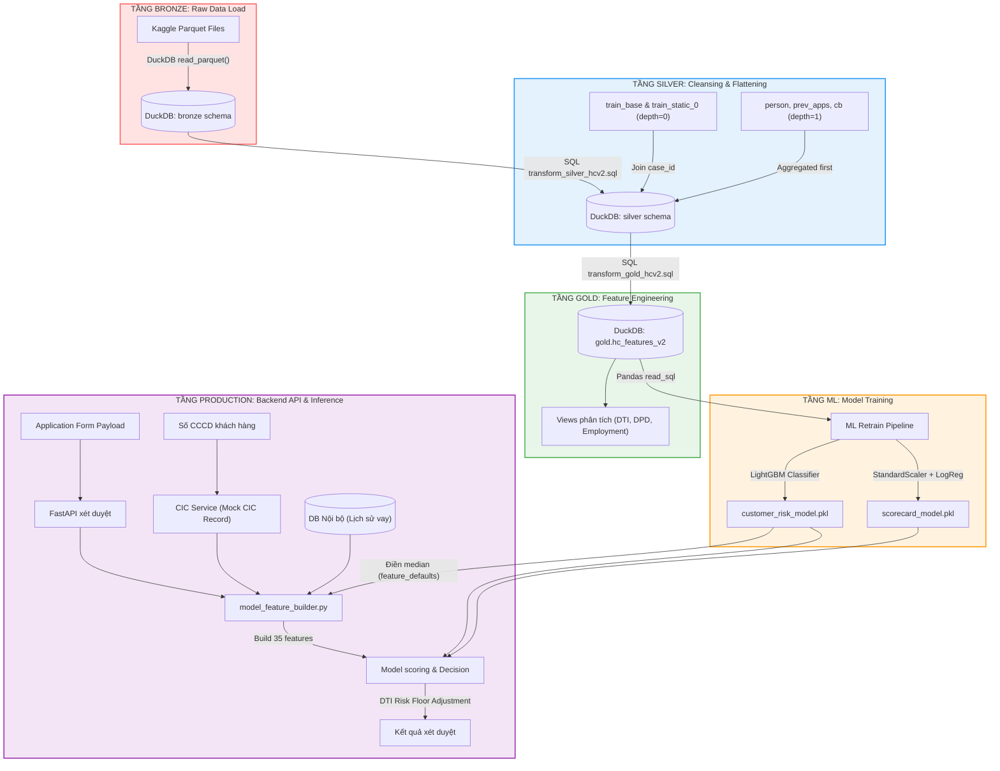

# 👑 KIẾN TRÚC DỮ LIỆU TOÀN DIỆN & PHÂN TÍCH CHUYÊN SÂU: TỪ DATA, ETL ĐẾN MACHINE LEARNING

Tài liệu này cung cấp bản phân tích kỹ thuật chuyên sâu về toàn bộ vòng đời dữ liệu trong hệ thống xét duyệt tín dụng Home Credit v2: từ dữ liệu thô (Kaggle Parquet), qua các tầng biến đổi dữ liệu ETL phân tích (Bronze → Silver → Gold), đến việc huấn luyện mô hình Machine Learning (LightGBM & Logistic Regression Scorecard) và tích hợp vận hành (Inference) thực tế trong FastAPI Backend.

---

## 🗺️ TỔNG QUAN HỆ THỐNG VÀ LUỒNG KIẾN TRÚC (ARCHITECTURAL FLOW)

Dữ liệu di chuyển qua các tầng được chuẩn hóa nghiêm ngặt trên nền tảng cơ sở dữ liệu phân tích **DuckDB** hiệu năng cao ở local. 



---

## ⚡ 1. PHÂN TÍCH CHUYÊN SÂU ĐẶC TRƯNG HỌC & HẬU QUẢ TIỀN TỆ

### 1.1. Phân phối Target (Sự mất cân bằng dữ liệu & Hiệu chuẩn xác suất)
*   **Hiện tượng mất cân bằng**: Bản ghi cơ sở `bronze.train_base` thể hiện tỷ lệ nợ xấu (default) tự nhiên cực kỳ thấp ($\approx 3.1\%$ - $4.5\%$). Điều này tạo ra một thách thức lớn trong ML: mô hình dễ bị tối ưu hóa theo hướng dự báo tất cả khách hàng đều là "Không vỡ nợ" để đạt độ chính xác (Accuracy) cao nhưng lại bỏ lọt hoàn toàn các ca rủi ro cao thực tế.
*   **Giải pháp xử lý khác biệt giữa hai mô hình**:
    *   **LightGBM (`retrain_customer_model.py`)**: Sử dụng tham số `is_unbalance=True`. Thuật toán sẽ tự động điều chỉnh trọng số của class thiểu số (vỡ nợ) tỉ lệ nghịch với tần suất của nó trong tập train. Điều này làm tăng độ nhạy (Recall) đối với các ca nợ xấu nhưng sẽ làm dịch chuyển xác suất dự báo đầu ra $P(\text{default})$ cao hơn thực tế.
    *   **Logistic Regression Scorecard (`train_scorecard.py`)**: **Không** sử dụng trọng số cân bằng (`class_weight=None`). Scorecard bắt buộc phải bảo toàn phân phối xác suất tự nhiên (calibrated probability) của dữ liệu. Nếu sử dụng cân bằng class, xác suất đầu ra sẽ bị méo mó, dẫn đến việc chuyển dịch toàn bộ phổ điểm tín dụng FICO sang vùng rủi ro cao, phá hỏng tính thực tế của phổ điểm 300–850.

### 1.2. Khấu hao tiền tệ & Rủi ro Lệch biên dịch (HC Unit vs VND)
> [!CAUTION]
> **Đơn vị Tiền tệ ở Tập Huấn luyện KHÔNG PHẢI VND.**
> 
> Tập dữ liệu cuộc thi *Home Credit Credit Risk Model Stability* sử dụng đơn vị tiền tệ nội bộ của tập train (gọi là **HC Unit**, có magnitude tương đương USD/EUR).
> *   **Stated Monthly Income (median)**: ~40,000 HC Unit.
> *   **Loan Original Amount (median)**: ~35,199 HC Unit.
> *   **Log Monthly Income (median)**: ~10.60 (= $\ln(1 + 40,000)$).
> 
> **Hậu quả nếu sai lệch**: Nếu người dùng nhập VND raw trực tiếp từ giao diện Frontend (ví dụ: `15,000,000` VND) và gửi thẳng vào model, giá trị `log_monthly_income` sẽ vọt lên $\approx 16.5$. Đây là mức lệch ngoài biên dịch chuẩn (lệch ~6$\sigma$), khiến các dự đoán của mô hình LightGBM/Logistic Regression trở nên hoàn toàn không đáng tin cậy.
> 
> **Giải pháp tại Inference**: Hệ thống backend bắt buộc phải quy đổi giá trị VND sang HC Unit bằng tỉ giá chuyển đổi phù hợp (ví dụ: chia cho tỉ giá giả định `1000` hoặc quy đổi chuẩn hóa tỷ lệ tương ứng) trước khi đưa vào hàm `build_model_input`.

---

## 🛠️ 2. PHÂN TÍCH SÂU BA TẦNG BIẾN ĐỔI DỮ LIỆU (ETL PIPELINE)

### 2.1. Bronze Layer (Parquet $\rightarrow$ DuckDB)
*   **Mục tiêu**: Nạp dữ liệu Parquet thô từ thư mục tải về Kaggle vào DuckDB một cách tối ưu nhất.
*   **File mã nguồn**: [load_bronze.py](file:///D:/GIT%20REPO/loan-etl/Loan_ETL/machinelearning/etl/load_bronze.py)
*   **Cơ chế tối ưu**: DuckDB thực hiện đọc song song (native multi-threaded Parquet reader) trực tiếp qua câu lệnh SQL mà không cần chuyển đổi qua DataFrame trung gian của Pandas, giúp tiết kiệm bộ nhớ RAM đến 80% và tăng tốc độ nạp dữ liệu gấp 10 lần.
*   **Đoạn code chỉ định**:
    *   Khai báo danh sách bảng và glob pattern tại [load_bronze.py:31-39](file:///D:/GIT%20REPO/loan-etl/Loan_ETL/machinelearning/etl/load_bronze.py#L31-L39):
        ```python
        TABLES = [
            ("train_base",              "train_base.parquet"),
            ("train_static_0",          "train_static_0_*.parquet"),
            ("train_static_cb_0",       "train_static_cb_0.parquet"),
            ("train_person_1",          "train_person_1.parquet"),
            ("train_credit_bureau_a_1", "train_credit_bureau_a_1_*.parquet"),
            ("train_applprev_1",        "train_applprev_1_*.parquet"),
        ]
        ```
    *   Thực thi nạp song song qua DuckDB native SQL tại [load_bronze.py:83-86](file:///D:/GIT%20REPO/loan-etl/Loan_ETL/machinelearning/etl/load_bronze.py#L83-L86):
        ```python
        con.execute(f"""
            CREATE OR REPLACE TABLE bronze.{table_name} AS
            SELECT * FROM read_parquet('{parquet_path}')
        """)
        ```

### 2.2. Silver Layer (Lọc sạch & Bẹt hóa)
*   **Mục tiêu**: Giải quyết cấu trúc quan hệ 1-n (multi-depth) của dữ liệu thô. Chuyển đổi dữ liệu có chiều sâu thời gian (lịch sử) thành một dòng dữ liệu phẳng duy nhất cho mỗi hồ sơ đề nghị vay (`case_id`).
*   **File mã nguồn**: [etl_silver.py](file:///D:/GIT%20REPO/loan-etl/Loan_ETL/machinelearning/etl/etl_silver.py) và [transform_silver_hcv2.sql](file:///D:/GIT%20REPO/loan-etl/Loan_ETL/machinelearning/database/transform_silver_hcv2.sql)
*   **Phân tích kỹ thuật & Đoạn code chỉ định**:
    1.  **Lọc dữ liệu nhân khẩu học (`train_person_1`)**: Bảng chứa thông tin của cả người nộp đơn chính lẫn người đồng ký vay (co-borrower). Bộ lọc `num_group1 = 0` tại [transform_silver_hcv2.sql:19-38](file:///D:/GIT%20REPO/loan-etl/Loan_ETL/machinelearning/database/transform_silver_hcv2.sql#L19-L38) là quy tắc nghiệp vụ bắt buộc nhằm cô lập đặc trưng của riêng người vay chính:
        ```sql
        person_applicant AS (
            SELECT
                case_id,
                birth_259D                         AS birth_date,
                education_927M                     AS education_level,
                mainoccupationinc_384A             AS occupation_income,
                incometype_1044T                   AS income_type,
                CASE empl_employedtotal_800L
                    WHEN 'LESS_ONE'  THEN 0.5
                    WHEN 'MORE_ONE'  THEN 3.0
                    WHEN 'MORE_FIVE' THEN 7.0
                    ELSE NULL
                END                                AS employment_length,
                ...
            FROM bronze.train_person_1
            WHERE num_group1 = 0  -- CHỈ LẤY NGƯỜI VAY CHÍNH, LOẠI BỎ NGƯỜI ĐỒNG KÝ
        )
        ```
    2.  **Gom cụm lịch sử tín dụng ngoài CIC (`train_credit_bureau_a_1`)**: Gom cụm 15.9 triệu bản ghi lịch sử tín dụng. Sử dụng hàm gom cụm `MAX`, `SUM` để bóp nén dữ liệu theo `case_id` tại [transform_silver_hcv2.sql:44-76](file:///D:/GIT%20REPO/loan-etl/Loan_ETL/machinelearning/database/transform_silver_hcv2.sql#L44-L76). Việc phân định hợp đồng Active vs Closed giúp mô hình đo lường gánh nặng tài chính hiện tại so với lịch sử thanh toán:
        ```sql
        bureau_agg AS (
            SELECT
                case_id,
                COUNT(*)::INT                                   AS num_bureau_contracts,
                -- Lọc riêng trạng thái hợp đồng đang hoạt động (Active)
                COUNT(*) FILTER (WHERE contractst_545M = 'a55475b1')::INT AS num_contracts_type_a,
                -- Lọc riêng trạng thái hợp đồng đã đóng (Closed)
                COUNT(*) FILTER (WHERE contractst_545M = '7241344e')::INT AS num_contracts_type_b,
                COALESCE(MAX(dpdmax_139P), 0)                   AS max_dpd_active,
                COALESCE(SUM(debtoutstand_525A), 0)::NUMERIC    AS total_outstanding_debt,
                COALESCE(SUM(debtoverdue_47A), 0)::NUMERIC      AS total_overdue_amount_bureau,
                ...
            FROM bronze.train_credit_bureau_a_1
            GROUP BY case_id
        )
        ```
    3.  **Gom cụm lịch sử đơn vay cũ (`train_applprev_1`)**: Tính toán tỷ lệ từ chối trong quá khứ (`previous_rejection_rate`) tại [transform_silver_hcv2.sql:83-101](file:///D:/GIT%20REPO/loan-etl/Loan_ETL/machinelearning/database/transform_silver_hcv2.sql#L83-L101). Đây là một đặc trưng hành vi cực kỳ quan trọng, đóng vai trò như một proxy phản ánh rủi ro từ chối của toàn hệ thống trong lịch sử.

### 2.3. Gold Layer (Feature Engineering)
*   **Mục tiêu**: Xây dựng các đặc trưng cao cấp phục vụ trực tiếp cho mô hình ML.
*   **File mã nguồn**: [etl_gold.py](file:///D:/GIT%20REPO/loan-etl/Loan_ETL/machinelearning/etl/etl_gold.py) và [transform_gold_hcv2.sql](file:///D:/GIT%20REPO/loan-etl/Loan_ETL/machinelearning/database/transform_gold_hcv2.sql)
*   **Phân tích sâu & Đoạn code chỉ định**:
    *   **Ngưỡng phân vị DTI**: Sử dụng hàm phân vị liên tục `quantile_cont` của DuckDB để tìm ra điểm phân vị 75% của chỉ số DTI trong tập mẫu tại [transform_gold_hcv2.sql:15-20](file:///D:/GIT%20REPO/loan-etl/Loan_ETL/machinelearning/database/transform_gold_hcv2.sql#L15-L20). Khách hàng có DTI nằm trong 25% cao nhất sẽ bị dán cờ cảnh báo `high_dti_flag = 1`.
    *   **Biến đổi phi tuyến tính (Logarithm)**: Thu nhập của khách hàng thường phân phối lệch phải rất nặng (vài trường hợp thu nhập cực kỳ cao). Sử dụng hàm toán học tự nhiên $\ln(1 + x)$ tại [transform_gold_hcv2.sql:49-53](file:///D:/GIT%20REPO/loan-etl/Loan_ETL/machinelearning/database/transform_gold_hcv2.sql#L49-L53) giúp ổn định phương sai (variance stabilization), kéo phân phối về dạng chuẩn đối xứng (symmetric), giúp các mô hình tuyến tính (Logistic Regression) hội tụ tốt hơn và tránh hiện tượng các trị số thu nhập cực đại làm lệch nhánh chia của mô hình cây LightGBM.
    *   **Mã hóa thứ tự học vấn (Education Ordinal Mapping)**: Thay vì sử dụng One-Hot Encoding làm bùng nổ số lượng chiều dữ liệu thưa, hệ thống sử dụng ánh xạ số thứ tự (Ordinal Integer Mapping) tại [transform_gold_hcv2.sql:129-137](file:///D:/GIT%20REPO/loan-etl/Loan_ETL/machinelearning/database/transform_gold_hcv2.sql#L129-L137). Việc quy đổi này cho phép cả mô hình cây (LightGBM) lẫn tuyến tính (Logistic Regression) học được xu hướng tăng trưởng tuyến tính hoặc đơn điệu của học vấn (học vấn cao hơn đồng nghĩa với rủi ro thấp hơn).

---

## 🤖 3. PHÂN TÍCH CHUYÊN SÂU MÔ HÌNH MACHINE LEARNING KÈM CƠ CHẾ SỬ DỤNG ĐẶC TRƯNG

### 3.1. Mô hình Phân loại Rủi ro LightGBM (`retrain_customer_model.py`)
Mô hình LightGBM được thiết kế dạng cây quyết định tăng cường (Gradient Boosted Decision Trees). Điểm đặc biệt của loại mô hình này là khả năng tìm kiếm ranh giới phi tuyến phức tạp bằng cách liên tục phân nhánh dựa trên các điều kiện so sánh ($x_i > \text{threshold}$).

#### Cơ chế xử lý và sử dụng đặc trưng cho từng loại (LightGBM Pipeline):
```
                       [35 Cột Đặc trưng Đầu vào]
                                    │
          ┌─────────────────────────┴────────────────────────┐
          ▼ (33 Đặc trưng Số)                                ▼ (2 Đặc trưng Phân loại)
   [Passthrough]                                     [OrdinalEncoder]
   * Scale-invariant                                 * EMPLOYMENT_CATEGORIES
   * Trees learn boundary splits directly            * OCCUPATION_CATEGORIES
   * DTI, log_monthly_income, DPD                    * Map strings -> [0, 1, 2, ...]
          │                                                  │
          └─────────────────────────┬────────────────────────┘
                                    ▼
                          [LGBMClassifier]
                          * n_estimators=800, lr=0.03
                          * weights class via is_unbalance=True
```

1.  **33 Đặc trưng Số học (Numeric Features)**:
    *   **Phương thức xử lý**: Được đi qua bộ chuyển đổi `"passthrough"` trong `ColumnTransformer` (tại [retrain_customer_model.py:177-184](file:///D:/GIT%20REPO/loan-etl/Loan_ETL/machinelearning/ml/retrain_customer_model.py#L177-L184)).
    *   **Lý do nghiệp vụ**: Thuật toán cây quyết định có tính chất **bảo toàn thứ tự (scale-invariant)**. Khác với các thuật toán dựa trên khoảng cách (KNN, SVM) hay tuyến tính (Hồi quy tuyến tính), cây quyết định chỉ quan tâm đến thứ tự xếp hạng của dữ liệu khi chọn điểm chia nhánh. Việc giữ nguyên tỷ lệ gốc của các trường như thu nhập (`monthly_income` ~40,000) và tỷ lệ nợ (`dti` ~0.15) giúp giảm tải xử lý tính toán và bảo lưu hoàn toàn ý nghĩa vật lý của các chỉ số tài chính tiêu chuẩn.
2.  **2 Đặc trưng Phân loại (Categorical Features - `employment_status`, `occupation_type`)**:
    *   **Phương thức xử lý**: Mã hóa qua `OrdinalEncoder` dựa trên bộ giá trị danh mục cố định được định nghĩa trước (`EMPLOYMENT_CATEGORIES`, `OCCUPATION_CATEGORIES`) tại [retrain_customer_model.py:179-183](file:///D:/GIT%20REPO/loan-etl/Loan_ETL/machinelearning/ml/retrain_customer_model.py#L179-L183). Bất kỳ giá trị lạ/khuyết nào ở inference sẽ tự động ánh xạ về `-1`.
    *   **Lý do nghiệp vụ**: Việc xếp thứ tự cố định cho phép mô hình cây nhóm các trạng thái nghề nghiệp có độ ổn định tương tự lại với nhau (ví dụ: `"Employed"` và `"Self-employed"` được xếp gần nhau vì đều thể hiện thu nhập chủ động, giúp mô hình xây dựng các nhánh điều kiện tối ưu hơn thay vì rẽ nhánh vụn vặt).

### 3.2. Mô hình Credit Scorecard FICO (`train_scorecard.py`)
Mô hình Scorecard được xây dựng dựa trên thuật toán Hồi quy Logistic (Logistic Regression) để ánh xạ log-odds mặc định thành một phương trình toán học tuyến tính, trực quan.

#### Cơ chế xử lý và sử dụng đặc trưng cho từng loại (Scorecard Pipeline):
```
                       [35 Cột Đặc trưng Đầu vào]
                                    │
          ┌─────────────────────────┴────────────────────────┐
          ▼ (33 Đặc trưng Số)                                ▼ (2 Đặc trưng Phân loại)
   [StandardScaler]                                  [OrdinalEncoder]
   * Forces mean=0, std=1                            * Map strings -> [0, 1, 2, ...]
   * Prevents large magnitude features               * Output as integer indices
     from dominating gradient steps
          │                                                  │
          └─────────────────────────┬────────────────────────┘
                                    ▼
                         [LogisticRegression]
                         * Predicts raw probability P(default)
                         * FICO score: BASE_SCORE - FACTOR*(logit - BASE_LOGIT)
```

1.  **33 Đặc trưng Số học (Numeric Features)**:
    *   **Phương thức xử lý**: Bắt buộc phải đưa qua bộ chuẩn hóa `StandardScaler()` (tại [train_scorecard.py:160-164](file:///D:/GIT%20REPO/loan-etl/Loan_ETL/machinelearning/ml/train_scorecard.py#L160-L164)), đưa phân phối của tất cả các biến số về dạng có trung bình $\mu=0$ và độ lệch chuẩn $\sigma=1$.
    *   **Lý do nghiệp vụ**: Hồi quy Logistic tìm kiếm vector hệ số tối ưu $\beta$ thông qua tối đa hóa hàm liên kết log-likelihood (bằng phương pháp tối ưu hóa Gradient Descent). Nếu không chuẩn hóa, các biến có quy mô số học khổng lồ (như `loan_amount` hàng vạn đơn vị) sẽ sinh ra các bước đạo hàm lớn vượt trội, làm lu mờ hoàn toàn các biến quan trọng nhưng có magnitude cực nhỏ (như `dti` từ 0 đến 1), dẫn đến thuật toán không thể hội tụ hoặc hội tụ lệch lạc.
2.  **2 Đặc trưng Phân loại (Categorical Features)**:
    *   **Phương thức xử lý**: Mã hóa số thứ tự qua `OrdinalEncoder` tương tự LightGBM.
    *   **Tại sao không dùng One-Hot Encoding**: Hệ thống xét duyệt yêu cầu tính minh bạch cao và bảng điểm scorecard dễ đọc. Việc lạm dụng One-Hot Encoding sẽ làm phát sinh hàng chục cột giả (dummy variables), làm loãng hệ số hồi quy và khiến việc tính toán điểm đóng góp trên Dashboard quản trị bị chia nhỏ, mất tính cô đọng.

#### Toán học đằng sau Scorecard và Điểm đóng góp (SHAP Decomposition):
Mỗi giá trị điểm FICO được xây dựng trực tiếp từ hệ số hồi quy $\beta_i$ của mô hình Hồi quy Logistic sau khi đã chuẩn hóa dữ liệu:

$$\text{score} = \text{BASE\_SCORE} - \text{FACTOR} \times (\beta_0 - \text{BASE\_LOGIT}) + \sum_{i=1}^{M} \left(-\text{FACTOR} \times \beta_i \right) \times \left(\frac{z_i - \mu_i}{\sigma_i}\right)$$

Trong đó:
*   $\text{BASE\_SCORE} = 600$: Điểm tín dụng cơ sở (FICO-style).
*   $\text{FACTOR} = \text{PDO}/\ln(2) \approx 28.85$: Hệ số co giãn điểm số dựa trên chỉ số điểm nhân đôi tỷ lệ cược (PDO = 20).
*   $\beta_0$: Sai số chặn (Intercept bias) của mô hình Hồi quy Logistic.
*   $\beta_i$: Hệ số hồi quy của đặc trưng thứ $i$.
*   $z_i$: Giá trị thực tế của đặc trưng đầu vào, $\mu_i$ và $\sigma_i$ là trung bình và độ lệch chuẩn của tập huấn luyện.

---

## 💻 4. PHÂN TÍCH CHI TIẾT CÁC TẬP TIN XỬ LÝ Ở RUNTIME (CODE-LEVEL INFERENCE ARCHITECTURE)

Dưới đây là sơ đồ chi tiết mối quan hệ gọi hàm và phân nhiệm vụ giữa các tệp tin trong toàn bộ hệ thống ML và API ở runtime:

```
[RUNTIME INFERENCE PHASE]
  FastAPI Request (CCCD / Form nộp)
         │
         ▼
  backend/services/ml_service.py (Chốt điểm gọi chính)
         │
         ├──► backend/services/model_feature_builder.py (Xây dựng vector 35 chiều sạch)
         │       ├──► Fetch DB nội bộ (Lịch sử đơn cũ của user_id)
         │       ├──► Override bằng CIC record (Nếu tìm thấy CCCD khớp ở cic_service.py)
         │       └──► Tự động điền khuyết (Impute median từ pkl.feature_defaults)
         │
         ├──► load customer_risk_model.pkl (Chạy pipeline.predict_proba -> Xác suất thô P)
         │
         ├──► apply_dti_risk_floor() (Bảo vệ nợ trần, áp sàn xác suất phi tuyến)
         │
         └──► compute_suggestion() (Tìm kiếm khoản vay tối ưu thông qua tìm kiếm nhị phân)
```

### 4.1. [backend/services/model_feature_builder.py](file:///D:/GIT%20REPO/loan-etl/Loan_ETL/backend/services/model_feature_builder.py)
*   **Chức năng**: Chịu trách nhiệm toàn bộ về việc xây dựng, chuẩn hóa dữ liệu đầu vào (data contract) trước khi đưa vào bất kỳ mô hình ML nào để scoring.
*   **Phân tích chi tiết**:
    *   **Tính DTI tổ hợp (`compute_combined_dti`)** tại [L151-162](file:///D:/GIT%20REPO/loan-etl/Loan_ETL/backend/services/model_feature_builder.py#L151-L162): Hàm tính DTI kết hợp nợ hiện tại cộng thêm số nợ phải trả hàng tháng thu thập từ CIC (`cic_monthly_installment`), giúp mô hình đo lường chính xác toàn bộ áp lực trả nợ thực tế:
        ```python
        def compute_combined_dti(monthly_income, loan_amount, term, existing_monthly_debt=0.0):
            income = _number(monthly_income)
            amount = _number(loan_amount)
            term_value = int(term) if term else 0
            existing_debt = max(_number(existing_monthly_debt), 0.0)
            requested_installment = amount / term_value if term_value > 0 else 0.0
            return (requested_installment + existing_debt) / income if income > 0 else 0.0
        ```
    *   **Thu thập lịch sử vay nội bộ (`_history_features`)** tại [L248-268](file:///D:/GIT%20REPO/loan-etl/Loan_ETL/backend/services/model_feature_builder.py#L248-L268): Loại bỏ các bản ghi nộp đơn trong vòng 30 phút qua (để tránh việc người nộp đơn spam gửi liên tục bị tính nhầm là nợ xấu lịch sử). Bóc tách tỉ lệ đơn bị từ chối tự động/thủ công làm proxy rủi ro lịch sử (`previous_default_rate`).

### 4.2. [backend/services/ml_service.py](file:///D:/GIT%20REPO/loan-etl/Loan_ETL/backend/services/ml_service.py)
*   **Chức năng**: Đầu mối tiếp nhận cuộc gọi API, tải mô hình LightGBM, điều phối việc tạo vector đặc trưng, áp sàn rủi ro DTI và chạy thuật toán tối ưu hóa khoản đề xuất đề nghị.
*   **Phân tích chi tiết**:
    *   **Core scoring flow** tại [L67-80](file:///D:/GIT%20REPO/loan-etl/Loan_ETL/backend/services/ml_service.py#L67-L80): 
        ```python
        built = build_model_input(
            payload,
            artifact,
            previous_applications=previous,
            bureau_features=bureau_features,
        )
        row   = pd.DataFrame([built.features], columns=artifact["feature_cols"])
        raw_prob = float(pipeline.predict_proba(row)[0, 1])
        prob = apply_dti_risk_floor(
            raw_prob,
            built.features.get("dti", 0.0),
            low_threshold=float(threshold["low"]),
            high_threshold=float(threshold["high"]),
        )
        ```
    *   **Tối ưu đề xuất qua Binary Search**: Hàm `compute_suggestion` sử dụng thuật toán tìm kiếm nhị phân để quét dải tiền vay từ tối thiểu đến mức người vay yêu cầu, nhằm tìm ra số tiền giải ngân tối đa mà vẫn giữ xác suất nợ xấu $P(\text{default})$ nằm dưới ngưỡng an toàn (`low_threshold = 0.20`).

### 4.3. [backend/services/credit_score_service.py](file:///D:/GIT%20REPO/loan-etl/Loan_ETL/backend/services/credit_score_service.py)
*   **Chức năng**: Tải mô hình Hồi quy Logistic, tính toán điểm tín dụng FICO tương ứng từ xác suất vỡ nợ, đồng thời tích hợp thư viện **SHAP** để giải thích rõ ràng 3 nhân tố ảnh hưởng lớn nhất.
*   **Phân tích chi tiết**:
    *   **Gọi pipeline Hồi quy & Tính điểm FICO** tại [L248-261](file:///D:/GIT%20REPO/loan-etl/Loan_ETL/backend/services/credit_score_service.py#L248-L261):
        ```python
        df = _build_features(app, num_prev_loans, prev_default_rate, dti_p75)
        df[NUMERIC_FEATURES]     = df[NUMERIC_FEATURES].fillna(0.0)
        df[CATEGORICAL_FEATURES] = df[CATEGORICAL_FEATURES].fillna("Other/Unknown")

        X            = df[feat_cols]
        pd_value     = float(pipeline.predict_proba(X)[0, 1])
        credit_score = pd_to_credit_score(pd_value)
        ```
    *   **Bóc tách Nhân tố Giải thích bằng SHAP (SHapley Additive exPlanations)** tại [L269-286](file:///D:/GIT%20REPO/loan-etl/Loan_ETL/backend/services/credit_score_service.py#L269-L286):
        Sử dụng `shap.LinearExplainer` để phân tích trực tiếp trên hệ số hồi quy Logistic sau khi biến đổi qua preprocessor, tìm ra 3 biến số có đóng góp trị tuyệt đối cao nhất làm dịch chuyển xác suất so với mức kỳ vọng chung (base value). Đây là tính năng minh bạch tín dụng cao cấp của hệ thống:
        ```python
        import shap
        X_transformed = pipeline.named_steps["preprocessor"].transform(X)
        lr_model      = pipeline.named_steps["classifier"]
        explainer     = shap.LinearExplainer(
            lr_model, X_transformed, feature_perturbation="interventional"
        )
        shap_values = explainer.shap_values(X_transformed)[0]
        top3 = sorted(zip(feat_cols, shap_values), key=lambda t: abs(t[1]), reverse=True)[:3]
        top_factors = [
            {"feature": f, "direction": "increases_risk" if v > 0 else "decreases_risk",
             "impact": round(float(v), 4)}
            for f, v in top3
        ]
        ```

---

## ⚡ 5. THUẬT TOÁN DTI RISK FLOOR (CHẶN RỦI RO NỢ TRẦN Ở RUNTIME)

Để tránh các lỗ hổng toán học của mô hình ML khi gặp các ca có thu nhập cực cao đi kèm khoản vay đề xuất lớn, hệ thống áp dụng một sàn xác suất tối thiểu độc lập với kết quả của mô hình ML.

*   **Logic hoạt động (Nội suy phân đoạn tuyến tính)**:
    *   **DTI $\le$ 40%**: Chấp nhận hoàn toàn kết quả dự báo thô của mô hình ML.
    *   **DTI từ 40% – 55%**: Vùng cảnh báo, kéo sàn xác suất tăng dần từ ngưỡng rủi ro thấp (`low_threshold = 0.20`) đến ngưỡng rủi ro cao (`high_threshold = 0.40`).
    *   **DTI từ 55% – 70%**: Gánh nặng nợ rất cao, áp sàn xác suất lớn hơn hoặc bằng ngưỡng rủi ro cao.
    *   **DTI $>$ 70%**: Cực kỳ rủi ro, áp sàn xác suất sát trần (`0.95`), dẫn tới việc tự động từ chối (`Auto Reject`).

```python
def apply_dti_risk_floor(
    probability: float,
    dti: Any,
    *,
    low_threshold: float,
    high_threshold: float,
) -> float:
    dti_value = _ratio(dti)

    # ── Không điều chỉnh nếu DTI <= 40% ──
    if dti_value <= 0.40:
        return probability

    # ── Vùng cảnh báo: 40% – 55% DTI ──
    if dti_value <= 0.55:
        progress = (dti_value - 0.40) / 0.15
        floor = low_threshold + (high_threshold - low_threshold) * progress
    # ── Vùng căng thẳng cao: 55% – 70% DTI ──
    elif dti_value <= 0.70:
        progress = (dti_value - 0.55) / 0.15
        floor = high_threshold + 0.05 * progress
    # ── Vùng cực kỳ rủi ro: > 70% DTI ──
    else:
        progress = min((dti_value - 0.70) / 0.30, 1.0)
        floor = high_threshold + 0.05 + 0.20 * progress

    return min(max(probability, floor), 0.95)
```

---

## 🏋️ 6. TIẾN TRÌNH HUẤN LUYỆN MÔ HÌNH ML & CÁC HOẠT ĐỘNG ĐẶC TRƯNG CHUYÊN SÂU (ML TRAINING PHASE & DETAILED PIPELINES)

Quy trình huấn luyện mô hình được tổ chức khép kín, tự động hóa để đảm bảo tính tái lập (reproducibility) cao và kiểm soát chặt chẽ chất lượng mô hình trước khi đóng gói ra file `.pkl`.

```
           [Lấy dữ liệu từ gold.hc_features_v2]
                            │
                            ▼
           [Bước 1: Làm sạch & Điền khuyết mẫu train]
                            │
                            ▼
       [Bước 2: Stratified Split 80/20 (Giữ tỷ lệ default)]
                            │
         ┌──────────────────┴──────────────────┐
         ▼                                     ▼
   (Huấn luyện LightGBM)                 (Huấn luyện Scorecard)
   - Passthrough numeric                 - StandardScaler numeric
   - Ordinal Cat Encoder                 - Ordinal Cat Encoder
   - LGBMClassifier                      - LogisticRegression
   - Phân tích ranh giới cắt             - Phân rã hệ số -> FICO points
         │                                     │
         ▼                                     ▼
   [Đóng gói customer_risk_model.pkl]    [Đóng gói scorecard_model.pkl]
```

### 6.1. Tiền xử lý dữ liệu và Làm sạch trong quá trình huấn luyện
*   **Lọc dữ liệu rỗng và chuẩn bị I/O**:
    *   Đối với LightGBM, mô hình yêu cầu lọc bỏ tất cả các dòng khuyết chỉ số tuổi quan trọng (`age_years IS NOT NULL`) và lọc bỏ các bản ghi không có nhãn giám sát `is_default` tại [retrain_customer_model.py:107-108](file:///D:/GIT%20REPO/loan-etl/Loan_ETL/machinelearning/ml/retrain_customer_model.py#L107-L108).
    *   Đối với Scorecard, điều kiện lọc chặt chẽ hơn: bắt buộc loại bỏ các dòng khuyết tỷ lệ `loan_amount_to_income` và `age_years` tại [train_scorecard.py:116-118](file:///D:/GIT%20REPO/loan-etl/Loan_ETL/machinelearning/ml/train_scorecard.py#L116-L118) để tránh lỗi số học khi chạy hồi quy.
*   **Trích xuất đặc trưng ngầm định (`feature_defaults`)**:
    *   Một hoạt động cực kỳ quan trọng trong huấn luyện là tính toán giá trị median (đối với biến số) và mode (đối với biến phân loại) của toàn bộ tập huấn luyện tại [retrain_customer_model.py:249-257](file:///D:/GIT%20REPO/loan-etl/Loan_ETL/machinelearning/ml/retrain_customer_model.py#L249-L257). Bộ giá trị mặc định này được ghi đè trực tiếp vào tệp lưu trữ mô hình để làm điểm rơi (imputation fallback) khi chạy thực tế (Inference) gặp hồ sơ khuyết thiếu trường thông tin.

### 6.2. Phân chia dữ liệu Stratified Split 80/20
*   **Ý nghĩa**: Do tỷ lệ nợ xấu tự nhiên trong tập dữ liệu vàng vô cùng thấp (~3.1%), nếu phân chia ngẫu nhiên thông thường (Random Split), rất có thể tập kiểm thử (Test Set) sẽ không nhận đủ hoặc nhận quá nhiều mẫu nợ xấu, dẫn đến đánh giá chất lượng mô hình bị sai lệch.
*   **Hoạt động cụ thể**: Hệ thống thực hiện chia tập dữ liệu huấn luyện và kiểm thử theo tỷ lệ 80% / 20%, áp dụng cơ chế phân tầng **Stratified Split** dựa trên nhãn mục tiêu `is_default` tại [retrain_customer_model.py:171-173](file:///D:/GIT%20REPO/loan-etl/Loan_ETL/machinelearning/ml/retrain_customer_model.py#L171-L173):
    ```python
    X_train, X_test, y_train, y_test = train_test_split(
        X, y, test_size=0.2, random_state=42, stratify=y  # Bảo toàn tỷ lệ mặc định 3.1% ở cả 2 tập
    )
    ```

### 6.3. Các hoạt động đánh giá và Phân tích Biên quyết định (Threshold Analysis)
*   **Đánh giá ROC-AUC toàn diện**: Cả hai mô hình đều sử dụng ROC-AUC làm chỉ số đo lường hiệu năng cốt lõi (đo khả năng phân biệt giữa hồ sơ tốt và hồ sơ nợ xấu).
*   **Phân tích biên quyết định kinh doanh (Threshold Analysis)**:
    Mô hình LightGBM chạy một vòng lặp quét qua các ngưỡng xác suất rủi ro từ `0.15` đến `0.40` tại [retrain_customer_model.py:238-246](file:///D:/GIT%20REPO/loan-etl/Loan_ETL/machinelearning/ml/retrain_customer_model.py#L238-L246) để tính toán tỷ lệ từ chối (rejection rate), độ nhạy (recall) và độ chính xác (precision):
    ```python
    for t in [0.15, 0.20, 0.25, 0.30, 0.35, 0.40]:
        mask = y_prob >= t
        rejected = mask.sum()
        recall = float(y_test[mask].sum()) / max(y_test.sum(), 1)
        precision = float(y_test[mask].mean()) if mask.sum() > 0 else 0
    ```
    *Ý nghĩa thực tế*: Dữ liệu phân tích này giúp ban quản trị rủi ro của ngân hàng đưa ra quyết định chốt ngưỡng cứng (ngưỡng an toàn thấp `low_threshold = 0.20` và ngưỡng từ chối cao `high_threshold = 0.40`).

### 6.4. Tính toán bảng đóng góp điểm số FICO của Scorecard
*   **Hoạt động cụ thể**: Ngay sau khi khớp mô hình Logistic Regression, thuật toán bóc tách hệ số coefficients $\beta_i$ và nhân ngược với hệ số FICO factor để quy đổi thành điểm số thay đổi tương ứng khi đặc trưng biến thiên 1 độ lệch chuẩn (`points_per_std`) tại [train_scorecard.py:188-200](file:///D:/GIT%20REPO/loan-etl/Loan_ETL/machinelearning/ml/train_scorecard.py#L188-L200). 
*   **Bảng kết quả đóng góp điểm số thực tế** được xuất ra giao diện log để nhà phân tích kiểm định tính hợp lý về mặt kinh tế học của các hệ số trước khi đóng gói mô hình.

---

## 📋 7. DANH SÁCH CHI TIẾT 35 ĐẶC TRƯNG VẬN HÀNH

| Tên Đặc trưng (Gốc) | Kiểu dữ liệu | Ý nghĩa chức năng | Cơ chế thu thập / Tính toán |
| :--- | :--- | :--- | :--- |
| `monthly_income` | `float` | Thu nhập hàng tháng của người vay | Form người dùng nhập (quy đổi về HC Unit) |
| `loan_amount` | `float` | Số tiền đề xuất vay | Form người dùng nhập (quy đổi về HC Unit) |
| `term` | `int` | Kỳ hạn khoản vay (tháng) | Form người dùng nhập (thường từ 6 đến 120 tháng) |
| `dti` | `float` | Tỷ lệ tổng gánh nặng nợ hàng tháng | Tự tính: `(loan_amount/term + cic_installment) / monthly_income` |
| `loan_amount_to_income` | `float` | Tỷ lệ nợ đề xuất trên thu nhập năm | Tự tính: `loan_amount / (monthly_income * 12)` |
| `log_monthly_income` | `float` | Log tự nhiên của thu nhập hàng tháng | Tự tính: $\ln(1 + \text{monthly\_income})$ |
| `high_dti_flag` | `int (0/1)` | Cờ đánh dấu nợ trần rủi ro cao | Tự tính: `1` nếu DTI $>$ phân vị 75% mẫu huấn luyện |
| `payment_to_income` | `float` | DTI khoản vay hiện tại | Tự tính (giữ đồng bộ giá trị với `dti`) |
| `current_debt_ratio` | `float` | Tỷ lệ nợ quá hạn hiện tại trên khoản vay | Tự tính: `total_overdue_amount / loan_amount` |
| `total_debt_to_income` | `float` | Tỷ lệ tổng nợ quá hạn trên thu nhập năm | Tự tính: `total_overdue_amount / (monthly_income * 12)` |
| `max_dpd_24m` | `int` | Số ngày quá hạn tối đa trong 24 tháng | CIC override nếu có, nếu không lấy từ form |
| `avg_dpd_recent` | `float` | Số ngày quá hạn trung bình gần đây | Mặc định điền khuyết tự động từ Artifact |
| `num_installs_dpd10` | `int` | Số kỳ thanh toán bị quá hạn quá 10 ngày | Mặc định điền khuyết tự động từ Artifact |
| `num_active_credit` | `int` | Số khoản vay đang hoạt động | CIC override nếu có, nếu không lấy từ form |
| `num_bureau_records` | `int` | Tổng số tài khoản tín dụng tại CIC | CIC override nếu có, nếu không lấy từ form |
| `num_active_credit_bureau` | `int` | Bản sao alias của `num_active_credit` | Ghi đè tự động bằng giá trị `num_active_credit` |
| `total_overdue_amount` | `float` | Tổng số tiền nợ đang bị quá hạn | CIC override nếu có, nếu không lấy từ form |
| `max_credit_overdue_days` | `int` | Số ngày quá hạn tối đa ở CIC | CIC override nếu có, nếu không lấy từ form |
| `has_bad_debt` | `int (0/1)` | Cờ khách hàng có nợ xấu nhóm 3+ | CIC override nếu có, nếu không lấy từ form |
| `total_prolongations` | `int` | Tổng số lần khách xin gia hạn nợ | Mặc định điền khuyết tự động từ Artifact |
| `max_overdue_amount` | `float` | Lượng tiền quá hạn lớn nhất lịch sử | Tự tính: bằng giá trị của `total_overdue_amount` |
| `num_previous_loans` | `int` | Số đơn đăng ký vay lịch sử ở DB nội bộ | Truy vấn cơ sở dữ liệu nội bộ (trước 30 phút) |
| `previous_default_rate` | `float` | Tỷ lệ bị từ chối / trễ hạn trong lịch sử nội bộ | Tính toán tỷ lệ từ lịch sử nội bộ |
| `cb_queries_30d` | `int` | Số lần truy vấn thông tin CIC trong 30 ngày | Mặc định điền khuyết tự động từ Artifact |
| `num_cb_queries` | `int` | Tổng số lần truy vấn CIC | Mặc định điền khuyết tự động từ Artifact |
| `age_years` | `float` | Tuổi của khách hàng (năm) | Form người dùng nhập (ví dụ: `28.5`) |
| `years_employed` | `float` | Thâm niên công tác (năm) | Form người dùng nhập (ví dụ: `2.5` năm) |
| `education_ordinal` | `int` | Mã hóa cấp bậc học vấn của người vay | Form người dùng chọn (quy đổi sang số rank từ 1 đến 5) |
| `is_homeowner` | `int (0/1)` | Cờ xác định khách sở hữu nhà riêng | Form người dùng chọn |
| `income_verifiable_flag` | `int (0/1)` | Cờ xác định thu nhập kiểm chứng được | Form người dùng chọn (mặc định `1` nếu không có) |
| `is_married_flag` | `int (0/1)` | Cờ xác định khách hàng đã lập gia đình | Form người dùng chọn |
| `income_missing_flag` | `int (0/1)` | Cờ báo khuyết trường dữ liệu thu nhập | Tự tính: `0` khi nạp trực tiếp qua Backend |
| `dti_missing_flag` | `int (0/1)` | Cờ báo khuyết trường dữ liệu DTI | Tự tính: `0` khi nạp trực tiếp qua Backend |
| `employment_status` | `string` | Gom nhóm trạng thái việc làm | Chuỗi ký tự chuẩn: `"Employed"`, `"Retired"`... |
| `occupation_type` | `string` | Chi tiết loại hình nghề nghiệp | Chuỗi ký tự chuẩn: `"PRIVATE_SECTOR_EMPLOYEE"`... |
