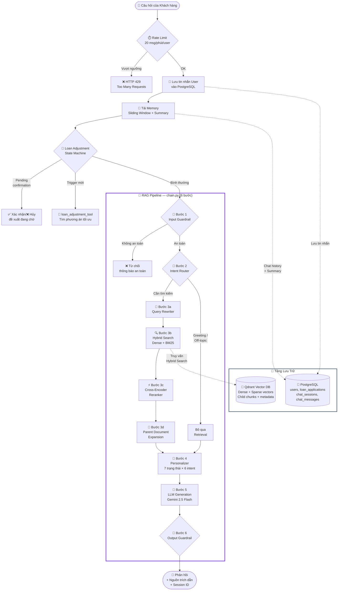
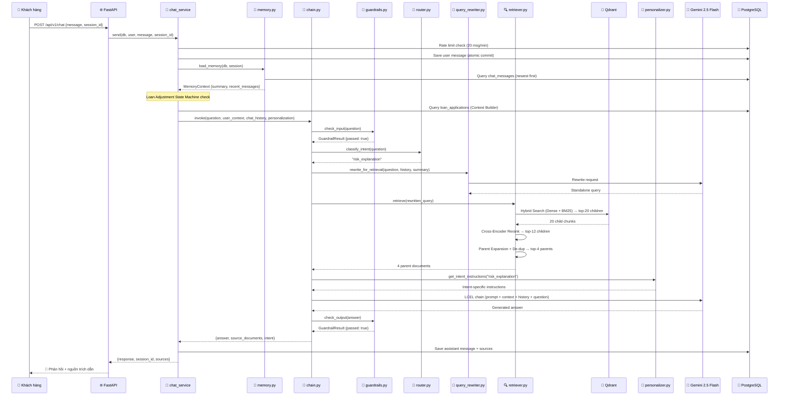

# Báo Cáo Học Thuật: Hệ Thống Retrieval-Augmented Generation (RAG) trong Dự Án CreditIntel

> **Môn học:** Hệ Quản Trị Cơ Sở Dữ Liệu  
> **Dự án:** CreditIntel — Nền tảng đánh giá rủi ro tín dụng ứng dụng AI  
> **Module báo cáo:** Retrieval-Augmented Generation (RAG)

---
## Mục lục

1. [Giới thiệu](#1-giới-thiệu)
2. [Cơ sở lý thuyết](#2-cơ-sở-lý-thuyết)
3. [Kiến trúc tổng quan](#3-kiến-trúc-tổng-quan)

---

## 1. Giới thiệu

### 1.1 Bối cảnh và động lực nghiên cứu

Trong thập kỷ gần đây, các mô hình ngôn ngữ lớn (Large Language Models — LLM) như GPT, Gemini, LLaMA đã mang lại bước đột phá trong lĩnh vực xử lý ngôn ngữ tự nhiên (NLP). Tuy nhiên, khi triển khai các chatbot sử dụng LLM trong các hệ thống nghiệp vụ chuyên ngành — đặc biệt là lĩnh vực tài chính và tín dụng — người phát triển đối mặt với một vấn đề nghiêm trọng: **hiện tượng ảo giác (hallucination)**.

Hallucination xảy ra khi LLM tự bịa ra thông tin không có trong dữ liệu huấn luyện, hoặc đưa ra các câu trả lời lỗi thời do kiến thức bị "đóng băng" tại thời điểm pre-training. Trong bối cảnh tư vấn tín dụng, hallucination có thể dẫn tới những hệ quả nghiêm trọng:

- **Sai chính sách:** LLM có thể hứa hẹn phê duyệt khoản vay trong khi thực tế đơn đã bị từ chối.
- **Sai dữ liệu cá nhân:** LLM có thể đưa ra số liệu DTI, xác suất vỡ nợ sai lệch so với kết quả thực tế từ mô hình Machine Learning.
- **Rò rỉ thông tin:** LLM có thể vô tình tiết lộ cấu trúc cơ sở dữ liệu nội bộ hoặc thông tin của khách hàng khác.

Để giải quyết các vấn đề trên, nhóm phát triển CreditIntel đã lựa chọn kiến trúc **Retrieval-Augmented Generation (RAG)** — một phương pháp kết hợp khả năng tìm kiếm tài liệu (Retrieval) với khả năng sinh văn bản của LLM (Generation), từ đó đảm bảo câu trả lời luôn có cơ sở trích dẫn từ nguồn tri thức đáng tin cậy.

Mục tiêu cụ thể của hệ thống RAG trong CreditIntel bao gồm:

| Mục tiêu | Mô tả |
|-----------|-------|
| Giải thích kết quả ML cá nhân hóa | Trả lời câu hỏi như *"Tại sao tôi bị đánh giá rủi ro CAO?"* dựa trên dữ liệu hồ sơ thực của khách hàng |
| Tư vấn tài chính cơ bản | Hướng dẫn khách hàng về DTI, điểm tín dụng, khả năng vay |
| Giải thích chính sách | Trả lời về tiêu chí phê duyệt, quy trình auto-reject, yêu cầu hồ sơ |
| Hỗ trợ điều chỉnh đơn vay | Đề xuất phương án vay phù hợp hơn khi đơn bị từ chối tự động |

Đặc biệt, hệ thống RAG của CreditIntel được thiết kế với nguyên tắc **"có trích dẫn nguồn, không bịa thông tin"** — mọi câu trả lời đều phải dựa trên tài liệu chính sách, dữ liệu hồ sơ thực, hoặc kết quả ML đã được tính toán sẵn.

### 1.2 Phạm vi báo cáo

Báo cáo này tập trung phân tích module `backend/rag/` trong hệ thống CreditIntel, bao gồm **17 file Python** và **2 file Markdown** tri thức chuyên ngành:

| Thành phần | Số file | Tổng kích thước |
|------------|---------|-----------------|
| Module RAG core (`backend/rag/`) | 17 file `.py` | ~102 KB |
| Knowledge Base (`backend/rag/knowledge/`) | 2 file `.md` | ~36 KB |
| Tích hợp (`chat_service.py`, `loan_adjustment_tool.py`) | 2 file `.py` | Phụ thuộc |

Ngoài ra, báo cáo còn tham chiếu tới các tài liệu thiết kế trong `docs/rag/` (3 file, ~58 KB) và `docs/superpowers/specs/` (12 file thiết kế kỹ thuật cho các iteration phát triển RAG).

**Các công nghệ cốt lõi được sử dụng:**

| Công nghệ | Phiên bản/Model | Vai trò |
|-----------|------------------|---------|
| LangChain | ≥ 0.3.0 | Framework xây dựng RAG pipeline theo chuẩn LCEL |
| Qdrant | Local Docker server | Vector database lưu trữ và tìm kiếm embedding |
| OpenRouter | API Gateway | Truy cập Gemini 2.5 Flash (LLM) và OpenAI text-embedding-3-small |
| FastEmbed | Local inference | BM25 sparse embedding + Cross-Encoder reranker |
| PostgreSQL | (Supabase) | Lưu chat history, session, user context, ML results |

### 1.3 Đóng góp chính của hệ thống

Hệ thống RAG trong CreditIntel đóng góp các thiết kế kỹ thuật nổi bật sau:

1. **Pipeline RAG đa giai đoạn 6 bước:** Từ Input Guardrail → Intent Router → Query Rewriting + Hybrid Search + Reranking → Personalization → LLM Generation → Output Guardrail. Mỗi bước đều có cơ chế graceful degradation riêng, đảm bảo hệ thống không crash khi một thành phần gặp lỗi.

2. **Hybrid Search kết hợp Dense + Sparse BM25:** Tận dụng đồng thời khả năng hiểu ngữ nghĩa (semantic search qua dense vector 1536 chiều) và khả năng khớp từ khóa chính xác (keyword matching qua BM25 sparse vector), đặc biệt hiệu quả với thuật ngữ chuyên ngành tín dụng (DTI, FICO, CIC).

3. **Cross-Encoder Reranking:** Sử dụng mô hình `jinaai/jina-reranker-v2-base-multilingual` (~1.1 GB) chạy local để tái xếp hạng kết quả tìm kiếm, nâng cao độ chính xác so với chỉ dùng bi-encoder similarity.

4. **Parent-Child Chunking cho tài liệu Markdown:** Phân đoạn tài liệu thành cấu trúc phân cấp — tìm kiếm ở mức chi tiết (child chunk, ≤ 700 ký tự) nhưng trả kết quả ở mức ngữ cảnh rộng (parent section, ≤ 3500 ký tự) để LLM có đầy đủ bối cảnh.

5. **Cá nhân hóa giọng điệu theo 7 trạng thái đơn vay × 6 loại ý định = 42 tổ hợp:** Mỗi khách hàng nhận câu trả lời với giọng điệu phù hợp với trạng thái tâm lý và nhu cầu thông tin cụ thể.

6. **Bảo mật đa lớp:** 19 pattern phát hiện prompt injection, 11 pattern phát hiện PII probing ở đầu vào; 13 pattern phát hiện rò rỉ nội bộ và 6 pattern phát hiện cam kết phê duyệt sai ở đầu ra.

---

## 2. Cơ sở lý thuyết

### 2.1 Retrieval-Augmented Generation (RAG)

#### 2.1.1 Định nghĩa

Retrieval-Augmented Generation (RAG) là kiến trúc kết hợp hai thành phần: **(1)** một hệ thống tìm kiếm thông tin (Information Retrieval) để truy xuất các đoạn tài liệu liên quan từ kho tri thức, và **(2)** một mô hình ngôn ngữ lớn (LLM) để sinh câu trả lời dựa trên thông tin đã truy xuất. Khái niệm RAG được đề xuất lần đầu bởi Lewis et al. (2020) trong bài báo *"Retrieval-Augmented Generation for Knowledge-Intensive NLP Tasks"* tại hội nghị NeurIPS.

Ý tưởng trung tâm của RAG là: thay vì bắt LLM phải ghi nhớ toàn bộ kiến thức trong trọng số mô hình (parametric memory), ta bổ sung cho nó một "bộ nhớ ngoài" (non-parametric memory) dưới dạng kho tài liệu có thể tìm kiếm. Khi nhận câu hỏi, hệ thống sẽ:

1. **Indexing (Lập chỉ mục):** Xử lý tài liệu nguồn thành các đoạn văn bản nhỏ (chunk), chuyển đổi thành vector embedding, và lưu trữ trong vector database.
2. **Retrieval (Truy xuất):** Khi nhận câu hỏi, encode câu hỏi thành vector và tìm kiếm các chunk tương đồng nhất trong vector database.
3. **Generation (Sinh văn bản):** Ghép các chunk đã tìm được vào prompt context và gửi cho LLM để sinh câu trả lời.

#### 2.1.2 So sánh RAG với Chatbot thuần LLM

| Tiêu chí | Chatbot thuần LLM | Chatbot RAG |
|-----------|-------------------|-------------|
| Nguồn kiến thức | Chỉ parametric memory (pre-training) | Parametric + non-parametric (tài liệu truy xuất) |
| Hallucination | Cao — LLM tự bịa khi không biết | Thấp — trả lời dựa trên tài liệu truy xuất |
| Cập nhật kiến thức | Phải fine-tune hoặc re-train | Chỉ cần cập nhật kho tài liệu |
| Trích dẫn nguồn | Không thể | Có thể — metadata từ chunk gốc |
| Chi phí | Thấp (1 LLM call) | Cao hơn (embedding + search + LLM call) |
| Độ trễ | Thấp (~1–5s) | Cao hơn (~3–15s, tùy reranking) |

Trong ngữ cảnh CreditIntel — nơi chính sách tín dụng thay đổi theo thời gian, dữ liệu khách hàng là real-time, và sai sót có thể dẫn tới hậu quả pháp lý — RAG là lựa chọn phù hợp hơn so với chatbot thuần LLM.

### 2.2 Vector Embedding và Tìm kiếm ngữ nghĩa

#### 2.2.1 Dense Embedding

Dense embedding là phương pháp biểu diễn văn bản dưới dạng vector số thực trong không gian nhiều chiều, sao cho các văn bản có ý nghĩa tương đồng sẽ có vector gần nhau. Trong CreditIntel, mô hình embedding được sử dụng là **`openai/text-embedding-3-small`** với **1536 chiều** (dimensions), truy cập qua OpenRouter API.

Quá trình encoding:

```
Văn bản đầu vào: "Tỷ lệ nợ/thu nhập (DTI) là thước đo quan trọng..."
       ↓ text-embedding-3-small
Vector: [0.0123, -0.0456, 0.0789, ..., 0.0012]  (1536 chiều)
```

Dense embedding có ưu điểm nổi bật là khả năng **hiểu ngữ nghĩa (semantic understanding)** — nó có thể tìm được các đoạn văn có ý nghĩa tương tự dù dùng từ khác nhau. Ví dụ, câu hỏi *"Tại sao đơn của tôi bị từ chối?"* có thể tìm thấy đoạn tài liệu nói về *"Tiêu chí auto-reject"* mặc dù không chia sẻ từ khóa chung.

#### 2.2.2 Sparse Embedding (BM25)

BM25 (Best Matching 25) là thuật toán tìm kiếm từ khóa cổ điển thuộc họ TF-IDF, được sử dụng rộng rãi trong các hệ thống Information Retrieval truyền thống. Khác với dense embedding, BM25 tạo ra **sparse vector** — vector thưa với phần lớn phần tử bằng 0, chỉ các vị trí tương ứng với từ xuất hiện trong văn bản mới có giá trị khác 0.

Trong CreditIntel, BM25 được triển khai qua thư viện **FastEmbedSparse** với model **`Qdrant/bm25`**, chạy hoàn toàn local (không cần gọi API). BM25 đặc biệt hữu ích cho các **thuật ngữ chuyên ngành tín dụng** (DTI, FICO, CIC, auto-reject) mà dense embedding có thể không nắm bắt chính xác.

#### 2.2.3 Cosine Similarity

Cosine Similarity là phương pháp đo độ tương đồng giữa hai vector bằng cách tính cosine của góc giữa chúng:

$$
\text{cosine\_similarity}(\mathbf{A}, \mathbf{B}) = \frac{\mathbf{A} \cdot \mathbf{B}}{||\mathbf{A}|| \cdot ||\mathbf{B}||}
$$

Giá trị nằm trong khoảng [-1, 1], với 1 nghĩa là hoàn toàn tương đồng và -1 là hoàn toàn đối ngược. Trong CreditIntel, Qdrant vector database được cấu hình sử dụng **Cosine distance** cho dense vector search, cụ thể trong file `ingest.py`:

```python
client.create_collection(
    collection_name=collection_name,
    vectors_config={
        "dense": models.VectorParams(size=1536, distance=models.Distance.COSINE),
    },
    sparse_vectors_config={
        "sparse": models.SparseVectorParams(),
    },
)
```

### 2.3 Hybrid Search — Tìm kiếm hỗn hợp

#### 2.3.1 Động lực

Cả dense embedding và sparse BM25 đều có điểm mạnh và hạn chế riêng:

| Phương pháp | Điểm mạnh | Hạn chế |
|-------------|-----------|---------|
| Dense Search | Hiểu ngữ nghĩa, tìm được paraphrase | Yếu với thuật ngữ chuyên ngành hiếm gặp |
| Sparse BM25 | Khớp từ khóa chính xác, nhanh | Không hiểu ngữ nghĩa, bỏ lỡ paraphrase |

Hybrid Search kết hợp cả hai phương pháp để bù đắp lẫn nhau. Khi xử lý câu hỏi *"Mức DTI bao nhiêu là an toàn?"*:

- **Dense search** tìm được các đoạn về *"tỷ lệ nợ trên thu nhập"*, *"gánh nặng tài chính"* (semantic match)
- **BM25 search** tìm chính xác các đoạn chứa keyword **"DTI"** (exact match)

#### 2.3.2 Triển khai trong CreditIntel

Qdrant hỗ trợ native hybrid search thông qua `RetrievalMode.HYBRID`. Trong file `retriever.py`, hybrid search được cấu hình như sau:

```python
vectorstore = QdrantVectorStore(
    client=client,
    collection_name=QDRANT_COLLECTION,
    embedding=embeddings,          # Dense: OpenAIEmbeddings 1536d
    sparse_embedding=sparse_embeddings,  # Sparse: FastEmbedSparse BM25
    retrieval_mode=RetrievalMode.HYBRID,
    vector_name="dense",
    sparse_vector_name="sparse",
)
```

Kết quả hybrid search được Qdrant kết hợp nội bộ bằng **Reciprocal Rank Fusion (RRF)** hoặc weighted combination, trả về top-K ứng viên tốt nhất từ cả hai phương pháp.

### 2.4 Cross-Encoder Reranking — Tái xếp hạng

#### 2.4.1 Bi-Encoder vs Cross-Encoder

Có hai kiến trúc chính để đánh giá mức độ liên quan giữa câu hỏi (query) và tài liệu (document):

**Bi-Encoder (dùng ở bước Retrieval):**
- Encode query và document **độc lập** thành 2 vector riêng biệt.
- So sánh bằng cosine similarity.
- **Nhanh** (có thể pre-compute document vectors) nhưng **kém chính xác** do không có tương tác trực tiếp giữa query và document.

```
Query  → Encoder → v_q ──┐
                          ├── cosine(v_q, v_d) → score
Document → Encoder → v_d ─┘
```

**Cross-Encoder (dùng ở bước Reranking):**
- Ghép query + document thành **1 chuỗi duy nhất** và đưa qua transformer.
- Mô hình "nhìn thấy" cả query và document cùng lúc → attention giữa chúng → **chính xác hơn**.
- **Chậm** (phải encode lại cho mỗi cặp) → chỉ phù hợp cho bước reranking sau khi đã lọc top-K.

```
[CLS] Query [SEP] Document [SEP] → Cross-Encoder → relevance score
```

#### 2.4.2 Triển khai trong CreditIntel

CreditIntel sử dụng mô hình cross-encoder **`jinaai/jina-reranker-v2-base-multilingual`** (kích thước ~1.1 GB), hỗ trợ đa ngôn ngữ bao gồm tiếng Việt. Model được tải về local (thư mục `~/.cache/fastembed/`) qua thư viện `fastembed`, và chạy inference trên CPU.

Reranker được thiết kế theo **Singleton Pattern** với **Lazy Loading** trong file `reranker.py`:

```python
class Reranker:
    def __init__(self, model_name: str = RERANKER_MODEL):
        self._model_name = model_name
        self._encoder = None  # lazy — chỉ tải khi cần

    def _ensure_loaded(self):
        if self._encoder is None:
            from fastembed.rerank.cross_encoder import TextCrossEncoder
            self._encoder = TextCrossEncoder(model_name=self._model_name)
        return self._encoder

    def rerank(self, query: str, docs: list, top_k: int) -> list:
        encoder = self._ensure_loaded()
        texts = [getattr(d, "page_content", str(d)) for d in docs]
        scores = list(encoder.rerank(query, texts))
        scored = sorted(zip(scores, docs), key=lambda t: t[0], reverse=True)
        return [doc for _, doc in scored[:top_k]]
```

Đáng chú ý, reranker được **pre-warm khi server startup** (qua `@app.on_event("startup")` trong `main.py`) để tránh latency 30–40 giây ở request đầu tiên do phải tải model.

### 2.5 Chunking Strategies — Chiến lược phân đoạn tài liệu

#### 2.5.1 Tổng quan các phương pháp chunking

Chunking là quá trình chia tài liệu gốc thành các đoạn nhỏ hơn trước khi encode thành vector. Chất lượng chunking ảnh hưởng trực tiếp tới chất lượng retrieval. Các phương pháp phổ biến:

| Phương pháp | Mô tả | Ưu điểm | Nhược điểm |
|-------------|-------|---------|------------|
| **Fixed-size** | Chia cố định theo số ký tự/token | Đơn giản, đều đặn | Có thể cắt ngang ý nghĩa |
| **Recursive** | Chia theo separator (`\n\n`, `\n`, `.`) | Giữ cấu trúc câu | Chunk không đều |
| **Semantic** | Chia theo embedding similarity giữa câu | Giữ ngữ nghĩa | Tốn embedding cost |
| **Parent-Child** | Chia 2 tầng: Parent (ngữ cảnh rộng) + Child (chi tiết) | Tìm chi tiết, trả ngữ cảnh rộng | Phức tạp triển khai |

#### 2.5.2 Parent-Child Chunking — Phương pháp được chọn

CreditIntel triển khai chiến lược **Parent-Child Chunking** — một phương pháp phân đoạn phân cấp (hierarchical chunking). Ý tưởng cốt lõi:

- **Child chunk (mức tìm kiếm):** Đoạn nhỏ, tập trung, chứa thông tin cụ thể → vector embedding khớp tốt hơn với câu hỏi chi tiết.
- **Parent section (mức trả kết quả):** Đoạn lớn hơn, chứa đầy đủ ngữ cảnh của section → LLM nhận được bối cảnh rộng hơn để sinh câu trả lời chính xác.

Mối quan hệ Parent-Child được duy trì qua **metadata** gắn kèm mỗi child chunk (bao gồm `parent_id` và `parent_content`), cho phép hệ thống retrieval tự động truy ngược từ child lên parent.

Cấu hình cụ thể trong file `chunking.py`:

```python
PARENT_MAX_CHARS = 3500    # Kích thước tối đa mỗi parent section
CHILD_MAX_CHARS  = 700     # Kích thước tối đa mỗi child chunk
CHILD_OVERLAP_CHARS = 80   # Overlap giữa các child chunk liên tiếp
```

**Minh họa:**

```
Tài liệu gốc (policy.md)
    │
    ├── Parent Section 1: "Giới Thiệu" (≤ 3500 chars)
    │   ├── Child Chunk 1.1 (≤ 700 chars) → [Dense Vector + Sparse Vector] → Qdrant
    │   ├── Child Chunk 1.2 (≤ 700 chars, overlap 80) → Qdrant
    │   └── Child Chunk 1.3 → Qdrant
    │
    ├── Parent Section 2: "Tiêu Chí Phân Loại Rủi Ro" (≤ 3500 chars)
    │   ├── Child Chunk 2.1 → Qdrant
    │   └── Child Chunk 2.2 → Qdrant
    └── ...
```

---

## 3. Kiến trúc tổng quan

### 3.1 Sơ đồ kiến trúc hệ thống

Hệ thống RAG của CreditIntel được thiết kế theo kiến trúc **Pipeline đa giai đoạn (Multi-stage Pipeline)**, tích hợp chặt chẽ với tầng dịch vụ chat (`chat_service.py`) và tầng lưu trữ kép (Qdrant Vector DB + PostgreSQL). Sơ đồ dưới đây mô tả luồng xử lý đầy đủ từ khi khách hàng gửi tin nhắn cho tới khi nhận phản hồi:



### 3.2 Các thành phần chính của Pipeline RAG

Hệ thống RAG được tổ chức thành các module riêng biệt, mỗi module đảm nhận một chức năng cụ thể trong pipeline. Bảng dưới đây liệt kê đầy đủ các thành phần cùng vai trò và file tương ứng:

| Thành phần | File nguồn | Vai trò | Kích thước |
|-----------|-----------|---------|-----------|
| **Orchestrator** | `chain.py` | Điều phối toàn bộ pipeline 6 bước; quản lý LangChain LCEL chain (`prompt \| llm \| StrOutputParser`) | 7.4 KB |
| **Ingest Pipeline** | `ingest.py` | Nạp tài liệu từ `knowledge/` và `docs/data_dictionary/` vào Qdrant; hỗ trợ CLI với `--dry-run` và `--recreate` | 4.3 KB |
| **Chunking Engine** | `chunking.py` | Thuật toán Parent-Child phân đoạn Markdown-aware; enrichment metadata; stable ID generation | 10.2 KB |
| **Retriever** | `retriever.py` | Hybrid Search (Dense + Sparse) qua Qdrant → Reranking → Parent-Child expansion; Singleton pattern | 4.7 KB |
| **Reranker** | `reranker.py` | Cross-Encoder scoring qua `jinaai/jina-reranker-v2-base-multilingual`; Singleton + Lazy Loading | 1.8 KB |
| **Intent Router** | `router.py` | Phân loại ý định: Regex fast-path (4 nhóm) + LLM JSON fallback → 6 loại intent | 7.9 KB |
| **Query Rewriter** | `query_rewriter.py` | Viết lại câu hỏi ngữ cảnh thành truy vấn độc lập cho retrieval (≤ 500 ký tự) | 4.4 KB |
| **Guardrails** | `guardrails.py` | Bảo mật đầu vào (injection, PII) và đầu ra (leak, promise, length) | 8.4 KB |
| **Personalizer** | `personalizer.py` | Ánh xạ 7 trạng thái đơn vay → tông giọng LLM; cung cấp intent instructions cho 6 loại intent | 9.2 KB |
| **Memory Manager** | `memory.py` | Sliding window (budget 2000 tokens) + Lazy summarization khi ≥ 6 tin nhắn ngoài window | 6.4 KB |
| **Context Builder** | `context_builder.py` | Xây dựng 4-block user context (Form, ML, Advisory, Data Quality) từ PostgreSQL | 16.0 KB |
| **Prompt Template** | `prompts.py` | `ChatPromptTemplate` 5-biến: system (9 quy tắc) + user context + docs + history + question | 3.5 KB |
| **Exception Hierarchy** | `exceptions.py` | Cây exception: `RAGError` → `RetrievalError`, `LLMError`, `RAGTimeoutError` | 0.5 KB |
| **Configuration** | `config.py` | Trung tâm cấu hình: load model names, API keys, top-K values từ `core/config.py` | 0.6 KB |
| **Package Facade** | `__init__.py` | Lazy-loading facade — export 14 API functions cho các module bên ngoài | 1.3 KB |
| **Evaluation Runner** | `eval_runner.py` | Bộ kiểm thử tự động offline cho RAG pipeline | 6.1 KB |
| **Evaluation Metrics** | `eval_metrics.py` | Định nghĩa chỉ số: Faithfulness, Answer Relevance, Context Recall | 12.5 KB |

#### 3.2.1 Lazy-Loading Facade (`__init__.py`)

Module `rag/` sử dụng pattern **Lazy-Loading Facade** thông qua `__getattr__` — các sub-module chỉ được import khi có code bên ngoài thực sự gọi tới:

```python
_EXPORTS = {
    "invoke":              ("rag.chain",          "invoke"),
    "build_user_context":  ("rag.context_builder","build_user_context"),
    "classify_intent":     ("rag.router",         "classify_intent"),
    "check_input":         ("rag.guardrails",     "check_input"),
    # ... 14 API functions tổng cộng
}

def __getattr__(name):
    if name not in _EXPORTS:
        raise AttributeError(...)
    module_name, attr_name = _EXPORTS[name]
    value = getattr(import_module(module_name), attr_name)
    globals()[name] = value  # cache lại để lần gọi sau không import lại
    return value
```

Thiết kế này giúp:
- **Giảm startup time:** Server FastAPI không tải toàn bộ RAG module khi boot nếu chưa cần.
- **Tách biệt dependency:** Module nào import lỗi (ví dụ: Qdrant chưa chạy) chỉ ảnh hưởng khi thực sự gọi tới, không crash toàn bộ server.

### 3.3 Ngăn xếp công nghệ chi tiết

#### 3.3.1 Qdrant — Vector Database

| Thuộc tính | Chi tiết |
|-----------|---------|
| Vai trò | Lưu trữ và tìm kiếm dense + sparse vector embedding |
| Triển khai | Docker container local (`http://localhost:6333`) |
| Collection | `creditintel-kb` |
| Dense vector | 1536 chiều, Cosine distance |
| Sparse vector | BM25 sparse params |
| Chế độ tìm kiếm | `RetrievalMode.HYBRID` (Dense + Sparse đồng thời) |

Qdrant được chọn vì khả năng chạy **hoàn toàn local** (không cần cloud API key), hỗ trợ native hybrid search, và có đường nâng cấp sang cloud/cluster khi mở rộng quy mô.

#### 3.3.2 LangChain — Framework RAG

LangChain được sử dụng theo paradigm **LCEL (LangChain Expression Language)**, trong đó pipeline được biểu diễn dưới dạng chuỗi pipe:

```python
# chain.py — Pipeline LCEL
chain = chat_prompt | llm | StrOutputParser()
```

Ba thành phần trong pipeline:
1. **`chat_prompt`** (`ChatPromptTemplate`): Template prompt với 8 biến đầu vào (system instructions, user_display_name, personalization_instructions, intent_instructions, user_context, conversation_summary, context, chat_history, question).
2. **`llm`** (`ChatOpenAI`): Gọi Gemini 2.5 Flash qua OpenRouter API với `temperature=0.3`.
3. **`StrOutputParser()`**: Parse output từ LLM thành chuỗi text thuần.

LangChain LCEL mang lại lợi ích:
- **Composable:** Dễ dàng thêm/bớt/thay thế bất kỳ thành phần nào.
- **Type-safe:** Mỗi bước nhận/trả kiểu dữ liệu xác định.
- **Streaming-ready:** Hỗ trợ streaming output (dù CreditIntel chưa kích hoạt tính năng này).

#### 3.3.3 OpenRouter — API Gateway

| Dịch vụ | Model | Thông số |
|---------|-------|----------|
| LLM chính (Generation) | `google/gemini-2.5-flash` | temperature=0.3, timeout=30s, max_retries=2 |
| LLM classifier (Router) | `google/gemini-2.5-flash` | temperature=0.0, max_tokens=60, timeout=30s |
| LLM query rewriter | `google/gemini-2.5-flash` | temperature=0.0, timeout=30s |
| LLM summarizer (Memory) | `google/gemini-2.5-flash` | temperature=0.2, max_tokens=500, timeout=30s |
| Embedding | `openai/text-embedding-3-small` | 1536 chiều, timeout=10s, max_retries=2 |

OpenRouter hoạt động như **API gateway đa model** — chỉ cần 1 API key để truy cập nhiều model từ nhiều provider khác nhau (Google, OpenAI, Anthropic...). CreditIntel sử dụng OpenRouter qua endpoint **tương thích OpenAI SDK** (`base_url="https://openrouter.ai/api/v1"`), giúp tận dụng trực tiếp `ChatOpenAI` và `OpenAIEmbeddings` từ LangChain mà không cần viết adapter riêng.

#### 3.3.4 FastEmbed — Local Inference Engine

FastEmbed cung cấp hai khả năng inference local (không cần gọi API):

1. **Sparse Embedding (BM25):** `FastEmbedSparse(model_name="Qdrant/bm25")` — tính toán sparse vector cho hybrid search, chạy trực tiếp trên CPU.

2. **Cross-Encoder Reranking:** `TextCrossEncoder(model_name="jinaai/jina-reranker-v2-base-multilingual")` — scoring relevance cho 20 cặp (query, chunk) ở bước reranking, model ~1.1 GB tải về `~/.cache/fastembed/`.

#### 3.3.5 PostgreSQL — Cơ sở dữ liệu quan hệ

PostgreSQL đóng vai trò **lưu trữ persistent** cho 4 loại dữ liệu quan trọng trong RAG:

| Bảng | Vai trò trong RAG |
|------|-------------------|
| `users` | Thông tin khách hàng (username, email) → Personalization |
| `loan_applications` | Đơn vay + kết quả ML (default_probability, risk_level, recommended_amount...) → Context Builder 4-block |
| `chat_sessions` | Metadata phiên chat (title, summary, summary_covers_until_id) → Memory Manager |
| `chat_messages` | Lịch sử tin nhắn (role, content, sources, error flag) → Sliding Window + Summarization |

Mối quan hệ giữa RAG và PostgreSQL thể hiện rõ qua **Context Builder** — module truy vấn trực tiếp bảng `loan_applications` để xây dựng 4-block user context (Form Context, ML Context, Advisory Context, Data Quality Context) được inject vào prompt. Dữ liệu cá nhân **không** được embed vào Qdrant (tránh rò rỉ giữa khách hàng), mà luôn được query live theo `user_id` từ JWT tại thời điểm request.

### 3.4 Luồng dữ liệu tổng quan

Toàn bộ luồng xử lý từ khi khách hàng gửi tin nhắn cho tới khi nhận phản hồi có thể tóm tắt qua sơ đồ sequence sau:



### 3.5 Cấu hình môi trường RAG

Toàn bộ cấu hình RAG được quản lý tập trung qua file `backend/.env` và load vào ứng dụng thông qua `core/config.py` → `rag/config.py`. Bảng dưới liệt kê đầy đủ các tham số cùng giá trị mặc định:

| Biến môi trường | Giá trị mặc định | Mô tả |
|-----------------|------------------|-------|
| `RAG_LLM_MODEL` | `google/gemini-2.5-flash` | Model LLM chính cho Generation, Routing, Rewriting, Summarization |
| `RAG_EMBEDDING_MODEL` | `openai/text-embedding-3-small` | Model Dense Embedding (1536 chiều) |
| `RAG_BM25_MODEL` | `Qdrant/bm25` | Model Sparse Embedding (local) |
| `RAG_RERANKER_ENABLED` | `True` | Bật/tắt Cross-Encoder Reranking |
| `RAG_RERANKER_MODEL` | `jinaai/jina-reranker-v2-base-multilingual` | Model Cross-Encoder (~1.1 GB, local) |
| `RAG_RERANKER_CANDIDATE_K` | `20` | Số child chunks trước reranking (từ Hybrid Search) |
| `RAG_RERANKER_TOP_K` | `12` | Số child chunks sau reranking |
| `RAG_TOP_K` | `4` | Số parent sections cuối cùng gửi vào LLM |
| `RAG_LLM_TIMEOUT_SECONDS` | `30` | Timeout cho mỗi LLM API call |
| `RAG_LLM_MAX_RETRIES` | `2` | Số lần retry khi LLM call fail |
| `RAG_EMBEDDING_TIMEOUT_SECONDS` | `10` | Timeout cho embedding API call |
| `RAG_EMBEDDING_MAX_RETRIES` | `2` | Số lần retry khi embedding call fail |
| `RAG_QDRANT_TIMEOUT_SECONDS` | `5` | Timeout cho Qdrant query |
| `RAG_MEMORY_WINDOW_TOKEN_BUDGET` | `2000` | Token budget cho sliding window memory |
| `RAG_MEMORY_MIN_MESSAGES_TO_SUMMARIZE` | `6` | Ngưỡng tối thiểu tin nhắn ngoài window để trigger summarization |
| `RAG_MEMORY_SUMMARY_MAX_TOKENS` | `500` | Giới hạn tokens cho summary output |

### 3.6 Cây phân cấp Exception

Hệ thống RAG định nghĩa cây exception riêng trong `exceptions.py`, tách biệt hoàn toàn khỏi exception của ứng dụng chính:

```
RAGError (base)
├── RetrievalError    — Qdrant hoặc Embedding service lỗi
├── LLMError          — OpenRouter / LLM call lỗi
└── RAGTimeoutError   — Upstream call vượt timeout budget
```

**Nguyên tắc xử lý exception trong pipeline:**

| Exception | Hành vi | Lý do |
|-----------|---------|-------|
| `RetrievalError` | Log + tiếp tục với `documents = []` | Graceful degradation — LLM vẫn trả lời được dựa trên user context |
| `RAGTimeoutError` (retrieval) | Log warning + tiếp tục với `documents = []` | Tương tự trên |
| `LLMError` / `RAGTimeoutError` (generation) | Propagate lên `chat_service` → HTTP 503 | Không có LLM thì không thể sinh câu trả lời |
| `RAGError` (chat_service) | Save error message → HTTP 503 | User message đã được persist, assistant message lưu với `error=True` |

Thiết kế này đảm bảo **không bao giờ mất tin nhắn của khách hàng** — ngay cả khi RAG pipeline crash hoàn toàn, tin nhắn user vẫn được lưu trong PostgreSQL nhờ cơ chế **atomic save** (commit user message trước khi gọi RAG).

### 3.7 Cấu trúc thư mục

```
backend/rag/
├── __init__.py              # Lazy-loading facade — export 14 API functions
├── config.py                # Trung tâm cấu hình: model, API keys, top-K
├── chain.py                 # Orchestrator: pipeline 6 bước từ guardrail đến output
├── ingest.py                # Pipeline nạp tài liệu: CLI với --dry-run, --recreate
├── chunking.py              # Parent-Child chunking: Markdown-aware, stable ID
├── context_builder.py       # 4-block user context: Form + ML + Advisory + Quality
├── router.py                # Intent classification: 4 nhóm Regex + LLM JSON fallback
├── query_rewriter.py        # Viết lại câu hỏi ngữ cảnh → truy vấn độc lập (≤ 500 chars)
├── retriever.py             # Hybrid Search → Reranking → Parent expansion
├── reranker.py              # Cross-Encoder: Singleton + Lazy Load + fallback
├── guardrails.py            # Input (19 injection + 11 PII) + Output (13 leak + 6 promise)
├── personalizer.py          # 7 trạng thái × tông giọng + 6 intent instructions
├── memory.py                # Sliding window (2000 tokens) + Lazy summarization
├── prompts.py               # ChatPromptTemplate: system (9 rules) + 7 variables
├── exceptions.py            # RAGError → RetrievalError, LLMError, RAGTimeoutError
├── eval_runner.py           # Bộ kiểm thử tự động offline
├── eval_metrics.py          # Faithfulness, Answer Relevance, Context Recall
└── knowledge/
    ├── faq.md               # ~19 KB — 30 cặp Q&A, 9 chủ đề (A–I)
    └── policy.md            # ~17 KB — 12 chương chính sách tín dụng
```

---

## Tài liệu tham khảo

1. Lewis, P. et al. (2020). *Retrieval-Augmented Generation for Knowledge-Intensive NLP Tasks.* Advances in Neural Information Processing Systems (NeurIPS), 33.
2. Gao, Y. et al. (2024). *Retrieval-Augmented Generation for Large Language Models: A Survey.* arXiv preprint arXiv:2312.10997.
3. Robertson, S. & Zaragoza, H. (2009). *The Probabilistic Relevance Framework: BM25 and Beyond.* Foundations and Trends in Information Retrieval, 3(4), 333–389.
4. Nogueira, R. & Cho, K. (2019). *Passage Re-ranking with BERT.* arXiv preprint arXiv:1901.04085.
5. LangChain Documentation — https://python.langchain.com/
6. Qdrant Documentation — https://qdrant.tech/documentation/
7. Jina AI Reranker v2 — https://jina.ai/reranker/
8. OpenRouter API Documentation — https://openrouter.ai/docs
9. FastEmbed Documentation — https://qdrant.github.io/fastembed/
