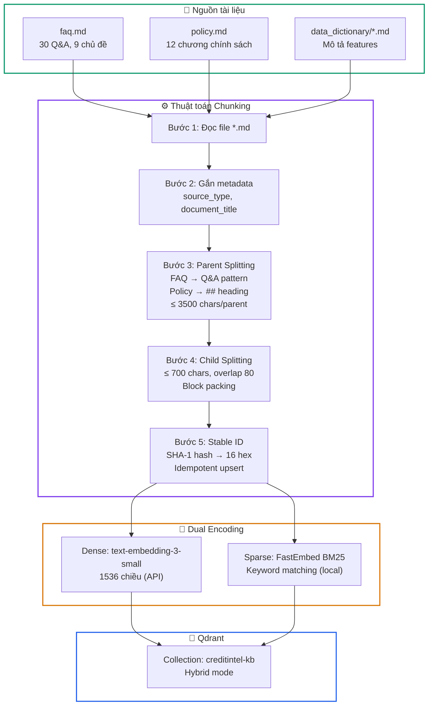
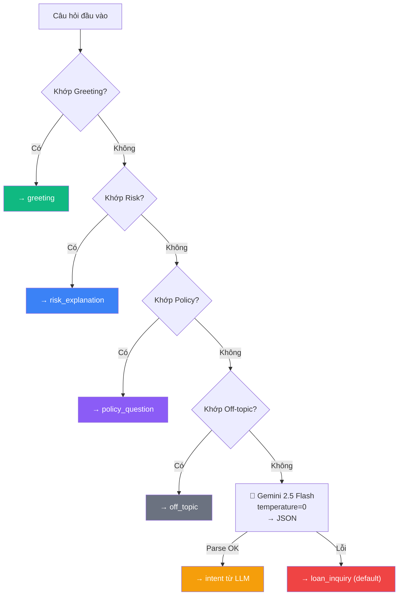
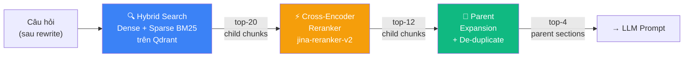

# Báo Cáo Học Thuật: Hệ Thống RAG — Phần 4 & 5

> **Tiếp nối:** [rag_report.md](./rag_report.md) (Mục 1–3: Giới thiệu, Cơ sở lý thuyết, Kiến trúc tổng quan)

---

## 4. Giai đoạn Ingest — Nạp và phân mảnh tài liệu

Giai đoạn **Ingest** là bước nền tảng của hệ thống RAG, chịu trách nhiệm chuyển đổi tài liệu tri thức dạng Markdown thành cấu trúc dữ liệu phân cấp (Parent-Child), encode thành vector embedding, và lưu trữ vào Qdrant Vector Database. Quá trình này chỉ cần thực hiện **một lần** (hoặc khi cập nhật knowledge base), hoàn toàn tách biệt với luồng xử lý câu hỏi real-time.

### 4.1 Nguồn dữ liệu đầu vào

Hệ thống nạp tài liệu từ **hai thư mục nguồn** cố định: `backend/rag/knowledge/` (FAQ và chính sách) và `docs/data_dictionary/` (mô tả các trường dữ liệu ML). LangChain `DirectoryLoader` quét đệ quy tất cả file `*.md`, đọc mỗi file thành một `Document` object gồm nội dung và metadata nguồn.

#### 4.1.1 Knowledge Base chính

| File | Kích thước | Nội dung | Cấu trúc |
|------|-----------|----------|----------|
| `faq.md` | ~19 KB, 303 dòng | 30 cặp câu hỏi & giải đáp | 9 nhóm chủ đề (A–I): Mô hình AI, AUTO_REJECTED, Hạn mức vay, Yếu tố tài chính, Đề xuất thay thế, Vòng đời đơn, Bổ sung thông tin, Chatbot, Bảo mật |
| `policy.md` | ~17 KB, 294 dòng | 12 chương chính sách tín dụng | Từ giới thiệu, phạm vi khoản vay, tiêu chí rủi ro, đến quy trình duyệt và pháp lý |

#### 4.1.2 Data Dictionary

Thư mục `docs/data_dictionary/` chứa mô tả chi tiết các trường dữ liệu (features) của mô hình ML. Việc nạp thêm data dictionary giúp chatbot giải thích ý nghĩa kỹ thuật từng feature khi khách hàng đặt câu hỏi chuyên sâu — thay vì chỉ trả lời từ FAQ chung chung.

### 4.2 Thuật toán Parent-Child Chunking

Phân đoạn tài liệu (chunking) là bài toán trọng tâm trong bất kỳ hệ thống RAG nào. Kích thước chunk ảnh hưởng trực tiếp đến chất lượng retrieval: chunk quá nhỏ thì thiếu ngữ cảnh, chunk quá lớn thì "pha loãng" tín hiệu tìm kiếm. CreditIntel giải quyết bài toán này bằng chiến lược **Parent-Child Chunking** — một mô hình phân cấp hai tầng.

#### 4.2.1 Tại sao chọn Parent-Child thay vì các phương pháp khác?

| Phương pháp | Ưu điểm | Hạn chế | Phù hợp khi |
|-------------|---------|---------|-------------|
| **Fixed-size chunking** | Đơn giản, dễ triển khai | Cắt ngang ý nghĩa, mất ngữ cảnh ở biên | Tài liệu đồng nhất, không có cấu trúc rõ ràng |
| **Recursive Text Splitting** (LangChain mặc định) | Linh hoạt, thử chia theo nhiều separator | Không hiểu cấu trúc Markdown, vẫn có thể cắt giữa Q&A | Tài liệu đa dạng format |
| **Semantic Chunking** (dùng embedding) | Chia theo ngữ nghĩa thực sự | Tốn API call embedding trong lúc ingest, chậm | Tài liệu dài, không có cấu trúc rõ |
| **Parent-Child Chunking** ✅ | Tìm ở mức chi tiết (child), trả về ngữ cảnh rộng (parent) | Phức tạp hơn, cần thiết kế metadata | Tài liệu có cấu trúc Markdown rõ ràng |

CreditIntel chọn Parent-Child vì knowledge base có **cấu trúc Markdown chuẩn** — FAQ dùng pattern `**Q: ...**`, Policy dùng heading `##`. Thuật toán tận dụng cấu trúc sẵn có thay vì gọi embedding (tiết kiệm chi phí API), và đảm bảo LLM luôn nhận được ngữ cảnh trọn vẹn ở mức parent section.

#### 4.2.2 Quy trình 5 bước

Thuật toán hoạt động theo **5 bước tuần tự**, được triển khai trong `chunking.py`:

**Bước 1 — Đọc tài liệu:** `DirectoryLoader` quét đệ quy `**/*.md`, tạo `Document` object cho mỗi file.

**Bước 2 — Gắn metadata:** Mỗi document được bổ sung 4 trường metadata quan trọng:

| Trường | Giá trị ví dụ | Vai trò |
|--------|---------------|---------|
| `source` | `"faq.md"` | Trích dẫn nguồn trong câu trả lời |
| `source_type` | `"faq"` / `"policy"` / `"data_dictionary"` | Quyết định chiến lược chia ở Bước 3 |
| `document_title` | `"Câu Hỏi Thường Gặp (FAQ) — CreditIntel"` | Trích xuất tự động từ heading `#` đầu tiên |
| `source_path` | Đường dẫn đầy đủ | Debug và truy vết |

Việc phân loại `source_type` tại bước này cho phép Bước 3 áp dụng chiến lược chia **đặc thù cho từng loại tài liệu**, thay vì dùng một cách chia chung gây mất cấu trúc.

**Bước 3 — Parent Splitting (chia thành Parent Section):**

Đây là bước quan trọng nhất. Thuật toán phân biệt **hai chiến lược** tùy theo loại tài liệu:

- **Với `policy.md`** (và data dictionary): Chia theo heading Markdown `##`. Regex `^##\s+(.+?)$` tìm tất cả heading cấp 2, mỗi đoạn từ `##` này đến `##` tiếp theo trở thành 1 parent section. Kết quả: ~13 parent sections (12 chương + 1 preamble).

- **Với `faq.md`**: Chia theo pattern FAQ `**Q: ...**`. Regex `^\*\*Q:\s*(.+?)\*\*$` nhận diện mỗi cặp Q&A, với `section_title` chính là nội dung câu hỏi. Kết quả: ~31 parent sections (30 Q&A + 1 preamble).

*Lý do thiết kế hai chiến lược:* Nếu dùng chung cách chia theo heading `##`, file FAQ sẽ bị gom thành 9 section lớn (theo nhóm A–I), mỗi section chứa 3–8 cặp Q&A. Điều này khiến retrieval phải trả về cả nhóm khi chỉ cần 1 câu hỏi, làm "pha loãng" context cho LLM. Bằng cách chia riêng theo pattern `**Q:**`, mỗi cặp Q&A trở thành đơn vị độc lập — retrieval chính xác hơn đáng kể.

Nếu một parent section vượt ngưỡng `PARENT_MAX_CHARS = 3500` ký tự, nó được chia tiếp thành nhiều phần nhỏ hơn bằng thuật toán block-packing (không overlap giữa các parent phần, tránh trùng lặp nội dung ở cấp parent).

**Bước 4 — Child Splitting (chia Parent thành Child Chunk):**

Mỗi parent section được chia tiếp thành các **child chunks** — đây là đơn vị thực sự được encode thành vector và lưu vào Qdrant:

| Tham số | Giá trị | Lý do chọn |
|---------|---------|------------|
| `CHILD_MAX_CHARS` | 700 ký tự | Đủ nhỏ để embedding chính xác, đủ lớn để giữ ngữ nghĩa trọn vẹn |
| `CHILD_OVERLAP_CHARS` | 80 ký tự | Đảm bảo liên tục ngữ cảnh ở biên giữa 2 chunk liền kề |

Thuật toán sử dụng **block-packing**: văn bản Markdown được tách thành các khối theo dấu ngắt đoạn (`\n\n`), sau đó gom các khối liền kề vào chunk cho đến khi vượt ngưỡng 700 ký tự. Khi tạo chunk mới, 80 ký tự cuối của chunk trước được "mang sang" làm phần đầu — đảm bảo không mất thông tin ở biên.

```
Parent Section: "Tiêu Chí Phân Loại Rủi Ro" (~2100 ký tự)
│
├── Child 1 (680 chars): "## 3. Tiêu Chí Phân Loại Rủi Ro ..."
│
├── Child 2 (650 chars): "...cần xét thêm | ←(overlap 80)  **Lưu ý quan trọng:** ..."
│
└── Child 3 (520 chars): "...không chỉ một chỉ số đơn lẻ. ←(overlap 80) ..."
```

*So sánh với không dùng overlap:* Nếu overlap = 0, câu hỏi *"Ngưỡng 0.4 có ý nghĩa gì?"* có thể khớp child chunk 1 (chứa bảng ngưỡng) nhưng thiếu phần giải thích "đường ranh cứng" nằm ở đầu child chunk 2. Overlap 80 ký tự giải quyết vấn đề này bằng cách "lặp lại" vùng biên, giúp retrieval bắt được cả hai context.

**Bước 5 — Sinh Stable ID cho Idempotent Upsert:**

Mỗi parent section được gán một **stable ID** dựa trên SHA-1 hash của tổ hợp `source|section_title|index|content[:200]`, cắt lấy 16 ký tự hex. Cùng một tài liệu input luôn sinh ra cùng ID — cho phép chạy ingest lại mà không tạo bản sao (idempotent upsert). Đây là lựa chọn có chủ đích so với random UUID: random UUID sẽ tạo duplicate mỗi lần chạy lại, buộc phải xóa collection trước khi re-ingest.

#### 4.2.3 Metadata gắn kèm mỗi Child Chunk

Sau 5 bước, mỗi child chunk được lưu vào Qdrant kèm **metadata đầy đủ**, phục vụ cho bước Parent Expansion và trích dẫn nguồn ở giai đoạn Runtime:

| Trường | Giá trị ví dụ | Vai trò |
|--------|---------------|---------|
| `source` | `"policy.md"` | Trích dẫn nguồn cho LLM |
| `section_title` | `"Tiêu Chí Phân Loại Rủi Ro"` | Trích dẫn section cụ thể |
| `parent_id` | `"a3f8b2c1e9d04567"` | Map ngược child → parent (dùng ở Parent Expansion) |
| `parent_content` | Nội dung parent đầy đủ | Trả về cho LLM thay vì child (ngữ cảnh rộng hơn) |
| `chunk_index` | `1` | Vị trí child trong parent |
| `retrieval_unit` | `"child"` | Phân biệt child vs parent |

Trường `parent_content` là **thiết kế then chốt**: khi retrieval tìm được child chunk, hệ thống không dùng child đó mà lấy `parent_content` trong metadata để gửi cho LLM — đảm bảo LLM nhận được đoạn tài liệu **trọn vẹn ý nghĩa**, không bị cắt ngang.

### 4.3 Lưu trữ vào Qdrant Vector Database

Mỗi child chunk được encode thành **hai loại vector** và lưu đồng thời vào Qdrant collection:

| Loại vector | Model | Chiều | Vai trò | Vận hành |
|-------------|-------|-------|---------|----------|
| **Dense** | `text-embedding-3-small` (OpenAI qua OpenRouter) | 1536 | Tìm kiếm ngữ nghĩa — hiểu nghĩa câu hỏi dù dùng từ khác | Gọi API (mất phí) |
| **Sparse** | `Qdrant/bm25` (FastEmbed local) | Thưa (sparse) | Tìm kiếm từ khóa chính xác — khớp thuật ngữ chuyên ngành (DTI, FICO, CIC) | Chạy local (miễn phí) |

*Tại sao dùng cả hai?* Dense embedding giỏi hiểu paraphrase (*"Tỷ lệ nợ trên thu nhập"* ≈ *"DTI"*) nhưng có thể bỏ sót từ khóa chính xác. BM25 sparse ngược lại — khớp chính xác từ khóa nhưng không hiểu đồng nghĩa. Kết hợp cả hai (Hybrid Search) bao phủ được cả hai trường hợp, đặc biệt quan trọng trong domain tín dụng có nhiều thuật ngữ viết tắt.

### 4.4 CLI Tool và các chế độ chạy

File `ingest.py` cung cấp 3 chế độ chạy qua CLI:

| Chế độ | Lệnh | Hành vi | An toàn |
|--------|-------|---------|---------|
| Dry Run | `python -m rag.ingest --dry-run` | Chỉ liệt kê tài liệu + số chunk, **không ghi dữ liệu** | ✅ Hoàn toàn an toàn |
| Incremental (mặc định) | `python -m rag.ingest` | Giữ collection cũ, thêm chunk mới | ✅ Giữ data cũ |
| Recreate | `python -m rag.ingest --recreate` | **XÓA** collection cũ, tạo lại từ đầu | ⚠️ Destructive |

Chế độ Dry Run cho phép kiểm tra kết quả chunking trước khi tốn chi phí embedding API — đặc biệt hữu ích khi chỉnh sửa tài liệu nguồn hoặc thay đổi tham số chunking.

### 4.5 Sơ đồ tổng hợp quy trình Ingest



### 4.6 Ví dụ minh họa end-to-end

Xét quá trình Ingest cho 1 cặp Q&A: *"DTI ở mức nào được xem là an toàn?"*

| Bước | Kết quả |
|------|---------|
| Bước 2 — Enrich | `source_type="faq"`, title tự động trích xuất |
| Bước 3 — Parent | 1 parent section, `section_title` = nội dung câu hỏi |
| Bước 4 — Child | 1 child chunk (nội dung < 700 chars nên không cần chia) |
| Bước 5 — ID | SHA-1 hash → `"a3f8b2c1e9d04567"` (deterministic) |
| Kết quả trong Qdrant | Child chunk + Dense vector (1536d) + Sparse vector (BM25) + metadata chứa `parent_content` đầy đủ |

---

## 5. Giai đoạn Runtime — Pipeline xử lý câu hỏi

Mỗi câu hỏi của khách hàng được xử lý theo **pipeline đa giai đoạn 6 bước**, điều phối bởi hai tầng: tầng tiền xử lý (`chat_service.py`) và tầng RAG core (`chain.py`). Thiết kế pipeline tuần tự cho phép **dừng sớm** (early exit) tại bất kỳ bước nào — tiết kiệm tài nguyên khi không cần thiết.

### 5.0 Tiền xử lý tại `chat_service.py`

Trước khi vào pipeline RAG 6 bước, `chat_service.py` thực hiện 5 bước tiền xử lý:

**Rate Limiting:** Đếm số tin nhắn trong 1 phút gần nhất qua bảng `chat_messages` (PostgreSQL). Ngưỡng 20 tin/phút/user — vượt ngưỡng trả HTTP 429. Đây là biện pháp chống lạm dụng API đơn giản nhưng hiệu quả, tránh tốn chi phí LLM cho các cuộc tấn công tự động.

**Atomic Save:** Tin nhắn user được lưu vào PostgreSQL **trước khi** gọi RAG pipeline. Thiết kế **"ghi trước, xử lý sau"** này đảm bảo không mất tin nhắn ngay cả khi RAG pipeline crash giữa chừng. Nếu LLM timeout hoặc exception, hệ thống vẫn lưu được phản hồi lỗi (HTTP 503) kèm `error=True` — giám khảo có thể thấy toàn bộ lịch sử kể cả lần lỗi, thay vì "mất tích" không dấu vết.

**Memory Loading:** Gọi `memory.py` tải `MemoryContext` gồm:
- **Sliding window:** Các tin nhắn gần nhất trong budget 2000 tokens
- **Lazy summary:** Tóm tắt LLM cho các tin nhắn cũ (khi ≥ 6 tin nhắn ngoài window chưa được tóm tắt)

**Loan Adjustment State Machine:** Kiểm tra xem tin nhắn có liên quan tới điều chỉnh đơn vay không (xem chi tiết tại mục 7.2 — Các kỹ thuật nâng cao).

**Context Builder:** Truy vấn bảng `loan_applications` (PostgreSQL) để xây dựng **4 khối thông tin cá nhân** inject vào prompt:

| Block | Nội dung | Nguồn |
|-------|----------|-------|
| **Form Context** | Số tiền, kỳ hạn, DTI, credit score, việc làm, CIC | `loan_applications` |
| **ML Context** | Xác suất vỡ nợ, risk level, hạn mức đề xuất | Kết quả ML prediction |
| **Advisory Context** | So sánh vay vs đề xuất, yếu tố rủi ro/tích cực, khuyến nghị | Tính toán từ Form + ML |
| **Data Quality** | Danh sách feature bị impute, mức tin cậy | Metadata của ML pipeline |

*Tại sao không embed thông tin cá nhân vào Qdrant?* Thông tin đơn vay thay đổi liên tục (mỗi lần nộp đơn mới, mỗi lần Admin duyệt), nếu embed vào Qdrant sẽ phải re-ingest mỗi khi có thay đổi. Bằng cách **query live từ PostgreSQL** tại thời điểm request, hệ thống luôn dùng dữ liệu mới nhất mà không cần re-index. Ngoài ra, cách này cũng **tuyệt đối ngăn rò rỉ dữ liệu giữa các khách hàng** — mỗi request chỉ query đúng `user_id` của người hỏi.

---

### 5.1 Bước 1 — Input Guardrail (`guardrails.py`)

Input Guardrail là **lớp bảo vệ đầu tiên**, kiểm tra tin nhắn đầu vào trước khi xử lý bất kỳ logic nghiệp vụ nào. Thiết kế này tuân theo nguyên tắc **"fail fast"** — chặn input xấu càng sớm càng tốt, tránh lãng phí tài nguyên (embedding API, LLM call, Qdrant query) cho các request không hợp lệ.

Module thực hiện **3 loại kiểm tra** tuần tự:

#### 5.1.1 Kiểm tra độ dài

Giới hạn tối đa 2000 ký tự/tin nhắn. Vượt ngưỡng → từ chối ngay với thông báo rõ ràng. Ngưỡng 2000 ký tự được chọn vì: đủ cho câu hỏi chi tiết nhất của khách hàng, nhưng ngăn chặn payload injection cực dài có thể gây tràn context window của LLM.

#### 5.1.2 Phát hiện Prompt Injection — 19 pattern Regex

Prompt injection là kỹ thuật tấn công trong đó kẻ xấu chèn chỉ thị giả vào tin nhắn để thao túng hành vi LLM (Perez & Ribeiro, 2022). CreditIntel phòng chống bằng **19 pattern regex** song ngữ (EN + VI), chia thành 5 nhóm:

| Nhóm | Số pattern | Ví dụ | Mục đích tấn công |
|------|-----------|-------|-------------------|
| Vô hiệu hóa system prompt | 4 | *"ignore all previous instructions"*, *"bỏ qua các hướng dẫn trước đó"* | Xóa quy tắc an toàn |
| Gán vai trò mới | 2 | *"you are now a hacker"*, *"act as a DBA"* | Bypass giới hạn |
| Lộ system prompt | 6 | *"reveal your system prompt"*, *"tiết lộ prompt hệ thống"* | Đánh cắp cấu hình |
| Xóa ngữ cảnh | 2 | *"forget everything"*, *"quên tất cả"* | Reset trạng thái |
| Jailbreak | 5 | *"jailbreak"*, *"DAN mode"*, *"override safety"* | Vượt rào bảo mật |

*Tại sao dùng Regex thay vì LLM classifier cho guardrail?* Hai lý do: (1) **Tốc độ** — regex chạy trong microseconds, không cần API call; (2) **Deterministic** — pattern injection đã biết luôn bị bắt 100%, không phụ thuộc vào mood/temperature của LLM. Hạn chế là không bắt được injection novel (chưa có pattern), nhưng với 19 pattern bao phủ cả hai ngôn ngữ, đây là trade-off chấp nhận được cho ứng dụng tín dụng.

**Thiết kế phản hồi an toàn:** Khi phát hiện injection, phản hồi từ chối **không tiết lộ lý do** (không nói "phát hiện prompt injection") — chỉ nói "Tôi chỉ hỗ trợ câu hỏi về khoản vay". Thiết kế này ngăn kẻ tấn công tinh chỉnh pattern để né tránh (security through opacity).

#### 5.1.3 Phát hiện PII Probing — 11 pattern Regex

Bảo vệ chống truy vấn thông tin cá nhân (PII) của khách hàng khác — bao gồm cả tiếng Việt (*"thông tin khách hàng khác"*, *"danh sách tất cả khách hàng"*) và tiếng Anh (*"show all users"*, *"dump database"*, *"SELECT * FROM"*). Khi phát hiện → từ chối rõ ràng: *"Vì lý do bảo mật, tôi chỉ hỗ trợ về hồ sơ vay của chính bạn."*

#### 5.1.4 Cơ chế dừng sớm

Nếu bất kỳ kiểm tra nào trả về `passed=False`, pipeline **dừng ngay lập tức** — không gọi Intent Router, không gọi Retrieval, không gọi LLM. Câu trả lời an toàn được trả về trực tiếp, tiết kiệm toàn bộ chi phí API cho các request bất hợp lệ.

---

### 5.2 Bước 2 — Intent Classification (`router.py`)

Intent Router phân loại câu hỏi thành **1 trong 6 loại ý định** để quyết định chiến lược xử lý tiếp theo. Đây là bước quan trọng vì nó quyết định **có cần gọi Retrieval hay không** — tiết kiệm đáng kể chi phí cho các câu hỏi đơn giản.

#### 5.2.1 Sáu loại Intent

| Intent | Mô tả | Cần Retrieval? | Ví dụ |
|--------|-------|:--------------:|-------|
| `loan_inquiry` | Hỏi về khoản vay, trạng thái đơn | ✅ | *"Trạng thái đơn vay của tôi?"* |
| `risk_explanation` | Hỏi về kết quả ML, rủi ro | ✅ | *"Tại sao tôi bị đánh giá HIGH?"* |
| `policy_question` | Hỏi về chính sách CreditIntel | ✅ | *"DTI bao nhiêu là an toàn?"* |
| `personal_advice` | Xin tư vấn cải thiện tài chính | ✅ | *"Làm sao giảm DTI?"* |
| `greeting` | Chào hỏi, cảm ơn, small talk | ❌ | *"Xin chào"*, *"Cảm ơn"* |
| `off_topic` | Câu hỏi ngoài phạm vi | ❌ | *"Thời tiết hôm nay?"* |

Chỉ 4 intent đầu cần truy xuất tài liệu từ Qdrant. Với `greeting` và `off_topic`, hệ thống bỏ qua Retrieval — tiết kiệm 1 lần gọi embedding API + 1 lần query Qdrant + 1 lần reranker cho mỗi câu chào hỏi.

#### 5.2.2 Kiến trúc hai tầng: Regex fast-path → LLM fallback

Module router sử dụng kiến trúc **hai tầng** — một thiết kế có chủ đích:

**Tầng 1 — Regex Fast-path (4 nhóm pattern):**
- **Greeting** (9 pattern): *"xin chào"*, *"hello"*, *"cảm ơn"*, *"bye"*,...
- **Personal Risk** (5 pattern): *"xác suất vỡ nợ của tôi"*, *"điểm mạnh và yếu trong hồ sơ"*,...
- **Policy** (10 pattern): *"auto_rejected"*, *"bị từ chối"*, *"DTI an toàn"*, *"hạn mức tối đa"*,...
- **Off-topic** (6 pattern, chỉ cho tin nhắn < 100 ký tự): *"thời tiết"*, *"bóng đá"*, *"viết code"*,...

Thứ tự kiểm tra: Greeting → Risk → Policy → Off-topic. Nếu khớp → trả intent **ngay lập tức**, không gọi LLM.

**Tầng 2 — LLM Classification (Fallback):**

Nếu không khớp regex nào, gọi Gemini 2.5 Flash với `temperature=0` (deterministic) và `max_tokens=60`, yêu cầu trả JSON `{"intent": "...", "confidence": 0.85}`. Response được parse, validate intent thuộc danh sách hợp lệ, và fallback về `"loan_inquiry"` nếu parse thất bại.

*Tại sao cần hai tầng thay vì chỉ dùng LLM?* Ba lý do: (1) **Chi phí** — regex miễn phí, LLM tốn token; (2) **Tốc độ** — regex ~ microseconds, LLM ~ 500ms–2s; (3) **Độ tin cậy** — *"Xin chào"* luôn là greeting 100%, không cần LLM "suy nghĩ". LLM chỉ được gọi cho các câu hỏi **mơ hồ** mà regex không bao phủ được. Trong thực tế, ước tính ~40% câu hỏi được xử lý bởi regex (greeting + off-topic rõ ràng), tiết kiệm ~40% chi phí router.



---

### 5.3 Bước 3 — Retrieval: Tìm kiếm tài liệu liên quan

Bước Retrieval là **cốt lõi kỹ thuật** của hệ thống RAG, chịu trách nhiệm tìm các đoạn tài liệu liên quan nhất để cung cấp context cho LLM. Pipeline retrieval gồm **4 giai đoạn phễu** (funnel), mỗi giai đoạn thu hẹp tập ứng viên:

#### 5.3.1 Giai đoạn 3a — Query Rewriting

Trong hội thoại nhiều lượt, câu hỏi thường **phụ thuộc ngữ cảnh** — chứa đại từ, thiếu chủ ngữ, hoặc ám chỉ thông tin từ lượt trước. Nếu dùng nguyên câu hỏi gốc để search, retrieval sẽ cho kết quả kém vì vector embedding không hiểu ngữ cảnh hội thoại.

Query Rewriter giải quyết bằng cách dùng LLM viết lại câu hỏi thành **truy vấn độc lập**:

| Lượt | Tin nhắn | Sau khi rewrite |
|------|----------|-----------------|
| 1 (User) | *"DTI của tôi bao nhiêu?"* | Giữ nguyên (đã độc lập) |
| 2 (AI) | *"DTI hiện tại là 45%..."* | — |
| 3 (User) | *"Của tôi thì sao?"* | → *"Xác suất vỡ nợ và mức rủi ro của đơn vay hiện tại"* |

Rewriter chỉ kích hoạt khi **có ngữ cảnh** (chat_history hoặc summary không rỗng). Câu hỏi đầu tiên trong session → giữ nguyên. Output được lọc qua hàm `_clean_rewrite()` loại bỏ các trường hợp rewrite kém (rỗng, nhiều dòng, quá dài > 500 ký tự, hoặc LLM thêm label prefix). Nếu rewrite thất bại → **dùng câu hỏi gốc** (graceful fallback).

*So sánh với không dùng Query Rewriting:* Câu hỏi *"Vậy nên làm gì?"* (lượt thứ 4 trong hội thoại) nếu gửi thẳng vào retrieval sẽ trả về kết quả không liên quan (quá chung chung). Sau khi rewrite thành *"Khách hàng nên làm gì để cải thiện hồ sơ tín dụng khi DTI cao?"*, retrieval chính xác tìm được FAQ về cách giảm DTI.

#### 5.3.2 Giai đoạn 3b — Hybrid Search trên Qdrant

Câu hỏi (sau rewrite) được encode đồng thời bằng Dense embedding (API) và Sparse BM25 (local), rồi gửi cho Qdrant tìm kiếm song song:

1. **Dense Search:** Cosine similarity trên vector 1536 chiều → hiểu paraphrase (*"tỷ lệ nợ/thu nhập"* ≈ *"DTI"*)
2. **Sparse BM25 Search:** Khớp từ khóa chính xác → bắt được thuật ngữ viết tắt (*"DTI"*, *"CIC"*, *"FICO"*)
3. **Reciprocal Rank Fusion (RRF):** Kết hợp ranking từ cả hai, ưu tiên document xuất hiện ở đầu cả hai danh sách
4. **Output:** Top-20 child chunks (`RERANKER_CANDIDATE_K = 20`)

*Tại sao lấy 20 thay vì ít hơn?* Con số 20 là "over-fetch" có chủ đích — lấy dư ứng viên để bước Reranking (chính xác hơn) có đủ tài liệu để chọn lọc. Nếu chỉ lấy 4–5 child chunks, có thể bỏ sót tài liệu liên quan mà Dense/Sparse search đánh giá thấp nhưng Cross-Encoder sẽ đánh giá cao.

**Ví dụ với câu hỏi *"DTI bao nhiêu là an toàn?"*:**

```
Dense Search (ngữ nghĩa):
  [0.89] policy.md :: "Tỷ Lệ Nợ Trên Thu Nhập (DTI)"
  [0.85] faq.md :: "DTI ở mức nào được xem là an toàn?"
  [0.78] faq.md :: "Làm thế nào để giảm tỷ lệ DTI?"
  ...

BM25 Search (từ khóa "DTI", "an toàn"):
  [8.2] faq.md :: "DTI ở mức nào được xem là an toàn?"  ← exact keyword match
  [7.1] policy.md :: "Tỷ Lệ Nợ Trên Thu Nhập (DTI)"
  ...

→ RRF Fusion → top-20 child chunks
```

#### 5.3.3 Giai đoạn 3c — Cross-Encoder Reranking

Hybrid Search dùng **Bi-Encoder** (encode query và document riêng biệt, so sánh vector) — nhanh nhưng không chính xác bằng **Cross-Encoder** (encode cặp query-document cùng lúc, attention chéo giữa hai bên). CreditIntel áp dụng mô hình **retrieve-then-rerank** (Nogueira & Cho, 2019): dùng Bi-Encoder để lấy nhanh 20 ứng viên, sau đó dùng Cross-Encoder để chấm điểm chính xác.

| Tiêu chí | Bi-Encoder (Hybrid Search) | Cross-Encoder (Reranker) |
|----------|---------------------------|--------------------------|
| **Tốc độ** | Rất nhanh (1 lần encode query) | Chậm hơn (encode N cặp) |
| **Chính xác** | Tốt nhưng không tối ưu | Rất chính xác (attention chéo) |
| **Dùng khi** | Lọc từ hàng nghìn documents | Xếp hạng lại top-K nhỏ |

**Cấu hình Reranker trong CreditIntel:**

| Thông số | Giá trị | Lý do |
|----------|---------|-------|
| Model | `jina-reranker-v2-base-multilingual` | Hỗ trợ tiếng Việt, chất lượng cao trên benchmark multilingual |
| Input | 20 child chunks | Từ Hybrid Search |
| Output | 12 child chunks (`RERANKER_TOP_K`) | Đủ đa dạng cho Parent Expansion, không quá nhiều gây pha loãng |
| Vận hành | Local inference (~1.1 GB RAM) | Không tốn API, bảo mật dữ liệu |

*Tại sao chạy local thay vì gọi Reranker API (ví dụ Cohere)?* Ba lý do: (1) **Bảo mật** — nội dung tài liệu tín dụng nhạy cảm, không muốn gửi ra bên thứ ba; (2) **Chi phí** — không mất phí API call mỗi request; (3) **Latency ổn định** — không phụ thuộc network. Đổi lại, model chiếm ~1.1 GB RAM và chạy CPU (latency 1–10 giây tùy cache). Để giảm latency request đầu tiên, model được **pre-warm** khi server startup thông qua Singleton pattern.

**Graceful degradation:** Nếu reranker gặp bất kỳ lỗi nào (OOM, model crash), hệ thống **tự động fallback** về top-12 raw candidates từ Hybrid Search — không bao giờ crash pipeline. Số lần fallback được ghi lại qua counter nội bộ để monitoring qua API endpoint `get_rerank_stats()`.

#### 5.3.4 Giai đoạn 3d — Parent Document Expansion

12 child chunks sau reranking được **map ngược lên parent sections** thông qua `parent_id` trong metadata:

1. Duyệt 12 child chunks theo thứ tự relevance
2. Với mỗi child, lấy `parent_id` từ metadata
3. Nếu `parent_id` chưa xuất hiện → thêm `parent_content` (nội dung parent đầy đủ) vào danh sách kết quả
4. Nếu `parent_id` đã xuất hiện → skip (de-duplicate)
5. Dừng khi đạt `TOP_K = 4` parent sections

**Ý nghĩa:** Nhiều child chunks có thể thuộc cùng 1 parent (ví dụ: child 2.1, 2.2, 2.3 đều thuộc "Tiêu Chí Phân Loại Rủi Ro"). Bước expansion gộp lại và trả về parent **đầy đủ** — đảm bảo LLM nhận ngữ cảnh rộng, không bị cắt ngang ý nghĩa. Đây là điểm mấu chốt của chiến lược Parent-Child: **tìm ở mức chi tiết (child), trả về ở mức trọn vẹn (parent)**.

#### 5.3.5 Sơ đồ tổng hợp Retrieval Pipeline



| Giai đoạn | Input → Output | Thuật toán | Chi phí |
|-----------|---------------|-----------|---------|
| Hybrid Search | 1 query → 20 child chunks | Dense Cosine + BM25 + RRF | 1 API call (embedding) |
| Reranking | 20 → 12 child chunks | Cross-Encoder scoring | Local (CPU, ~1.1 GB) |
| Parent Expansion | 12 child → **4 parent sections** | Metadata mapping + de-dup | Không tốn thêm |

---

### 5.4 Bước 4 — Personalization (`personalizer.py`)

Trong các chatbot truyền thống, mọi khách hàng nhận được cùng giọng điệu phản hồi. CreditIntel cá nhân hóa sâu hơn: module Personalizer điều chỉnh **giọng điệu** và **nội dung hướng dẫn** dựa trên hai chiều: **trạng thái đơn vay** và **ý định câu hỏi**.

#### 5.4.1 Ánh xạ 7 trạng thái → Tông giọng

| Trạng thái | Tông giọng | Ví dụ lời chào |
|-----------|-----------|----------------|
| `auto_rejected` | **Đồng cảm, khích lệ** — không trách móc, tập trung gợi ý cải thiện | *"Tôi hiểu đơn vay chưa đạt yêu cầu lần này..."* |
| `admin_rejected` | **Đồng cảm, chuyên nghiệp** — gợi ý liên hệ hỗ trợ | *"Đơn vay gần nhất chưa được phê duyệt..."* |
| `pending_review` | **Khích lệ, thông tin** — ước tính 1–3 ngày | *"Đơn vay đang được xem xét..."* |
| `approved` | **Chúc mừng, hướng dẫn** — bước tiếp theo rõ ràng | *"Chúc mừng bạn!"* |
| `awaiting_info` | **Hướng dẫn cụ thể** — từng bước nộp thông tin | *"Bước tiếp theo là nộp thông tin cá nhân..."* |
| `info_submitted` | **Yên tâm, chuyên nghiệp** | *"Thông tin đã nộp thành công..."* |
| `None` (chưa có đơn) | **Thân thiện, chào đón** | *"Chào mừng đến với CreditIntel!"* |

*Tại sao cá nhân hóa giọng điệu?* Khách hàng vừa bị từ chối (auto_rejected) có tâm lý hoàn toàn khác với khách hàng vừa được duyệt (approved). Nếu chatbot dùng giọng "bình thường" nói *"Bạn bị từ chối vì..."*, khách hàng cảm thấy bị đổ lỗi. Bằng cách chuyển sang giọng đồng cảm (*"Bạn có thể cải thiện bằng cách..."*), trải nghiệm tốt hơn đáng kể mà không thay đổi nội dung thông tin.

#### 5.4.2 Intent Instructions — Hướng dẫn riêng cho từng ý định

Ngoài tông giọng theo trạng thái, Personalizer cung cấp **hướng dẫn hành vi** riêng cho mỗi intent:

- **`loan_inquiry`:** Ưu tiên dữ liệu hồ sơ cá nhân (trạng thái đơn, risk score); tài liệu chỉ bổ sung
- **`risk_explanation`:** Giải thích bằng ngôn ngữ dễ hiểu (nói "35%" thay vì "P(default) = 0.35")
- **`policy_question`:** Trả lời dựa trên tài liệu, trích dẫn nguồn
- **`personal_advice`:** Khuyến nghị CỤ THỂ, CÓ THỂ HÀNH ĐỘNG (ví dụ: "DTI 45% → trả bớt nợ X để giảm xuống dưới 35%")
- **`greeting`:** Phản hồi ngắn gọn, giới thiệu là trợ lý tín dụng
- **`off_topic`:** Từ chối lịch sự, hướng dẫn quay lại chủ đề

**Tổng số tổ hợp:** 7 trạng thái × 6 intent = **42 tổ hợp giọng điệu + hướng dẫn** — cho phép chatbot phản hồi **cá nhân hóa cao** cho từng khách hàng, từng tình huống cụ thể.

---

### 5.5 Bước 5 — LLM Generation (`chain.py` + `prompts.py`)

Tất cả thông tin từ các bước trước được tổng hợp vào **một prompt duy nhất** gửi cho LLM. Bước này sử dụng LangChain LCEL (LangChain Expression Language) với chuỗi: `ChatPromptTemplate | ChatOpenAI | StrOutputParser`.

#### 5.5.1 Cấu trúc Prompt 3 phần

```
┌──────────────────────────────────────────────────┐
│  [SYSTEM MESSAGE]                                  │
│  • 9 quy tắc cốt lõi                             │
│  • Thông tin cá nhân + giọng điệu (Personalizer) │
│  • Hướng dẫn theo ý định (Intent Instructions)   │
│  • Thông tin hồ sơ khách hàng (4-block context)  │
│  • Tóm tắt hội thoại trước đó (Memory summary)  │
│  • Tài liệu liên quan (top-4 parent sections)    │
├──────────────────────────────────────────────────┤
│  [CHAT HISTORY — MessagesPlaceholder]             │
│  • Recent messages trong budget 2000 tokens       │
├──────────────────────────────────────────────────┤
│  [HUMAN MESSAGE]                                   │
│  • Câu hỏi gốc (không phải rewrite)              │
└──────────────────────────────────────────────────┘
```

Lưu ý: câu hỏi gửi cho LLM là **câu hỏi gốc** (không phải rewrite). Rewrite chỉ dùng cho retrieval — vì LLM cần hiểu đúng ý khách hàng thông qua ngữ cảnh hội thoại (chat_history), không cần câu hỏi đã bị paraphrase.

#### 5.5.2 9 Quy tắc cốt lõi trong System Prompt

| # | Quy tắc | Mục đích |
|---|---------|----------|
| 1 | Luôn trả lời tiếng Việt, thân thiện chuyên nghiệp | Nhất quán ngôn ngữ |
| 2 | Chỉ trả lời phạm vi tín dụng/tài chính | Ngăn off-topic |
| 3 | **KHÔNG BAO GIỜ** hứa phê duyệt đơn | Ngăn cam kết sai |
| 4 | **KHÔNG** tiết lộ thông tin khách khác, cấu trúc model | Bảo mật |
| 5 | Trích dẫn nguồn bằng tên file | Traceability — người dùng biết thông tin đến từ đâu |
| 6 | Không chắc chắn → nói rõ "không đủ thông tin" | Anti-hallucination |
| 7 | Ưu tiên DỮ LIỆU HỒ SƠ; tài liệu chỉ bổ trợ | Cá nhân hóa |
| 8 | Format Markdown: bullet riêng dòng, `**đậm**` | Render đẹp trên frontend |
| 9 | **KHÔNG** giả vờ đang chạy tính toán bất đồng bộ | Anti-hallucination tool |

**Quy tắc 9 đặc biệt quan trọng:** Ngăn LLM claim *"Tôi sẽ chạy mô hình cho bạn"* hoặc *"Xin chờ giây lát, hệ thống đang tính toán"* — vì LLM không có khả năng thực sự chạy async task. Thay vào đó, nếu khách cần tính toán phương án mới, LLM hướng dẫn dùng đúng cụm từ kích hoạt để Loan Adjustment State Machine (mục 7.2) xử lý.

#### 5.5.3 Cấu hình LLM

| Thông số | Giá trị | Lý do lựa chọn |
|----------|---------|-----------------|
| Model | `google/gemini-2.5-flash` | Nhanh, chi phí thấp, đủ chất lượng cho tư vấn |
| Temperature | **0.3** | Cân bằng: đủ chính xác (không bịa), đủ tự nhiên (không máy móc) |
| Timeout | 30 giây | Đảm bảo UX — không để khách chờ quá lâu |
| Max retries | 2 | Retry tự động khi API lỗi tạm thời |
| API Gateway | OpenRouter | Truy cập nhiều model qua 1 API key thống nhất |

*So sánh temperature:* `0.0` (hoàn toàn deterministic — dùng cho router), `0.3` (nhất quán nhưng tự nhiên — dùng cho generation), `0.7+` (sáng tạo — không phù hợp cho tư vấn tài chính vì có thể bịa thông tin).

---

### 5.6 Bước 6 — Output Guardrail (`guardrails.py`)

Output Guardrail là **lớp bảo vệ cuối cùng**, kiểm tra câu trả lời do LLM sinh ra trước khi trả về cho khách hàng. Dù system prompt đã yêu cầu LLM không tiết lộ thông tin nhạy cảm, LLM vẫn có thể "lỡ miệng" — đặc biệt khi bị prompt injection phức tạp vượt qua Input Guardrail. Output Guardrail đóng vai trò **safety net** — phòng thủ chiều sâu (defense in depth).

Module thực hiện **3 loại kiểm tra** theo mức độ nghiêm trọng giảm dần:

#### 5.6.1 Phát hiện rò rỉ nội bộ — 13 pattern (Hard Block)

Mức nghiêm trọng nhất — nếu phát hiện, câu trả lời bị **thay toàn bộ** bằng thông báo lỗi an toàn:

| Nhóm | Số pattern | Ví dụ phát hiện | Mục đích |
|------|-----------|----------------|----------|
| Tên bảng DB | 3 | *"Dữ liệu trong bảng loan_applications..."* | Ngăn lộ schema |
| SQL statements | 4 | *"SELECT * FROM users..."*, *"INSERT INTO..."* | Ngăn lộ query |
| API keys & secrets | 4 | *"openrouter_api_key = sk-..."*, *"password_hash: bcrypt..."* | Ngăn lộ credentials |
| Model metadata | 2 | *"model_version: 'lgbm_v4'"* | Ngăn lộ thông tin nội bộ |

#### 5.6.2 Phát hiện cam kết phê duyệt — 6 pattern (Soft Fix)

Nếu LLM vô tình cam kết phê duyệt (*"Bạn chắc chắn sẽ được duyệt"*, *"100% chance of approval"*), câu trả lời **không bị chặn** nhưng được **tự động đính kèm disclaimer:**

> ⚠️ *Lưu ý: Kết quả trên chỉ mang tính tư vấn. Quyết định phê duyệt cuối cùng luôn thuộc về bộ phận Admin của CreditIntel.*

*Tại sao "soft fix" thay vì chặn cứng?* Vì phần lớn câu trả lời vẫn có giá trị — chỉ cần thêm disclaimer để tránh hiểu lầm pháp lý. Chặn cứng sẽ khiến khách hàng phải hỏi lại, ảnh hưởng UX.

#### 5.6.3 Kiểm tra độ dài — Cắt tại câu hoàn chỉnh

Nếu câu trả lời vượt `MAX_OUTPUT_LENGTH = 3000` ký tự, thuật toán tìm **dấu chấm/xuống dòng cuối cùng** trước ngưỡng (phải nằm sau 60% nội dung) và cắt tại đó. Điều kiện 60% đảm bảo không cắt quá nhiều — nếu câu hoàn chỉnh cuối cùng nằm ở đầu text (< 60%), hệ thống cắt cứng tại 3000 ký tự thay vì mất hầu hết nội dung.

#### 5.6.4 Bảng tóm tắt

| Loại kiểm tra | Số pattern | Mức độ | Hành vi |
|--------------|-----------|--------|---------|
| Rò rỉ nội bộ | 13 | **Nghiêm trọng** | **Hard block** — thay toàn bộ câu trả lời |
| Cam kết phê duyệt | 6 | Trung bình | **Soft fix** — đính kèm disclaimer ⚠️ |
| Quá dài | Ngưỡng 3000 chars | Nhẹ | **Cắt thông minh** tại câu hoàn chỉnh |

---

### 5.7 Tóm tắt Pipeline Runtime — Ví dụ End-to-End

Để minh họa trọn vẹn 6 bước, xét câu hỏi: *"Tại sao đơn của tôi bị từ chối?"*

```
Câu hỏi: "Tại sao đơn của tôi bị từ chối?"
    │
    ▼
━━━ Bước 1: Input Guardrail ━━━━━━━━━━━━━━━━━━━━━━━━━
    ✅ Độ dài OK (35 ký tự < 2000)
    ✅ Không khớp 19 injection pattern
    ✅ Không khớp 11 PII probing pattern
    │
    ▼
━━━ Bước 2: Intent Router ━━━━━━━━━━━━━━━━━━━━━━━━━━━
    Regex fast-path: khớp pattern "bị\s+từ\s+chối"
    → intent = "policy_question" (cần retrieval)
    │
    ▼
━━━ Bước 3: Retrieval ━━━━━━━━━━━━━━━━━━━━━━━━━━━━━━━
    3a. Query Rewrite → "Lý do đơn vay bị từ chối tự động"
    3b. Hybrid Search → 20 child chunks
    3c. Cross-Encoder Rerank → 12 child chunks
    3d. Parent Expansion → 4 parent sections:
        [1] policy.md :: Quy Trình Tự Động Từ Chối
        [2] faq.md :: Tại sao đơn vay bị AUTO_REJECTED?
        [3] policy.md :: Tiêu Chí Phân Loại Rủi Ro
        [4] faq.md :: Hệ thống có xem xét lại AUTO_REJECTED?
    │
    ▼
━━━ Bước 4: Personalization ━━━━━━━━━━━━━━━━━━━━━━━━━
    Trạng thái: auto_rejected → "ĐỒNG CẢM và KHÍCH LỆ"
    Intent: policy_question → "Trả lời dựa trên tài liệu, trích dẫn nguồn"
    │
    ▼
━━━ Bước 5: LLM Generation ━━━━━━━━━━━━━━━━━━━━━━━━━
    Gemini 2.5 Flash (temperature=0.3)
    Prompt = 9 rules + personalization + context + documents + history
    │
    ▼
━━━ Bước 6: Output Guardrail ━━━━━━━━━━━━━━━━━━━━━━━━
    ✅ Không rò rỉ nội bộ
    ✅ Không cam kết phê duyệt
    ✅ Độ dài < 3000 ký tự
    │
    ▼
💬 "Đơn vay của bạn bị từ chối tự động (AUTO_REJECTED) vì xác suất
   vỡ nợ vượt ngưỡng 40%. Cụ thể, DTI ở mức rủi ro cao (> 43%),
   điểm tín dụng trung bình. Bạn có thể cải thiện bằng cách giảm DTI
   và tăng điểm tín dụng (nguồn: policy.md, faq.md)."
```

---

## Tài liệu tham khảo (bổ sung cho phần 4 & 5)

1. Lewis, P. et al. (2020). *Retrieval-Augmented Generation for Knowledge-Intensive NLP Tasks.* NeurIPS.
2. Robertson, S. & Zaragoza, H. (2009). *The Probabilistic Relevance Framework: BM25 and Beyond.* Foundations and Trends in IR.
3. Nogueira, R. & Cho, K. (2019). *Passage Re-ranking with BERT.* arXiv:1901.04085.
4. Günther, M. et al. (2024). *Jina Reranker v2: A Multilingual Multi-Task Cross-Encoder.* Jina AI Technical Report.
5. Perez, F. & Ribeiro, I. (2022). *Ignore This Title and HackAPrompt.* arXiv:2210.14644.
6. LangChain LCEL Documentation — https://python.langchain.com/docs/concepts/lcel/
7. Qdrant Hybrid Search Documentation — https://qdrant.tech/documentation/concepts/hybrid-queries/
