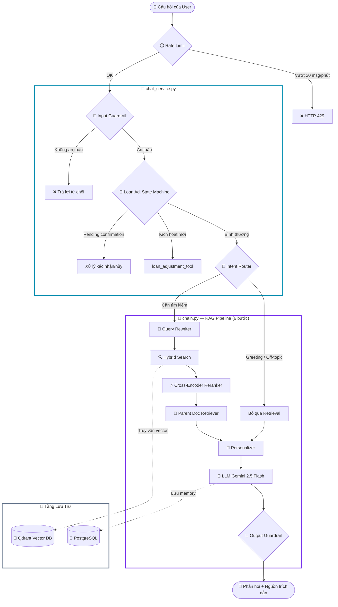

# Tổng Quan Hệ Thống AI RAG — CreditIntel

> **Phạm vi:** `backend/rag/` · `backend/services/chat_service.py` · `backend/api/routers/chat.py` · `backend/services/loan_adjustment_tool.py`
> **Ngày cập nhật:** 2026-05-22
> **Tác giả:** Đội ngũ phát triển AI/RAG CreditIntel

---

## Changelog — 2026-05-22

| Thay đổi | File | Mục đích |
|---|---|---|
| Fix typo import `RERANKER_MODE` → `RERANKER_MODEL` | `backend/rag/reranker.py:12` | Module crash khi load do tên không tồn tại trong `rag/config.py` |
| Pre-warm reranker khi server start | `backend/main.py` (`@app.on_event("startup")`) | Chuyển download model 1.1GB (`jinaai/jina-reranker-v2-base-multilingual`) từ "request đầu tiên" sang "lúc uvicorn boot" → UX không còn bị block 44s ở câu chat đầu |
| Thêm rule 8 (format Markdown) vào `SYSTEM_TEMPLATE` | `backend/rag/prompts.py` | Yêu cầu LLM mỗi bullet trên 1 dòng, paragraph cách bằng dòng trống → frontend render đúng (không còn wall-of-text inline `* **bullet:**`) |
| Thêm rule 9 (chống hallucinate tool execution) | `backend/rag/prompts.py` | Cấm AI claim "Tôi sẽ chạy mô hình / Xin chờ giây lát / Hệ thống đang tính toán" — đây là async claim mà backend không có khả năng thực hiện |
| Mở rộng `_ADJUSTMENT_RESUBMIT_TERMS` (+8 cặp keyword) | `backend/services/chat_service.py` | Bắt được cụm AI hay đề xuất làm quick-reply như "đề xuất gói vay phù hợp", "phương án khác"... — coordination bug giữa AI suggestion ↔ backend trigger |
| Thêm 3 endpoint multi-session | `backend/api/routers/chat.py`, `backend/services/chat_service.py` | `GET /chat/sessions` · `POST /chat/sessions` · `DELETE /chat/sessions/{id}` cho UI sidebar kiểu Gemini |

### Bug coordination tool calling (chưa fix tận gốc)

Hiện tại tool calling của RAG là **regex keyword matching**, không phải LLM function-calling thật. Hệ quả:
- Mọi cụm AI gợi ý trong response phải được add vào `_ADJUSTMENT_*_TERMS` bằng tay
- LLM không biết tool tồn tại theo cách formal — chỉ biết qua context block injection
- Khi keyword trigger fail, LLM hallucinate (claim "Tôi sẽ tính toán...") thay vì gọi tool

**Lộ trình đề xuất**: chuyển sang OpenRouter function calling (Gemini hỗ trợ) — refactor 1 ngày, bỏ toàn bộ regex.

### Schema migration cần chạy 1 lần

`chat_messages.error` column được dùng trong code (`backend/models/chat.py:47`) nhưng có thể chưa có trong DB hiện tại. Migration đã có trong `backend/init_db.py:9` (`ADD COLUMN IF NOT EXISTS error BOOLEAN NOT NULL DEFAULT FALSE`) — cần chạy `python init_db.py` để áp dụng nếu hệ thống chưa migrate.

---

## 1. Tổng Quan Kiến Trúc Đa Giai Đoạn (Multi-stage RAG Pipeline)

Hệ thống RAG (Retrieval-Augmented Generation) của CreditIntel là một **Pipeline xử lý đa giai đoạn** tích hợp bộ lọc an toàn, phân loại ý định, tìm kiếm hỗn hợp (Hybrid Search), tái xếp hạng (Reranking), cá nhân hóa giọng điệu (Personalization) và máy trạng thái hỗ trợ điều chỉnh đơn vay (Loan Adjustment State Machine).



**Các thông số kỹ thuật cốt lõi:**
- **Mô hình LLM chính:** `google/gemini-2.5-flash` (qua OpenRouter)
- **Embedding Model (Dense):** `openai/text-embedding-3-small` (1536 chiều)
- **Embedding Model (Sparse):** `Qdrant/bm25` (thư viện FastEmbedSparse local)
- **Reranker Model:** `jinaai/jina-reranker-v2-base-multilingual` (thông qua FastEmbed `TextCrossEncoder` local)
- **Vector Store:** Qdrant local server/Docker (`http://localhost:6333`)
- **Framework:** LangChain LCEL (`chat_prompt | llm | StrOutputParser`)

---

## 2. Kiến Trúc Module Chi Tiết

```
backend/rag/
├── __init__.py          # Lazy-loading facade — export các API giao tiếp bên ngoài
├── config.py            # Cấu hình: model, API keys, ngưỡng top-K (đọc từ core/config.py)
├── chain.py             # Orchestrator chính — pipeline 6 bước từ guardrail đến output
├── ingest.py            # Pipeline nạp và phân mảnh tài liệu từ knowledge/ + docs/data_dictionary/
├── chunking.py          # Thuật toán phân đoạn hierarchical (Parent-Child, Markdown-aware)
├── context_builder.py   # Xây dựng 4-block user context (form, ML, advisory, data quality)
├── router.py            # Phân loại ý định hội thoại (6 loại: Regex + LLM JSON fallback)
├── query_rewriter.py    # Viết lại câu hỏi hội thoại thành truy vấn độc lập (tối đa 500 ký tự)
├── retriever.py         # Qdrant Hybrid Search → Reranking → Parent-Child mapping
├── reranker.py          # Cross-Encoder Reranker singleton (có thể tắt qua config)
├── guardrails.py        # Kiểm soát đầu vào (injection, PII) và đầu ra (leak, promise, length)
├── personalizer.py      # Tự động điều chỉnh giọng điệu theo 7 trạng thái đơn vay
├── memory.py            # Sliding window + lazy summarization lịch sử hội thoại
├── prompts.py           # ChatPromptTemplate 5-biến cho system prompt (Vietnamese)
├── exceptions.py        # Cây exception: RAGError → RetrievalError, LLMError, RAGTimeoutError
├── eval_runner.py       # Công cụ chạy kiểm thử tự động offline cho RAG
├── eval_metrics.py      # Định nghĩa các chỉ số đo lường (Faithfulness, Relevance, Groundedness)
└── knowledge/
    ├── faq.md           # FAQ: câu hỏi & giải đáp thường gặp về dịch vụ
    └── policy.md        # Chính sách tín dụng cho vay của CreditIntel
```

**Nguồn tri thức nạp vào Qdrant (`ingest.py`):**
- `backend/rag/knowledge/` — FAQ và chính sách
- `docs/data_dictionary/` — Từ điển dữ liệu (tất cả file `**/*.md`)

---

## 3. Giai Đoạn 1 — INGEST: Hierarchical Parent-Child Chunking

Để tăng độ chính xác trong việc tìm kiếm thông tin mà không làm mất đi ngữ cảnh rộng của tài liệu, CreditIntel triển khai phương thức **Parent-Child Chunking** (Phân đoạn cây phân cấp).

### 3.1 Quy trình Ingest

1. **Load Documents:** Tất cả file `*.md` trong `knowledge/` và `docs/data_dictionary/` được đọc bằng `DirectoryLoader`.
2. **Parent Parsing (`chunking.py`):** Tài liệu được phân nhỏ thành các **Parent Documents** (các Section lớn có ý nghĩa trọn vẹn, dựa trên tiêu đề Markdown `#`/`##`). Độ dài tối đa **3500 ký tự**.
3. **Child Splitting:** Mỗi Parent Section lại tiếp tục được chia nhỏ thành các **Child Chunks** (độ dài tối đa **700 ký tự**, overlap **80 ký tự**).
4. **Vector Database Store:**
   - Chỉ có **Child Chunks** mới được encode bằng `OpenAIEmbeddings` (Dense) và `FastEmbedSparse` (Sparse BM25) rồi lưu trữ vào Qdrant.
   - Mỗi Child Chunk được gắn metadata `parent_id`, `parent_content`, `section_title`, `source`, `source_type`, `retrieval_unit`.
   - Khi Qdrant trả về kết quả khớp với Child Chunk, retriever tự động truy vết ngược lên **Parent Document** tương ứng, rồi de-duplicate.

**Lợi ích:**
- Vector matching ở mức chi tiết (Child chunk ngắn, tập trung → khớp tốt hơn).
- LLM nhận Parent section đầy đủ với tiêu đề, bảng biểu và đoạn giải thích liên đới.

**Chạy script Ingest:**
```bash
cd backend

# Dry run — liệt kê docs + chunks, không ghi dữ liệu
PYTHONPATH=. ../.venv/bin/python -m rag.ingest --dry-run

# Incremental upsert (mặc định — giữ collection hiện có)
PYTHONPATH=. ../.venv/bin/python -m rag.ingest

# Recreate collection (phá hủy — xóa collection cũ trước)
PYTHONPATH=. ../.venv/bin/python -m rag.ingest --recreate
```

---

## 4. Giai Đoạn 2 — RUNTIME: Luồng Xử Lý Chi Tiết

### 4.1 Xử lý tại `chat_service.py` (trước RAG)

Khi có một API request gửi tới endpoint `POST /api/v1/chat`, `chat_service.send()` thực hiện:

**Bước 1: Kiểm tra Rate Limit**
- Giới hạn tối đa **20 tin nhắn/phút** cho mỗi người dùng thông qua bảng `chat_messages`.
- Vượt ngưỡng → HTTP 429: *"Bạn đã gửi quá nhiều yêu cầu. Vui lòng thử lại sau 1 phút."*

**Bước 2: Chuẩn bị dữ liệu**
- Lấy thông tin user, đảm bảo đơn vay mới nhất đã có dự đoán ML.
- Lấy hoặc tạo `ChatSession`; lưu tin nhắn user vào DB ngay lập tức (trước RAG để đảm bảo không mất dữ liệu nếu RAG lỗi).

**Bước 3: Tải Memory**
- Gọi `memory.py` để lấy `MemoryContext` (recent messages + lazy summary).

**Bước 4: Máy trạng thái Loan Adjustment**
- Nếu session có `pending_action` chưa hết hạn (TTL: 30 phút): kiểm tra câu trả lời của user.
  - Từ khóa xác nhận ("đồng ý", "xác nhận", "ok") → tự động khởi tạo đơn vay mới qua `loan_adjustment_tool`.
  - Từ khóa từ chối ("thôi", "không", "hủy") → hủy đề xuất.
  - Khác → tiếp tục vào RAG pipeline bình thường.
- Nếu không có `pending_action`: kiểm tra xem tin nhắn có kích hoạt yêu cầu điều chỉnh mới không (dựa trên tổ hợp từ khóa từ `_ADJUSTMENT_*_TERMS`). Nếu có → gọi `loan_adjustment_tool.find_best_reapplication_option()`.

**Bước 5: Xây dựng Context và gọi RAG chain**
- Gọi `context_builder.py` → 4-block user context.
- Gọi `chain.invoke()` → 6-bước pipeline (xem mục 4.2).

**Bước 6: Lưu kết quả**
- Lưu tin nhắn assistant vào DB.
- Nếu có đề xuất loan adjustment: lưu vào `session.pending_action`.
- Trả về response + session_id + source documents.

---

### 4.2 Pipeline RAG 6 Bước trong `chain.py`

```
Bước 1: Input Guardrail (guardrails.py)
├─ Kiểm tra độ dài tối đa 2000 ký tự
├─ Kiểm tra prompt injection (19 Regex patterns)
└─ Kiểm tra PII probing (11 Regex patterns)

Bước 2: Intent Classification (router.py)
├─ Fast-path: Regex cho greeting, off_topic, personal risk, policy
└─ LLM-path: Gemini 2.5 Flash trả JSON {"intent": ..., "confidence": ...}
   └─ 6 intent: loan_inquiry | risk_explanation | policy_question
                 | personal_advice | greeting | off_topic

Bước 3: Retrieval (retriever.py) — bỏ qua nếu greeting/off_topic
├─ Query Rewriter: viết lại câu hỏi ngắn/có đại từ thành truy vấn độc lập
├─ Hybrid Search Qdrant: Dense (cosine) + Sparse (BM25) → top-20 child chunks
├─ Cross-Encoder Reranker: chấm điểm 20 cặp (query, chunk) → giữ top-12
└─ Parent Expansion: map child → parent, de-duplicate → tối đa 4 parent sections

Bước 4: Personalization (personalizer.py)
├─ Xác định tông giọng theo trạng thái đơn vay (7 trạng thái)
└─ Lấy hướng dẫn ý định (intent_instructions) theo intent đã phân loại

Bước 5: LLM Generation
├─ Ghép prompt: system + user_context + docs + chat_history + summary + question
└─ Gọi Gemini 2.5 Flash (temperature=0.3) qua OpenRouter

Bước 6: Output Guardrail (guardrails.py)
├─ Phát hiện rò rỉ nội bộ (tên bảng, API key) → chặn cứng, trả lỗi an toàn
├─ Phát hiện cam kết phê duyệt tuyệt đối → đính kèm Disclaimer
└─ Kiểm tra độ dài tối đa 3000 ký tự → cắt tại câu hoàn chỉnh cuối
```

**Cấu hình LLM theo mục đích:**

| Mục đích | Temperature | Max Tokens | Timeout |
|----------|-------------|------------|---------|
| Generation (chain.py) | 0.3 | Không giới hạn | 30s |
| Classification (router.py) | 0.0 | 60 | 30s |
| Query Rewriting | 0.0 | Không giới hạn | 30s |
| Summarization (memory.py) | 0.2 | 500 | 30s |

---

## 5. Phân Loại Ý Định (Intent Router)

`router.py` phân loại câu hỏi thành **6 loại ý định**:

| Intent | Mô tả | Cần Retrieval |
|--------|-------|--------------|
| `loan_inquiry` | Câu hỏi về số tiền vay, kỳ hạn, trạng thái đơn | Có |
| `risk_explanation` | Câu hỏi về kết quả ML, xác suất vỡ nợ, điểm rủi ro | Có |
| `policy_question` | Câu hỏi về chính sách, quy trình CreditIntel | Có |
| `personal_advice` | Yêu cầu tư vấn cải thiện tài chính cá nhân | Có |
| `greeting` | Chào hỏi, cảm ơn, small talk | Không |
| `off_topic` | Câu hỏi không liên quan tín dụng/tài chính | Không |

**Lưu ý quan trọng:** Intent `loan_adjustment_trigger` **không** thuộc về router — việc phát hiện và xử lý yêu cầu điều chỉnh đơn vay được thực hiện trực tiếp trong `chat_service.py` (Bước 4 của luồng chat_service), trước khi gọi RAG chain.

---

## 6. Cấu Trúc Prompt

System Prompt được thiết kế tập trung trong `backend/rag/prompts.py` với cấu trúc `ChatPromptTemplate`:

```
[SYSTEM INSTRUCTIONS — SYSTEM_TEMPLATE]

═══════ THÔNG TIN CÁ NHÂN ═══════
Tên khách hàng: {user_display_name}
{personalization_instructions}    ← tông giọng + lời chào theo trạng thái đơn vay

═══════ HƯỚNG DẪN THEO Ý ĐỊNH ═══════
{intent_instructions}             ← hướng dẫn cụ thể theo intent được phân loại

═══════ THÔNG TIN HỒ SƠ KHÁCH HÀNG ═══════
{user_context}                    ← 4-block context: form, ML, advisory, data quality

═══════ TÓM TẮT HỘI THOẠI TRƯỚC ĐÓ ═══════
{conversation_summary}            ← lazy summary của các tin nhắn cũ

═══════ TÀI LIỆU LIÊN QUAN ═══════
{context}                         ← Parent Document sections truy xuất từ Qdrant [1], [2]...

[CONVERSATION MEMORY]
MessagesPlaceholder: {chat_history}   ← recent HumanMessage/AIMessage objects

[HUMAN QUESTION]
{question}
```

**Các quy tắc cốt lõi trong System Prompt:**
1. Luôn trả lời tiếng Việt thân thiện, lịch sự và chuyên nghiệp.
2. Chỉ trả lời câu hỏi trong phạm vi tín dụng, khoản vay, tài chính cá nhân, chính sách CreditIntel.
3. Tuyệt đối không tự ý hứa hẹn phê duyệt đơn vay.
4. Tuyệt đối không tiết lộ thông tin người dùng khác, cấu trúc DB hoặc cấu trúc model nội bộ.
5. Luôn trích dẫn tên file tài liệu làm nguồn (Ví dụ: `[policy.md]`).
6. Với câu hỏi cá nhân: **ưu tiên dữ liệu hồ sơ khách hàng** trước, tài liệu chính sách là bổ sung.
7. Nếu không chắc chắn → trả lời *"Tôi không có đủ thông tin"*.

---

## 7. Cơ Chế Bộ Nhớ (Memory & Summarization)

Bộ nhớ được quản lý bằng lớp `MemoryContext` kết hợp với bảng `chat_sessions` và `chat_messages` trong PostgreSQL.

### 7.1 Thuật toán Token Budget trượt (Sliding Window)

Token được ước lượng đơn giản: `len(content) // 4`.

- Budget mặc định: `rag_memory_window_token_budget = 2000` tokens
- Lịch sử chat duyệt từ mới nhất đến cũ nhất.
- Tin nhắn trong phạm vi budget → giữ nguyên dưới dạng `HumanMessage`/`AIMessage`.
- Tin nhắn cũ vượt budget → đưa vào hàng đợi tóm tắt.

### 7.2 Lazy Summarization (Tóm tắt lười)

Khi số lượng tin nhắn ngoài budget vượt ngưỡng tối thiểu (`rag_memory_min_messages_to_summarize = 6`):

1. Gọi Gemini 2.5 Flash (temperature=0.2) để tóm tắt kết hợp tóm tắt cũ + tin nhắn chưa được tóm tắt.
2. Tóm tắt mới được lưu vào `ChatSession.summary` trong PostgreSQL (tối đa 500 tokens).
3. Nếu lỗi → rollback, không làm gián đoạn luồng retrieval.

---

## 8. Tìm Kiếm Hỗn Hợp (Hybrid Search) & Tái Xếp Hạng (Reranking)

### 8.1 Hybrid Retrieval trong Qdrant

`get_retriever()` khởi tạo `QdrantVectorStore` với chế độ `RetrievalMode.HYBRID`:

- **Dense Vector Search:** `OpenAIEmbeddings` (`text-embedding-3-small`, 1536 chiều) — tìm kiếm ngữ nghĩa, hiểu ý định sâu (concept matching).
- **Sparse Vector Search:** `FastEmbedSparse` (BM25) — tìm kiếm từ khóa chính xác, đặc biệt hữu ích với thuật ngữ chuyên ngành (DTI, FICO, CIC).

### 8.2 Cross-Encoder Reranker

- **Model:** `jinaai/jina-reranker-v2-base-multilingual` (local, tải về `~/.cache/fastembed/` lần đầu ~1.1 GB)
- **Singleton pattern:** tải một lần, tái dụng toàn bộ session.
- **Có thể tắt hoàn toàn:** đặt `RAG_RERANKER_ENABLED=False` trong `.env` → fallback về hybrid sliced to TOP_K.
- **Observability:** `get_rerank_stats()` trả về số lần gọi và số lần fallback.

**Luồng 3 giai đoạn:**
```
Hybrid Search → top-20 child chunks  (RERANKER_CANDIDATE_K)
      ↓
Cross-Encoder rerank → top-12 docs   (RERANKER_TOP_K)
      ↓
Parent expansion + de-dup → top-4 parent sections  (TOP_K)
```

---

## 9. Personalizer — Cá Nhân Hóa Giọng Điệu

`personalizer.py` ánh xạ **7 trạng thái đơn vay** sang tông giọng tương ứng:

| Trạng thái | Tông giọng |
|-----------|-----------|
| `auto_rejected` | Đồng cảm, khuyến khích, không đổ lỗi; gợi ý cải thiện DTI/Credit score |
| `admin_rejected` | Đồng cảm, chuyên nghiệp; giải thích lý do từ Admin |
| `pending_review` | Khuyến khích, thông tin; cập nhật quy trình xét duyệt |
| `approved` | Vui vẻ, chúc mừng; hướng dẫn bước tiếp theo và tài liệu cần nộp |
| `awaiting_info` | Hướng dẫn cụ thể; nhắc nhở thông tin cần bổ sung |
| `info_submitted` | Trấn an, chuyên nghiệp; cung cấp thông tin thời gian xử lý dự kiến |
| `None` (chưa có hồ sơ) | Chào đón, thân thiện; giới thiệu dịch vụ và khuyến khích tìm hiểu |

Ngoài ra, Personalizer cung cấp **hướng dẫn ý định** (`intent_instructions`) riêng biệt cho từng intent (6 loại), giúp LLM biết cách ưu tiên giữa dữ liệu hồ sơ và tài liệu chính sách.

---

## 10. Context Builder — 4-Block User Context

`context_builder.py` xây dựng context người dùng gồm 4 khối:

| Block | Nội dung |
|-------|----------|
| **Form Context** | Số tiền vay, kỳ hạn, trạng thái, thu nhập, DTI, credit score, việc làm, tín dụng CIC |
| **ML Context** | Xác suất vỡ nợ, mức rủi ro, điểm rủi ro, số tiền/kỳ hạn đề xuất, phiên bản model |
| **Advisory Context** | So sánh vay vs đề xuất, DTI band, Credit score band, yếu tố rủi ro chính (tối đa 4), yếu tố tích cực (tối đa 4), hành động gợi ý (tối đa 5) |
| **Data Quality Context** | Danh sách feature bị impute, mức độ tin cậy (cao/trung bình/thấp), ghi chú chất lượng |

**Bảng band Credit Score:**

| Điểm | Đánh giá |
|------|---------|
| < 580 | Kém |
| 580–669 | Trung bình |
| 670–739 | Tốt |
| 740–799 | Rất tốt |
| ≥ 800 | Xuất sắc |

**Bảng band DTI:**

| DTI | Đánh giá |
|-----|---------|
| < 30% | Tốt |
| 30–43% | Cần chú ý |
| > 43% | Rủi ro cao |

---

## 11. Máy Trạng Thái Điều Chỉnh Đơn Vay (Loan Adjustment State Machine)

Tích hợp trong `chat_service.py` và `loan_adjustment_tool.py`. Kích hoạt khi user bị AUTO_REJECTED và gửi tin nhắn chứa tổ hợp từ khóa từ `_ADJUSTMENT_*_TERMS`.

**Hằng số quan trọng:**
- `AUTO_REVIEW_THRESHOLD = 0.4` — xác suất vỡ nợ tối đa để đề xuất được chấp nhận
- `SUPPORTED_TERMS = (12, 24, 36, 48, 60)` — các kỳ hạn hợp lệ (tháng)
- `PENDING_ACTION_TTL_MINUTES = 30` — thời gian hết hạn đề xuất chưa được xác nhận

**Thuật toán tìm phương án:**
1. Tìm đơn vay `AUTO_REJECTED` gần nhất.
2. Bỏ qua nếu trạng thái là `CIC_BLACKLIST`.
3. Thử từng tổ hợp `(loan_amount, term)` từ SUPPORTED_TERMS, chạy ML real-time.
4. Giữ các phương án có `default_probability ≤ 0.4` và pass business validation.
5. Xếp hạng: ưu tiên số tiền gốc → xác suất thấp nhất → kỳ hạn gần nhất.
6. Trả kết quả về với status code: `"proposal"` / `"no_passing_option"` / `"cic_blacklist"` / `"no_rejected_application"`.

---

## 12. Cấu Hình Môi Trường RAG

Các cấu hình chính điều chỉnh hành vi RAG nằm trong `backend/.env`:

```env
# Mô hình LLM & Embeddings qua OpenRouter
RAG_LLM_MODEL=google/gemini-2.5-flash
RAG_EMBEDDING_MODEL=openai/text-embedding-3-small
RAG_BM25_MODEL=Qdrant/bm25

# Reranker cấu hình
RAG_RERANKER_ENABLED=True
RAG_RERANKER_MODEL=jinaai/jina-reranker-v2-base-multilingual
RAG_RERANKER_CANDIDATE_K=20
RAG_RERANKER_TOP_K=12

# Retrieval cấu hình (Số lượng parent documents gửi vào LLM)
RAG_TOP_K=4

# Timeout & Retry
RAG_LLM_TIMEOUT_SECONDS=30
RAG_LLM_MAX_RETRIES=2
RAG_EMBEDDING_TIMEOUT_SECONDS=10
RAG_EMBEDDING_MAX_RETRIES=2
RAG_QDRANT_TIMEOUT_SECONDS=5

# Memory & Summarization cấu hình
RAG_MEMORY_WINDOW_TOKEN_BUDGET=2000
RAG_MEMORY_MIN_MESSAGES_TO_SUMMARIZE=6
RAG_MEMORY_SUMMARY_MAX_TOKENS=500
```

---

## 13. Bộ Đánh Giá Chất Lượng RAG (Offline RAG Evaluation)

`backend/rag/eval_runner.py` và `eval_metrics.py` cung cấp bộ kiểm thử tự động để phát hiện regression khi thay đổi prompt hoặc nâng cấp LLM.

### 13.1 Các chỉ số đo lường chính

1. **Faithfulness (Độ trung thực):** Câu trả lời có hoàn toàn dựa trên tài liệu truy xuất không (không tự bịa thông tin)?
2. **Answer Relevance (Độ liên quan):** Câu trả lời có giải quyết trực tiếp câu hỏi không?
3. **Context Recall (Độ phủ ngữ cảnh):** Retriever có tìm đủ thông tin cần thiết không?

### 13.2 Cách chạy Evaluation

```bash
cd backend
PYTHONPATH=. ../.venv/bin/python -m rag.eval_runner
```

---

## 14. Điểm Mạnh & Hạn Chế

### Điểm mạnh
- **Bảo mật đa lớp:** Input/output guardrails ngăn chặn prompt injection, PII probing, và rò rỉ dữ liệu nội bộ hiệu quả.
- **Tìm kiếm chính xác & ngữ cảnh rộng:** Hybrid Search + Cross-Encoder Rerank + Parent-Child chunking kết hợp để tìm chi tiết nhỏ nhưng giữ được toàn cảnh tài liệu.
- **Cá nhân hóa sâu sắc:** Tông giọng và nội dung tự động điều chỉnh linh hoạt theo 7 trạng thái đơn vay.
- **Loan Adjustment State Machine:** Chatbot trở thành kênh hành động — user có thể điều chỉnh cấu hình vay và nộp lại trực tiếp qua chat.
- **Bộ đánh giá tự động:** Đảm bảo an toàn hồi quy khi chỉnh sửa prompt hoặc nâng cấp LLM.

### Hạn chế & Hướng phát triển

- **Reranker chạy CPU local:** `jinaai/jina-reranker-v2-base-multilingual` chạy trên CPU qua FastEmbed có thể gây trễ 1–10 giây tùy cache trạng thái. Hướng khắc phục: đưa lên GPU hoặc sử dụng Rerank API bên ngoài khi mở rộng quy mô.
- **Knowledge Base tĩnh:** Tài liệu chính sách vẫn nạp thủ công dạng Markdown. Hướng khắc phục: kết nối ETL pipeline để tự động cập nhật Qdrant khi Admin chỉnh sửa chính sách.
- **Token estimation đơn giản:** Ước lượng token bằng `len // 4` có thể thiếu chính xác với văn bản tiếng Việt. Hướng khắc phục: dùng tokenizer thực tế hoặc tiktoken.
