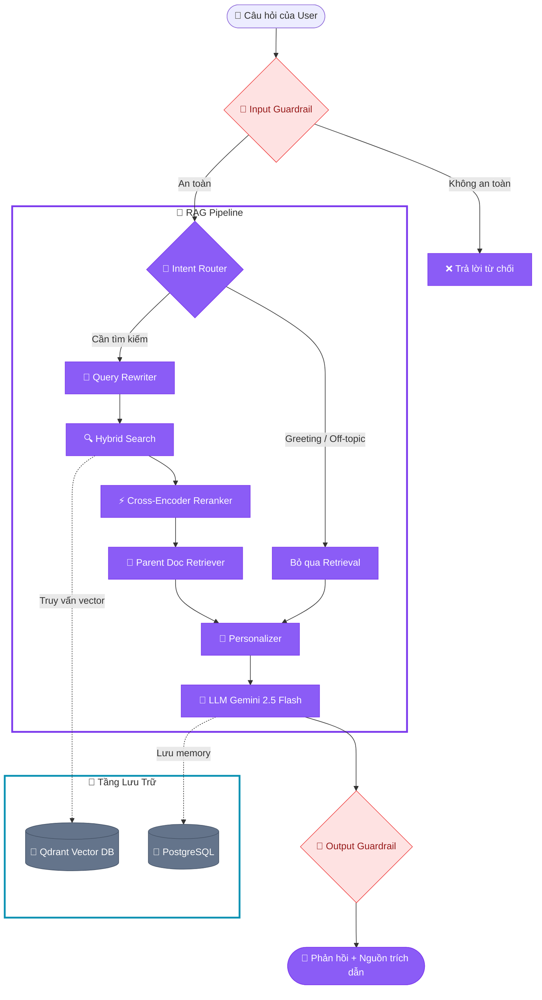

# 🤖 Tổng Quan Hệ Thống AI RAG — CreditIntel

> **Phạm vi:** `backend/rag/` · `backend/services/chat_service.py` · `backend/api/routers/chat.py` · `backend/services/loan_adjustment_tool.py`  
> **Ngày cập nhật:** 2026-05-20 (Cập nhật kiến trúc RAG phình to nâng cao)  
> **Tác giả:** Đội ngũ phát triển AI/RAG CreditIntel  

---

## 1. Tổng Quan Kiến Trúc Đa Giai Đoạn (Multi-stage RAG Pipeline)

Hệ thống RAG (Retrieval-Augmented Generation) của CreditIntel không chỉ dừng lại ở mô hình tìm kiếm-nhận diện thông thường mà đã phát triển thành một **Pipeline xử lý đa giai đoạn** tích hợp các bộ lọc an toàn, phân loại ý định tối ưu, tìm kiếm hỗn hợp (Hybrid Search), tái xếp hạng (Reranking), cá nhân hóa giọng điệu (Personalization) và máy trạng thái hỗ trợ điều chỉnh đơn vay (Loan Adjustment State Machine).



**Các thông số kỹ thuật cốt lõi:**
- **Mô hình LLM chính:** `google/gemini-2.5-flash` (qua OpenRouter)
- **Embedding Model (Dense):** `openai/text-embedding-3-small` (1536 chiều)
- **Embedding Model (Sparse):** BM25 (thư viện FastEmbed `FastEmbedSparse` local)
- **Reranker Model:** `BAAI/bge-reranker-large` (thông qua FastEmbed `TextCrossEncoder` local)
- **Vector Store:** Qdrant local server/Docker (`http://localhost:6333`)
- **Framework:** LangChain LCEL (`chat_prompt | llm | StrOutputParser`)

---

## 2. Kiến Trúc Module Chi Tiết

```
backend/rag/
├── __init__.py          # Export các API giao tiếp bên ngoài (invoke)
├── config.py            # Cấu hình: model, API keys, ngưỡng top-K
├── ingest.py            # Pipeline nạp và phân mảnh tài liệu faq.md/policy.md
├── chunking.py          # Thuật toán phân đoạn hierarchical (Parent-Child)
├── router.py            # Phân loại ý định hội thoại (Regex + LLM JSON)
├── query_rewriter.py    # Viết lại câu hỏi hội thoại thành truy vấn độc lập
├── retriever.py         # Qdrant Hybrid Search & Reranking & Parent-Child mapping
├── reranker.py          # Cross-Encoder Reranker chấm điểm và sắp xếp lại kết quả
├── guardrails.py        # Kiểm soát an toàn đầu vào (safety input) và đầu ra (output leaks)
├── personalizer.py      # Tự động thay đổi giọng điệu AI theo trạng thái đơn vay của user
├── memory.py            # Quản lý sliding window + lazy summarization lịch sử hội thoại
├── prompts.py           # Định nghĩa cấu trúc System Prompt (Vietnamese)
├── eval_runner.py       # Công cụ chạy kiểm thử tự động offline cho RAG
├── eval_metrics.py      # Định nghĩa các chỉ số đo lường (Faithfulness, Relevance, Groundedness)
└── knowledge/
    ├── faq.md           # FAQ: 17 câu hỏi & giải đáp thường gặp
    └── policy.md        # Chính sách tín dụng cho vay của CreditIntel
```

---

## 3. Giai Đoạn 1 — INGEST: Hierarchical Parent-Child Chunking

Để tăng độ chính xác trong việc tìm kiếm thông tin mà không làm mất đi ngữ cảnh rộng của tài liệu, CreditIntel triển khai phương thức **Parent-Child Chunking** (Phân đoạn cây phân cấp) thay thế cho việc cắt đoạn văn bản đều đặn truyền thống.

### 3.1 Quy trình Ingest
1. **Load Documents:** `faq.md` và `policy.md` được đọc bằng `TextLoader`.
2. **Parent Parsing (`chunking.py`):** Tài liệu được phân nhỏ thành các **Parent Documents** (các Section lớn có ý nghĩa trọn vẹn, thường dựa trên tiêu đề `##` hoặc `###`). Độ dài tối đa 3500 ký tự.
3. **Child Splitting:** Mỗi Parent Section lại tiếp tục được chia nhỏ thành các **Child Chunks** (độ dài tối đa 700 ký tự, overlap 100).
4. **Vector Database Store:**
   - Chỉ có **Child Chunks** mới được encode bằng `OpenAIEmbeddings` (Dense) và `FastEmbedSparse` (Sparse BM25) rồi lưu trữ vào Qdrant để đối sánh similarity search.
   - Mỗi Child Chunk được gắn metadata `parent_id` và lưu giữ toàn bộ nội dung text của parent section tương ứng.
   - Khi Qdrant trả về kết quả khớp với Child Chunk, retriever sẽ tự động truy vết ngược lên để trả về **Parent Document** tương ứng, sau đó de-duplicate (loại bỏ trùng lặp).

Điều này giúp:
- Tối ưu hóa việc khớp vector ở mức độ chi tiết (Child chunk ngắn và tập trung).
- Giữ vững ngữ cảnh mạch lạc của tài liệu gốc khi đưa vào LLM (Parent section chứa đầy đủ tiêu đề, bảng biểu và các đoạn giải thích liên đới).

Chạy script Ingest:
```bash
cd backend
PYTHONPATH=. ../.venv/bin/python -m rag.ingest
```

---

## 4. Giai Đoạn 2 — RUNTIME: Xử Lý Đa Giai Đoạn Chi Tiết

Khi có một API request gửi tới endpoint `POST /api/v1/chat`, luồng xử lý thực hiện qua 10 bước nghiêm ngặt:

### Bước 1: Rate Limiting
- Giới hạn tối đa 20 tin nhắn/phút cho mỗi người dùng thông qua bảng `chat_messages` nhằm ngăn chặn tấn công spam hoặc quá tải API.

### Bước 2: Input Guardrail (`guardrails.py`)
- Kiểm tra độ dài câu hỏi tối đa 2000 ký tự.
- Quét qua Regex để phát hiện Prompt Injection (các cụm từ cố gắng phá vỡ chỉ thị hệ thống như `ignore earlier rules`, `hãy đóng vai`, `reveal system prompt`) hoặc PII Probing (cố tình hỏi thông tin/hồ sơ của khách hàng khác). Nếu vi phạm, trả về thông báo từ chối an toàn ngay lập tức.

### Bước 3: Intent Classification (`router.py`)
- Phân loại câu hỏi thành 6 loại ý định.
- **Fast-path matching:** Sử dụng Regex để bắt nhanh các trường hợp chào hỏi (`greeting`), lạc đề (`off_topic`) hoặc đề xuất thay đổi kỳ hạn (`loan_adjustment_trigger`).
- **LLM-path matching:** Nếu không khớp Regex, gọi Gemini-2.5-Flash phân loại trả về JSON.
- Nếu ý định là `greeting` hoặc `off_topic`, bỏ qua bước tìm kiếm tài liệu (Retrieval) để tối ưu chi phí và độ trễ.

### Bước 4: Máy trạng thái điều chỉnh khoản vay (Loan Adjustment State Machine)
- Điều phối trực tiếp trong `chat_service.py` và `loan_adjustment_tool.py`.
- Nếu người dùng có đơn hàng bị từ chối tự động (`AUTO_REJECTED`) và hỏi về phương án xử lý hoặc đổi kỳ hạn, hệ thống sẽ đề xuất một phương án có xác suất vỡ nợ dưới `0.4` thông qua chạy thử nghiệm ML model real-time.
- Thông tin phương án được lưu vào `pending_action` trong DB nghiệp vụ.
- Chatbot hỏi người dùng có đồng ý nộp lại không. Nếu người dùng trả lời bằng từ khóa xác nhận ("đồng ý", "xác nhận", "ok"), hệ thống tự động khởi tạo đơn vay mới dựa trên cấu hình đề xuất.

### Bước 5: Viết lại câu hỏi (`query_rewriter.py`)
- Chuyển đổi câu hỏi hội thoại (vốn thường ngắn hoặc dùng đại từ thay thế như "Tại sao tôi bị từ chối?", "Đổi kỳ hạn giúp tôi") thành một câu truy vấn độc lập và đầy đủ ngữ nghĩa (ví dụ: "Tại sao hồ sơ vay của khách hàng Nguyễn Văn A bị từ chối tự động?") bằng cách kết hợp lịch sử chat và tóm tắt hội thoại.

### Bước 6: Hybrid Retrieval & Cross-Encoder Reranking (`retriever.py`, `reranker.py`)
- Thực hiện truy vấn Hybrid search trên Qdrant (Dense cosine similarity + Sparse BM25). Lấy ra 20 Child chunks tốt nhất (`RERANKER_CANDIDATE_K = 20`).
- Dùng model Cross-Encoder Reranker (`Reranker`) chấm điểm trực tiếp sự tương hợp giữa truy vấn độc lập và 20 chunks đó. Sắp xếp lại và lọc lấy 12 chunks có điểm số cao nhất (`RERANKER_TOP_K = 12`).
- Chuyển đổi 12 Child chunks này thành các Parent sections tương ứng và de-duplicate để lấy tối đa 4 Parent sections lớn nhất (`TOP_K = 4`).

### Bước 7: Personalization (`personalizer.py`)
- Kiểm tra trạng thái đơn vay hiện tại của khách hàng trong DB nghiệp vụ.
- Sinh ra chỉ thị bổ sung ( tone/giọng điệu ) đưa vào system prompt:
  - `auto_rejected` / `admin_rejected`: Giọng điệu đồng cảm, nhẹ nhàng, đưa ra lời khuyên cải thiện DTI/Credit score.
  - `pending_review`: Khách quan, chuyên nghiệp, thông tin quy trình duyệt đơn.
  - `approved` / `awaiting_info`: Vui vẻ, chúc mừng, hướng dẫn các tài liệu cần chuẩn bị nộp tiếp.
  - `info_submitted`: Trấn an, cung cấp thông tin thời gian xử lý dự kiến.
  - Chưa có hồ sơ: Chào đón, khuyến khích tìm hiểu chính sách.

### Bước 8: Memory Assembly & Summary (`memory.py`)
- Quản lý token budget của lịch sử chat (`rag_memory_window_token_budget`).
- Dùng cơ chế **Sliding Window** để giữ lại các lượt chat gần nhất trong budget.
- Các lượt chat cũ hơn được tự động tóm tắt gộp (lazy update) bằng LLM và cập nhật trường `summary` của `chat_sessions` lưu trong Postgres để làm giàu ngữ cảnh dài hạn.

### Bước 9: LLM Generation
- Ghép prompt hoàn chỉnh (System Prompt + User Context + Parent retrieved documents + Chat History Window + Summary + Personalization Tone).
- Gọi Gemini 2.5 Flash qua OpenRouter sinh câu trả lời tiếng Việt.

### Bước 10: Output Guardrail (`guardrails.py`)
- Quét câu trả lời đầu ra.
- Nếu phát hiện rò rỉ tên bảng, mật khẩu, API key -> che giấu dữ liệu hoặc thay thế bằng thông báo lỗi an toàn.
- Nếu phát hiện câu từ khẳng định phê duyệt tuyệt đối (như "tôi cam kết duyệt 100%"), tự động đính kèm Disclaimer ở cuối: *"Lưu ý: Quyết định duyệt cuối cùng do bộ phận Thẩm định quản trị viên đưa ra dựa trên hồ sơ đầy đủ."*
- Lưu tin nhắn mới vào PostgreSQL và trả phản hồi về cho Frontend.

---

## 5. Cấu Trúc Prompt Thiết Kế

System Prompt được thiết kế tập trung trong `backend/rag/prompts.py` với cấu trúc như sau:

```
[SYSTEM INSTRUCTION]
Bạn là trợ lý ảo tín dụng CreditIntel...
Hãy tuân thủ nghiêm ngặt các quy tắc ứng xử:
1. Luôn trả lời tiếng Việt thân thiện, lịch sự.
2. Chỉ trả lời câu hỏi trong phạm vi nghiệp vụ tín dụng và rủi ro khoản vay.
3. Tuyệt đối không tự ý hứa hẹn phê duyệt đơn vay.
4. Tuyệt đối không tiết lộ cấu trúc DB hoặc dữ liệu của người dùng khác.
5. Luôn trích dẫn tên file tài liệu làm nguồn (Ví dụ: [policy.md]).

═══ THÔNG TIN HỒ SƠ KHÁCH HÀNG (Dữ liệu từ Hệ Thống) ═══
{user_context}   <-- Chứa dữ liệu cá nhân, DTI, thu nhập, dự báo ML, khuyến nghị điều chỉnh

═══ THÔNG TIN TÀI LIỆU CHÍNH SÁCH (Trích xuất từ Qdrant) ═══
{context}        <-- Chứa các Parent Document sections liên quan đến câu hỏi

═══ CHỈ THỊ GIỌNG ĐIỆU CÁ NHÂN HÓA ═══
{personalization} <-- Chỉ dẫn giọng điệu đồng cảm/chúc mừng dựa trên trạng thái đơn

[CONVERSATION MEMORY]
Tóm tắt hội thoại trước đó: {conversation_summary}
Lịch sử chat gần đây:
{chat_history}

[HUMAN QUESTION]
{question}
```

---

## 6. Cơ Chế Bộ Nhớ (Memory & Summarization)

Bộ nhớ được quản lý bằng lớp `MemoryContext` kết hợp với bảng `chat_sessions` và `chat_messages` trong PostgreSQL.

### 6.1 Thuật toán Token Budget trượt (Sliding Window)
Vì độ dài context window của LLM có hạn và chi phí gọi token tăng cao, hệ thống ước lượng token bằng phương pháp đơn giản: `len(content) // 4`.
- Lịch sử chat được duyệt từ mới nhất đến cũ nhất.
- Những tin nhắn nằm trong phạm vi budget (ví dụ: `rag_memory_window_token_budget = 4096`) sẽ được giữ nguyên dưới dạng đối tượng `HumanMessage` / `AIMessage`.
- Các tin nhắn cũ vượt quá budget sẽ được đưa vào hàng đợi tóm tắt.

### 6.2 Lazy Summarization (Tóm tắt lười)
Khi số lượng tin nhắn ngoài budget vượt quá cấu hình tối thiểu (`rag_memory_min_messages_to_summarize` - mặc định là 3 tin nhắn mới chưa tóm tắt):
1. Hệ thống gọi Gemini-2.5-Flash để tóm tắt các tin nhắn cũ kết hợp với tóm tắt trước đó.
2. Tóm tắt mới nhất được lưu trực tiếp vào database nghiệp vụ: `ChatSession.summary = new_summary`.
3. Nhờ vậy, ngữ cảnh hội thoại dài hạn được lưu giữ ngắn gọn trong tối đa 500 tokens.

---

## 7. Tìm Kiếm Hỗn Hợp (Hybrid Search) & Tái Xếp Hạng (Rerank)

### 7.1 Hybrid Retrieval trong Qdrant
Lớp `get_retriever()` khởi tạo `QdrantVectorStore` với chế độ `RetrievalMode.HYBRID`.
- **Dense Vector Search:** Dùng `OpenAIEmbeddings` encode câu hỏi thành vector 1536 chiều. Hữu ích cho tìm kiếm ngữ nghĩa, hiểu ý định sâu xa (concept matching).
- **Sparse Vector Search:** Dùng `FastEmbedSparse` (mô hình BM25) để tìm kiếm từ khóa chính xác (keyword matching), cực kỳ hữu dụng khi người dùng hỏi các từ chuyên ngành hoặc từ viết tắt đặc thù (DTI, FICO, CIC).

### 7.2 Cross-Encoder Reranker
Vì retriever ban đầu chỉ đối sánh độc lập vector của câu hỏi với vector của chunk, nó có thể bỏ qua một số thông tin cấu trúc ngữ pháp. 
- Hệ thống lấy ra `RERANKER_CANDIDATE_K = 20` ứng viên hàng đầu.
- Reranker (`BAAI/bge-reranker-large` local) sẽ chấm điểm sự liên quan trực tiếp của từng cặp `(câu hỏi, chunk text)`.
- Rerank giúp đẩy những chunks thực sự liên quan mật thiết lên đầu bảng trước khi thực hiện bước mở rộng Parent document.

---

## 8. Cấu Hình Môi Trường RAG

Các cấu hình chính điều chỉnh hành vi RAG nằm trong `backend/.env`:

```env
# Mẫu mô hình LLM & Embeddings qua OpenRouter
RAG_LLM_MODEL=google/gemini-2.5-flash
RAG_EMBEDDING_MODEL=openai/text-embedding-3-small
RAG_BM25_MODEL=Qdrant/bm25

# Reranker cấu hình
RAG_RERANKER_ENABLED=True
RAG_RERANKER_MODEL=BAAI/bge-reranker-large
RAG_RERANKER_CANDIDATE_K=20
RAG_RERANKER_TOP_K=12

# Retrieval cấu hình (Số lượng parent documents gửi vào LLM)
RAG_TOP_K=4

# Timeout & Retry cho an toàn kết nối
RAG_LLM_TIMEOUT_SECONDS=15
RAG_LLM_MAX_RETRIES=3
RAG_EMBEDDING_TIMEOUT_SECONDS=10
RAG_EMBEDDING_MAX_RETRIES=3
RAG_QDRANT_TIMEOUT_SECONDS=5

# Memory & Summarization cấu hình
RAG_MEMORY_WINDOW_TOKEN_BUDGET=4096
RAG_MEMORY_MIN_MESSAGES_TO_SUMMARIZE=3
RAG_MEMORY_SUMMARY_MAX_TOKENS=500
```

---

## 9. Bộ Đánh Giá Chất Lượng RAG (Offline RAG Evaluation)

Để đảm bảo RAG hoạt động ổn định và không xảy ra hiện tượng ảo giác (hallucination) khi thay đổi mã nguồn, hệ thống tích hợp bộ công cụ kiểm thử tự động tại `backend/rag/eval_runner.py` và `eval_metrics.py`.

### 9.1 Các chỉ số đo lường chính (RAG Metrics)
1. **Faithfulness (Độ trung thực):** Kiểm tra xem câu trả lời có hoàn toàn dựa trên tài liệu được truy xuất hay không (không tự bịa thông tin ngoài tài liệu).
2. **Answer Relevance (Độ liên quan câu trả lời):** Đánh giá mức độ câu trả lời giải quyết trực tiếp câu hỏi của người dùng.
3. **Context Recall (Độ phủ ngữ cảnh):** Đo lường xem retriever có tìm đủ các thông tin cần thiết trong cơ sở tri thức để trả lời câu hỏi hay không.

### 9.2 Cách chạy Evaluation
Chạy script kiểm thử để xuất bảng báo cáo chất lượng:
```bash
cd backend
PYTHONPATH=. ../.venv/bin/python -m rag.eval_runner
```

---

## 10. Điểm Mạnh & Hạn Chế Của Hệ Thống Hiện Tại

### ✅ Điểm mạnh
- **Bảo mật tuyệt đối (Multi-layer Guardrails):** Ngăn chặn prompt injection và rò rỉ dữ liệu hệ thống hiệu quả bằng bộ lọc đầu vào/đầu ra.
- **Tìm kiếm chính xác & Ngữ cảnh rộng:** Nhờ Hybrid Search + Cross-Encoder Rerank + Parent-Child chunking, hệ thống tìm đúng chi tiết nhỏ nhưng vẫn giữ được toàn cảnh Section tài liệu gốc cho LLM đọc.
- **Hội thoại cá nhân hóa sâu sắc:** Tông giọng và nội dung câu trả lời tự động điều chỉnh linh hoạt theo trạng thái đơn vay (Rejected, Approved, Pending) giúp tăng tính chuyên nghiệp và đồng cảm tài chính.
- **Tích hợp Loan Adjustment State Machine:** Biến Chatbot thành một kênh hành động (Actionable Channel), cho phép người dùng thay đổi cấu hình vay và nộp lại trực tiếp qua chat mà không cần quay lại điền form phức tạp.
- **Bộ đánh giá tự động (Evaluation):** Đảm bảo an toàn hồi quy khi chỉnh sửa prompt hoặc nâng cấp LLM model.

### ⚠️ Hạn chế & Hướng phát triển tiếp theo
- **Bộ nhớ cục bộ Cross-Encoder:** Quá trình rerank chạy trên CPU local qua FastEmbed có thể gây trễ khoảng 1-2 giây cho câu trả lời đầu tiên. Hướng khắc phục: Đưa reranker lên GPU hoặc sử dụng API Rerank bên ngoài khi mở rộng quy mô.
- **Dữ liệu Knowledge Base tĩnh:** Tài liệu chính sách vẫn nạp thủ công dạng file Markdown tĩnh. Hướng khắc phục: Kết nối ETL pipeline để tự động xuất và cập nhật chính sách từ cơ sở dữ liệu hệ thống vào Qdrant khi Admin chỉnh sửa chính sách trực tuyến.
